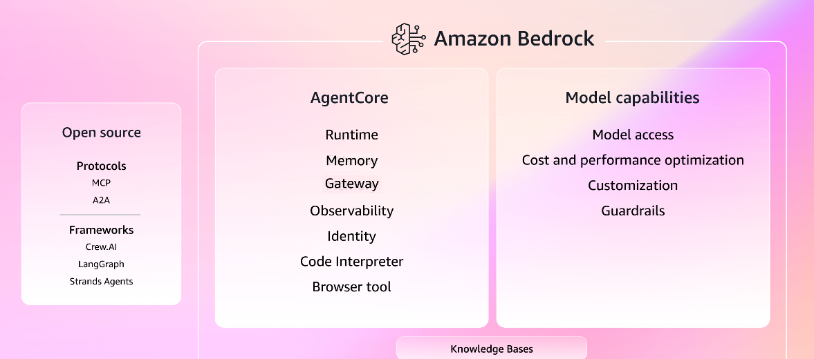
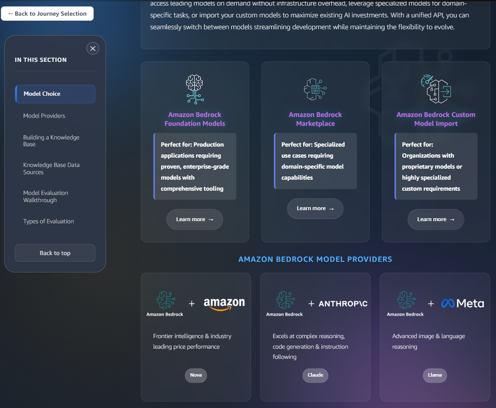

# 26년 4월 [Amazon AWS Certified Generative AI Developer - Professional(AIP-C01) 기출문제를 통해 AWS의 개념을 파악과 동시에 자격증 취득 목표]

1. 문제 및 정답 확인
2. 문제 설명
3. 정답 해설
4. 출제 의도 분석
5. 관련 AWS 공식 링크 공유

---

## 학습 개념 및 요약
* Q1 공정성 및 편향 감지,"SageMaker Clarify: Bedrock 모델 출력의 인구통계학적 편향을 분석하고, CloudWatch 복합 알람을 통해 실시간으로 공정성 지표를 모니터링하는 법을 학습함."
* Q2 AI 안전망 구축,"Bedrock Guardrails: 거부된 주제, 단어 필터링, 근거성 점수(Grounding Score) 설정을 통해 부적절한 답변 및 할루시네이션을 차단하는 다중 방어 체계를 익힘."
* Q3 응답 성능 최적화,Streaming (Amplify AI Kit): 복잡한 질문 시 발생하는 타임아웃을 방지하기 위해 응답을 조각으로 나누어 실시간 전송하는 스트리밍 구현법을 학습함.
* Q4 동적 모델 라우팅,AWS AppConfig & Lambda: 코드 배포 없이 실시간 설정 변경만으로 사용자 등급이나 규제에 맞춰 모델(FM)을 동적으로 교체하는 아키텍처를 분석함.
* Q5 중앙 집중식 관리,Prompt Management: 여러 부서의 다양한 프롬프트 템플릿과 변형을 코드와 분리하여 중앙에서 버전별로 관리하고 재사용하는 효율적 방식을 익힘.
* Q6 대규모 벡터 검색,"OpenSearch Serverless: 1,000만 건 이상의 대규모 데이터를 관리 부담 없이 서버리스로 운영하며, RAG 구조에서 다국어 문서를 검색하는 최적의 솔루션을 학습함."
* Q7 검색 정확도 향상,Hybrid Search: 단순 의미 검색(Vector)의 한계를 극복하기 위해 키워드 매칭(Lexical)을 결합하여 의학 약어나 고유 명사 검색 정확도를 높이는 법을 익힘.
* Q8 데이터 및 망 보안,PrivateLink & Lake Formation: VPC 엔드포인트를 통한 프라이빗 연결과 Lake Formation을 이용한 데이터 레이크의 컬럼 수준 접근 제어 방식을 학습함.
* Q9 AI 거버넌스 및 감사,"CloudTrail & 버전 제어: 프롬프트 수정 이력을 CloudTrail로 기록(Audit)하고, IAM 정책을 통해 승인 워크플로를 구축하는 기업용 거버넌스 체계를 분석함."
* Q10 실시간 사용자 경험,WebSocket API: 수천 명의 동시 접속자에게 지연 시간 없이 AI 응답을 전달하기 위해 WebSocket과 Bedrock 스트리밍 API를 결합하는 실시간 통신 설계를 학습함.

---

## (문제1)
Q1
A retail company has a generative AI (GenAI) product recommendation application that uses
Amazon Bedrock. The application suggests products to customers based on browsing history
and demographics. The company needs to implement fairness evaluation across multiple
demographic groups to detect and measure bias in recommendations between two prompt
approaches. The company wants to collect and monitor fairness metrics in real time. The
company must receive an alert if the fairness metrics show a discrepancy of more than 15%
between demographic groups. The company must receive weekly reports that compare the
performance of the two prompt approaches.
Which solution will meet these requirements with the LEAST custom development effort?

[Answer]
Set up Amazon SageMaker Clarify to analyze model outputs. Publish fairness metrics to
Amazon CloudWatch. Create CloudWatch composite alarms that combine SageMaker Clarify bias
metrics with Amazon Bedrock latency metrics to provide a comprehensive fairness evaluation
dashboard. 

### **1. 문제 및 정답 확인**
* **문제:** Amazon Bedrock 기반 GenAI 애플리케이션에서 두 가지 프롬프트 방식 간의 편향(Bias)을 감지하고 공정성 지표를 실시간 모니터링해야 함. 지표 차이가 15%를 초과할 경우 알람을 받고 주간 보고서를 생성하는 가장 효율적인 방법은?
* **정답:** **C. Amazon SageMaker Clarify를 설정하여 모델 출력을 분석함. 공정성 지표를 Amazon CloudWatch에 게시하고, CloudWatch 복합 알람(Composite alarms)을 생성하여 지표 모니터링 및 대시보드를 제공함.**

---

### **2. 문제 설명**
* **상황:** AI가 특정 성별이나 연령대(인구 통계 그룹)에 대해서만 편향된 추천을 하는지 감시해야 함. 
* **미션:** "A 프롬프트와 B 프롬프트 중 어느 것이 더 공정한가?"를 실시간으로 체크하고, 편차가 심해지면 즉시 담당자에게 경고를 보내야 함.
* **핵심:** AI의 편향성을 전문적으로 분석하는 도구(SageMaker Clarify)와 알람 시스템(CloudWatch)을 연결하여 직접 코드를 짜지 않고 AWS 기능을 최대한 활용하는 것이 포인트임.

---

### **3. 정답 해설**
* **SageMaker Clarify:** 모델의 예측 결과에서 인종, 성별 등 특정 조건에 따른 편향성(Bias)을 측정하고 설명해 주는 전문 서비스임. Bedrock 모델의 출력 결과도 분석 가능함.
* **CloudWatch 연동:** Clarify에서 계산된 공정성 수치를 CloudWatch로 보내면 실시간 그래프로 볼 수 있고, 설정한 임계값(15%) 초과 시 알람을 보낼 수 있음.
* **복합 알람(Composite Alarm):** 여러 지표(편향성 + 지연 시간 등)를 묶어서 관리함으로써 단순 알람보다 더 정교한 모니터링 환경을 제공함.
* **최소 개발 노력:** 자체적으로 편향성 계산 알고리즘을 개발할 필요 없이, AWS가 제공하는 관리형 서비스를 조합하는 방식이 가장 효율적임.

---

### **4. 문제 출제의도 분석**
* **책임감 있는 AI(Responsible AI):** 최근 GenAI 분야에서 중요해진 모델의 공정성 및 윤리적 모니터링 체계를 구축할 수 있는지 확인함.
* **SageMaker Clarify 활용 능력:** 이 서비스가 단순히 머신러닝 학습 단계뿐만 아니라, 운영 단계에서 편향성을 감지하는 용도로 쓰인다는 점을 아는지 평가함.
* **AWS 통합 모니터링 설계:** 분석 서비스(Clarify)와 경보 서비스(CloudWatch)를 결합하여 운영 자동화를 구현하는 능력을 확인함.

---

### **5. 관련 AWS 링크 공유**
* [Amazon SageMaker Clarify를 사용한 편향 감지 및 설명 가능성](https://docs.aws.amazon.com/ko_kr/sagemaker/latest/dg/clarify-fairness-and-explainability.html)
* [Amazon Bedrock용 모델 평가 가이드](https://docs.aws.amazon.com/ko_kr/bedrock/latest/userguide/model-evaluation.html)

---

## (문제2)
### **1. 문제 및 정답 확인**
* **문제:** 금융 회사가 AI 비서를 개발하면서 주식 추천, 수익 보장 등 고위험 대화 패턴과 경쟁사 언급, 사실에 근거하지 않은 주장을 차단해야 함. Amazon Bedrock Guardrails를 사용하여 이를 구현하기 위한 3가지 단계는?
* **정답:** * **A. 고위험 대화 패턴을 '거부된 주제(Denied topics)' 가드레일에 추가함.**
    * **D. 경쟁사 이름을 '사용자 지정 단어 필터(Custom word filters)'로 추가하고 입력/출력 차단 작업을 설정함.**
    * **F. 높은 '근거 점수 임계값(Grounding score threshold)'을 설정함.**

---

### **2. 문제 설명**
* **상황:** AI가 금융 규정을 어기거나(주식 추천), 라이벌 회사를 홍보하거나, 근거 없는 헛소리(할루시네이션)를 하지 못하도록 강력한 '안전망'을 설치해야 함.
* **미션:** Bedrock의 보안 기능인 **Guardrails**를 사용하여 대화의 입구와 출구를 모두 검문해야 함.
* **핵심:** 특정 주제는 아예 못 꺼내게 막고(주제 거부), 특정 단어는 필터링하며(단어 필터), 대답이 회사의 공식 문서에 근거한 것인지 수치로 확인(근거 점수)하는 다중 방어 체계임.

---

### **3. 정답 해설**
* **A (Denied Topics):** "특정 주식 추천"이나 "수익 보장" 같은 큰 범주의 금지 항목을 정의함. AI가 이 주제를 감지하면 답변을 거부하도록 설정함.
* **D (Custom Word Filters):** 경쟁사 이름처럼 문맥과 관계없이 무조건 나오면 안 되는 고유 명사들을 블랙리스트에 올림. 사용자가 질문할 때(입력)나 AI가 답할 때(출력) 모두 차단함.
* **F (Grounding Score):** AI의 답변이 참고 문서(Knowledge Bases 등)의 내용과 얼마나 일치하는지 점수를 매기는 것임. 이 임계값을 '높음'으로 설정하면, 조금이라도 지출처가 불분명하거나 사실 확인이 안 된 정보(근거 없는 주장)는 답변으로 내보내지 않음.

---

### **4. 문제 출제의도 분석**
* **AI 거버넌스 및 안전성:** 금융권처럼 규제가 엄격한 산업군에서 GenAI의 부작용을 막기 위한 기술적 통제 수단을 아는지 확인함.
* **Bedrock Guardrails 세부 기능:** 주제 필터링, 단어 필터링, 근거성 확인(Contextual Grounding) 등 가드레일의 핵심 기능들을 상황에 맞게 매칭할 수 있는지 평가함.
* **RAG(검색 증강 생성) 신뢰성 확보:** 사실에 근거한 답변만을 허용하기 위한 '근거성 체크'의 중요성을 인지하는지 확인함.

---

### **5. 관련 AWS 링크 공유**
* [Amazon Bedrock 가드레일 작동 방식](https://docs.aws.amazon.com/ko_kr/bedrock/latest/userguide/guardrails.html)
* [가드레일을 사용한 내용 필터링 및 근거성 검사](https://docs.aws.amazon.com/ko_kr/bedrock/latest/userguide/guardrails-components.html)

---

## (문제3)
Q3
A company has deployed an AI assistant as a React application that uses AWS Amplify, an AWS
AppSync GraphQL API, and Amazon Bedrock Knowledge Bases. The application uses the
GraphQL API to call the Amazon Bedrock RetrieveAndGenerate API for knowledge base
interactions. The company configures an AWS Lambda resolver to use the RequestResponse
invocation type.
Application users report frequent timeouts and slow response times. Users report these problems
more frequently for complex questions that require longer processing.
The company needs a solution to fix these performance issues and enhance the user experience.
Which solution will meet these requirements?

A. Use AWS Amplify AI Kit to implement streaming responses from the GraphQL API and to
optimize client-side rendering.

### **1. 문제 및 정답 확인**
* **문제:** React 앱(Amplify), AppSync(GraphQL), Bedrock Knowledge Bases를 연결한 AI 비서에서 복잡한 질문 시 타임아웃과 느린 응답 속도가 발생함. 현재 Lambda 리졸버는 `RequestResponse`(동기식) 방식을 사용 중임. 사용자 경험을 개선하기 위한 해결책은?
* **정답:** **A. AWS Amplify AI Kit를 사용하여 GraphQL API에서 스트리밍 응답(Streaming responses)을 구현하고 클라이언트 측 렌더링을 최적화함.**

---

### **2. 문제 설명**
* **상황:** AI가 답변을 작성하는 데 10초가 걸린다고 가정함. 현재 방식은 10초 동안 화면이 멈춰 있다가 답변이 한꺼번에 툭 튀어나오는 방식임. 이 과정에서 연결이 끊기거나(타임아웃) 사용자는 앱이 고장 났다고 느낄 수 있음.
* **미션:** AI가 답변을 생성하는 대로 글자 하나하나를 화면에 즉시 보여주는 '타이핑 효과(스트리밍)'를 도입해야 함. 
* **핵심:** 한 번에 다 받으려 하지 말고, 생기는 대로 바로바로 보내서(Streaming) 사용자가 기다리는 지루함을 없애고 연결 끊김을 방지하는 것임.

---

### **3. 정답 해설**
* **스트리밍(Streaming)의 장점:** 전체 응답이 완성될 때까지 기다리지 않고 첫 글자가 생성되는 즉시 화면에 뿌려줌. 이는 '인식되는 대기 시간(Perceived Latency)'을 획기적으로 줄여줌.
* **Amplify AI Kit:** AWS Amplify 환경에서 GenAI 기능을 쉽게 구현하도록 돕는 도구임. 복잡한 스트리밍 로직을 직접 짜지 않아도 AppSync와 Bedrock 간의 실시간 데이터 전송을 최적화해줌.
* **성능 개선:** 기존의 동기식(RequestResponse) 호출은 긴 응답 시간 동안 연결을 유지해야 하므로 타임아웃에 취약함. 스트리밍 방식을 쓰면 부분적인 데이터를 계속 주고받으므로 타임아웃 문제를 피하기 쉬움.

---

### **4. 문제 출제의도 분석**
* **GenAI 사용자 경험(UX) 최적화:** 대규모 언어 모델(LLM)의 특성상 응답이 길어질 수밖에 없는데, 이를 처리하는 표준 방식인 **스트리밍**을 아는지 확인함.
* **최신 도구 활용 역량:** Amplify AI Kit와 같은 최신 AWS 도구를 사용하여 최소한의 코드로 성능 문제를 해결할 수 있는지 평가함.
* **애플리케이션 아키텍처 이해:** 프론트엔드(React)와 백엔드(GraphQL/AppSync) 간의 효율적인 통신 방식(비동기/스트리밍)을 설계할 수 있는지 확인함.

---

### **5. 관련 AWS 링크 공유**
* [AWS Amplify AI Kit 소개 및 사용법](https://docs.aws.amazon.com/ko_kr/amplify/latest/userguide/ai-overview.html)
* [Amazon Bedrock에서 스트리밍 응답 사용하기](https://docs.aws.amazon.com/ko_kr/bedrock/latest/userguide/api-methods-run.html#api-methods-run-streaming)

---

## (문제4)
Q4
An ecommerce company operates a global product recommendation system that needs to switch
between multiple foundation models (FM) in Amazon Bedrock based on regulations, cost
optimization, and performance requirements. The company must apply custom controls based
on proprietary business logic, including dynamic cost thresholds, AWS Region-specific
compliance rules, and real-time A/B testing across multiple FMs. The system must be able to
switch between FMs without deploying new code. The system must route user requests based on
complex rules including user tier, transaction value, regulatory zone, and real-time cost metrics
that change hourly and require immediate propagation across thousands of concurrent requests.
Which solution will meet these requirements?

C. Configure an AWS Lambda function to fetch routing configurations from the AWS AppConfig
Agent for each user request. Run business logic in the Lambda function to select the appropriate
FM for each request. Expose the FM through a single Amazon API Gateway REST API endpoint.

### **1. 문제 및 정답 확인**
* **문제:** 규제, 비용, 성능에 따라 여러 파운데이션 모델(FM)을 동적으로 교체해야 함. 코드 배포 없이 수천 개의 요청에 대해 실시간으로 복잡한 라우팅 규칙(사용자 등급, 거래 가치, 지역 등)을 적용할 수 있는 솔루션은?
* **정답:** **C. 각 사용자 요청에 대해 AWS AppConfig Agent로부터 라우팅 구성을 가져오도록 AWS Lambda 함수를 구성함. Lambda 내에서 비즈니스 로직을 실행하여 적절한 FM을 선택하고, 이를 단일 Amazon API Gateway 엔드포인트를 통해 노출함.**

---

### **2. 문제 설명**
* **상황:** 여러 종류의 AI 모델(Bedrock의 모델들)을 상황에 맞춰 골라 써야 함. 예를 들어 "VIP 고객은 제일 비싼 모델로", "유럽 사용자는 유럽 규정에 맞는 모델로" 즉시 바꿔야 함.
* **미션:** 서버를 껐다 켜거나 코드를 다시 수정해서 올리는 과정(배포) 없이, 설정값만 살짝 바꿔도 수천 명의 사용자에게 즉각 적용되어야 함.
* **핵심:** **'AWS AppConfig'**라는 도구를 사용하여 설정값(비즈니스 로직의 기준)을 실시간으로 관리하고, **'Lambda'**가 그 기준에 따라 똑똑하게 길을 찾아주는(라우팅) 구조를 만드는 것임.

---

### **3. 정답 해설**
* **AWS AppConfig:** 코드 수정 없이 애플리케이션의 설정(Flag, 파라미터 등)을 실시간으로 배포하고 관리하는 서비스임. "지금부터 A 모델 대신 B 모델 써!"라는 명령을 즉시 전파할 수 있음.
* **Lambda 비즈니스 로직:** Lambda 함수가 호출될 때마다 최신 AppConfig 설정을 확인하여, 사용자의 등급이나 거래액에 따라 어떤 모델로 연결할지 실시간으로 판단함.
* **API Gateway 단일 엔드포인트:** 사용자는 주소 하나만 알면 됨. 내부에서 모델이 바뀌어도 겉으로 보이는 접속 주소는 변하지 않아 관리가 매우 단순해짐.
* **성능 최적화:** AppConfig Agent는 설정을 로컬에 캐싱하므로 수천 개의 요청이 들어와도 매우 빠르게 설정을 가져올 수 있음.

---

### **4. 문제 출제의도 분석**
* **동적 구성 관리 역량:** 인프라 고정 방식이 아닌, **기능 플래그(Feature Flags)**나 실시간 설정 업데이트를 통해 유연하게 시스템을 운영할 수 있는지 확인함.
* **고급 라우팅 아키텍처 이해:** 단순한 로드 밸런싱을 넘어, 비즈니스 지표(비용, 등급 등)에 기반한 정교한 모델 라우팅 설계 능력을 평가함.
* **최소 중단 운영:** "코드 배포 없이(without deploying new code)"라는 제약 조건을 해결하기 위해 AppConfig와 같은 구성 관리 도구를 선택할 수 있는지 확인함.

---

### **5. 관련 AWS 링크 공유**
* [AWS AppConfig를 사용한 동적 구성 관리](https://docs.aws.amazon.com/ko_kr/appconfig/latest/userguide/what-is-appconfig.html)
* [Amazon Bedrock 모델 호출 최적화 전략](https://docs.aws.amazon.com/ko_kr/bedrock/latest/userguide/inference.html)

---

## (문제5)
Q5
A company is developing an internal generative AI (GenAI) assistant that uses Amazon Bedrock
to summarize corporate documents for multiple business units. The GenAI assistant must
generate responses in a consistent format that includes a document summary, classification of
business risks, and terms that are flagged for review. The GenAI assistant must adapt the tone of
responses for each user's business unit, such as legal, human resources, or finance. The GenAI
assistant must block hate speech, inappropriate topics, and sensitive information such as
personal health information.
The company needs a solution to centrally manage prompt variants across business units and
teams. The company wants to minimize ongoing orchestration efforts and maintenance for
post-processing logic. The company also wants to have the ability to adjust content moderation
criteria for the GenAI assistant over time.
Which solution will meet these requirements with the LEAST maintenance overhead?

A. Use Amazon Bedrock Prompt Management to configure reusable templates and business
unit-specific prompt variants. Apply Amazon Bedrock guardrails that have category filters and
sensitive term lists to block prohibited content.

### **1. 문제 및 정답 확인**
* **문제:** 여러 부서(법무, 인사, 재무)를 위한 문서 요약 GenAI 비서를 개발 중임. 부서별로 다른 어조(Tone)를 적용하고, 일정한 출력 형식을 유지하며, 민감 정보(건강 정보 등)를 차단해야 함. 이를 중앙에서 관리하면서 유지보수 노력을 최소화하는 방법은?
* **정답:** **A. Amazon Bedrock Prompt Management를 사용하여 재사용 가능한 템플릿과 부서별 프롬프트 변형을 구성함. 카테고리 필터와 민감한 용어 목록이 포함된 Amazon Bedrock Guardrails를 적용하여 금지된 콘텐츠를 차단함.**

---

### **2. 문제 설명**
* **상황:** 부서마다 원하는 스타일이 다름. 법무팀은 '엄격하게', 재무팀은 '수치 중심으로' 요약해달라고 함. 또한, 병원 기록 같은 민감한 정보가 AI 답변에 섞여 나오면 안 됨.
* **미션:** 개발자가 부서별로 코드를 따로 짜지 않고, 한곳에서 "이 부서는 이 프롬프트를 써라"라고 정리(Prompt Management)하고, "이런 내용은 내보내지 마라"라고 규칙(Guardrails)을 세워야 함.
* **핵심:** 관리 포인트가 여기저기 흩어지지 않게 **Bedrock 내부 기능**들로만 묶어서 해결하는 것이 포인트임.

---

### **3. 정답 해설**
* **Amazon Bedrock Prompt Management:** 프롬프트(AI에게 내리는 지시문)를 버전별로 관리하고 템플릿화하는 도구임. 부서마다 다른 지시문을 코드 수정 없이 중앙에서 간편하게 교체하거나 업데이트할 수 있음.
* **Amazon Bedrock Guardrails:** AI가 하면 안 되는 말(증오 표현, 민감 정보 등)을 걸러주는 필터임. 질문이 들어올 때나 답이 나갈 때 실시간으로 감시하며, 필요에 따라 필터링 강도를 조절하기 매우 쉬움.
* **최소 유지보수(LEAST maintenance):** 외부 서비스나 복잡한 후처리 로직(Lambda 등)을 직접 개발하는 대신, Bedrock의 자체 관리형 기능을 사용하므로 운영 부담이 가장 적음.

---

### **4. 문제 출제의도 분석**
* **중앙 집중식 프롬프트 관리:** 대규모 조직에서 다양한 요구사항을 처리하기 위해 프롬프트를 코드가 아닌 **자산(Asset)**으로 관리할 수 있는지 확인함.
* **엔터프라이즈급 AI 거버넌스:** 기업 내 보안 및 규정 준수를 위해 가드레일을 활용하여 안전한 AI 서비스를 구축하는 능력을 평가함.
* **완전 관리형 서비스 선호:** 복잡한 오케스트레이션 코드를 작성하는 것보다 AWS의 최신 전용 도구(Prompt Management)를 사용하는 것이 효율적임을 인지하는지 확인함.

---

### **5. 관련 AWS 링크 공유**
* [Amazon Bedrock Prompt Management 사용 가이드](https://docs.aws.amazon.com/ko_kr/bedrock/latest/userguide/prompt-management.html)
* [Amazon Bedrock 가드레일을 사용한 콘텐츠 모더레이션](https://docs.aws.amazon.com/ko_kr/bedrock/latest/userguide/guardrails.html)

---

## (문제6)
Q6
A financial services company is building a customer support application that retrieves relevant
financial regulation documents from a database based on semantic similarities to user queries.
The application must integrate with Amazon Bedrock to generate responses. The application
must be able to search documents that are in English, Spanish, and Portuguese. The application
must filter documents by metadata such as publication date, regulatory agency, and document
type.
The database stores approximately 10 million document embeddings. To minimize operational
overhead, the company wants a solution that minimizes management and maintenance effort.
The application must provide low-latency responses for real-time customer interactions.
Which solution will meet these requirements?

A. Use Amazon OpenSearch Serverless to provide vector search capabilities and metadata
filtering. Connect to Amazon Bedrock Knowledge Bases to enable Retrieval Augmented
Generation (RAG) capabilities that use an Anthropic Claude foundation model (FM).

### **1. 문제 및 정답 확인**
* **문제:** 1,000만 개의 문서 임베딩을 저장하고, 다국어(영어, 스페인어, 포르투갈어) 지원 및 메타데이터 필터링이 필요한 금융 규제 문서 검색 기반 AI 앱을 구축해야 함. 운영 오버헤드를 최소화하면서 실시간 응답을 제공하는 솔루션은?
* **정답:** **A. Amazon OpenSearch Serverless를 사용하여 벡터 검색 및 메타데이터 필터링 기능을 제공함. Amazon Bedrock Knowledge Bases와 연결하여 Anthropic Claude 모델을 사용하는 RAG(검색 증강 생성) 아키텍처를 구현함.**

---

### **2. 문제 설명**
* **상황:** 엄청난 양의 금융 서류(1,000만 개) 중에서 사용자의 질문과 "의미가 비슷한" 내용을 광속으로 찾아내서 AI가 답변을 해줘야 함.
* **미션:** 서버 관리에 신경 쓰고 싶지 않고(운영 효율성), 날짜나 기관별로 검색 결과도 걸러야 하며(필터링), 여러 나라 언어도 잘 알아먹어야 함.
* **핵심:** 데이터를 저장하는 곳은 관리 부담이 없는 **'Serverless'** 방식이어야 하며, 질문에 맞는 근거를 찾아 답변하는 **'RAG'** 구조를 Bedrock과 연결하여 만드는 것임.

---

### **3. 정답 해설**
* **OpenSearch Serverless (Vector Engine):** 서버 사양을 정하거나 관리할 필요 없이 자동으로 크기가 조절되는 검색 엔진임. 1,000만 건의 대규모 데이터도 고성능으로 처리하며 벡터 검색(의미 기반 검색)과 메타데이터 필터링에 최적화됨.
* **Bedrock Knowledge Bases:** RAG(검색 증강 생성) 과정을 자동화해주는 도구임. 사용자의 질문을 벡터로 바꾸고, OpenSearch에서 근거를 찾고, AI 모델(Claude)에게 전달해 답변을 만드는 전 과정을 알아서 처리함.
* **Anthropic Claude 모델:** 다국어 이해 능력이 매우 뛰어나 영어뿐만 아니라 스페인어, 포르투갈어 문서도 정확하게 처리할 수 있음.
* **최소 운영 노력:** 'Serverless'와 'Managed Service' 조합이므로 인프라 패치나 확장을 직접 할 필요가 없음.

---

### **4. 문제 출제의도 분석**
* **대규모 벡터 데이터베이스 설계:** 단순한 데이터베이스가 아닌, 고성능 벡터 검색을 위해 서버리스 엔진(OpenSearch Serverless)을 선택할 수 있는지 확인함.
* **RAG 아키텍처의 이해:** 지식 기반(Knowledge Bases)을 활용하여 LLM의 환각(Hallucination)을 방지하고 최신/특정 문서에 근거한 답변을 생성하는 능력을 평가함.
* **실무적 운영 우선순위:** 성능과 관리 편의성을 동시에 만족해야 하는 시나리오에서 가장 최신 AWS 모범 사례를 알고 있는지 확인함.

---

### **5. 관련 AWS 링크 공유**
* [Amazon OpenSearch Serverless 벡터 엔진 소개](https://docs.aws.amazon.com/ko_kr/opensearch-service/latest/developerguide/serverless-vector-search.html)
* [Amazon Bedrock Knowledge Bases를 활용한 RAG 구현](https://docs.aws.amazon.com/ko_kr/bedrock/latest/userguide/knowledge-bases.html)

---

## (문제7)
Q7
A medical company is building a generative AI (GenAI) application that uses RAG to provide
evidence-based medical information. The application uses Amazon OpenSearch Service to
retrieve vector embeddings. Users report that searches frequently miss results that contain exact
medical terms and acronyms and return too many semantically similar but irrelevant documents.
The company needs to improve retrieval quality and maintain low end user latency, even as the
document collection grows to millions of documents.
Which solution will meet these requirements with the LEAST operational overhead?

A. Configure hybrid search by combining vector similarity with keyword matching to improve
semantic understanding and exact term and acronym matching.

### **1. 문제 및 정답 확인**
* **문제:** RAG 기반 의료 AI 앱에서 벡터 검색만 사용하니 정확한 의학 용어나 약어(Acronyms)를 놓치고, 의미만 비슷하고 관련 없는 문서가 너무 많이 나옴. 검색 품질을 개선하면서 낮은 지연 시간을 유지할 수 있는 방법은?
* **정답:** **A. 벡터 유사도(Vector similarity)와 키워드 매칭(Keyword matching)을 결합한 하이브리드 검색(Hybrid search)을 구성함.**

---

### **2. 문제 설명**
* **상황:** 현재 AI는 "감기"라고 검색하면 "독감", "호흡기 질환"처럼 의미가 비슷한 것은 잘 찾지만(벡터 검색), 정작 "COVID-19"나 "MRI" 같은 특정 약어(Exact term)를 정확히 집어내는 데는 약함.
* **미션:** "의미가 비슷한 것(맥락)"과 "글자가 똑같은 것(키워드)" 두 마리 토끼를 다 잡아야 함.
* **핵심:** **'하이브리드 검색'**이라는 혼합 방식을 써서, 문맥도 이해하고 고유 명사나 약어도 정확하게 찾아내도록 검색 엔진의 기능을 업그레이드하는 것임.

---

### **3. 정답 해설**
* **벡터 검색(Semantic Search):** 단어의 뜻을 이해함. 하지만 '고유 명사'나 '특수 약어'를 구분하는 데 한계가 있을 수 있음.
* **키워드 매칭(Lexical Search):** 전통적인 검색 방식으로, 글자 그대로 일치하는 것을 찾음. 의료 분야의 특정 약어를 찾는 데 매우 효과적임.
* **하이브리드 검색의 장점:** 두 방식의 결과를 합쳐서 순위를 매김(Re-ranking). 이를 통해 정확한 용어 매칭과 문맥적 이해가 동시에 가능해져 검색 정확도가 비약적으로 상승함.
* **운영 효율성:** Amazon OpenSearch는 하이브리드 검색 기능을 내장하고 있어, 외부 로직을 복잡하게 짤 필요 없이 설정만으로 구현 가능함.

---

### **4. 문제 출제의도 분석**
* **검색 최적화 기술 이해:** RAG의 성능은 '얼마나 정확한 문서를 가져오느냐(Retrieval)'에 달려 있음. 단순 벡터 검색의 한계를 인지하고 **하이브리드 검색**이라는 해결책을 제시할 수 있는지 확인함.
* **도메인 특성 고려:** 의료, 법률처럼 전문 용어나 약어가 중요한 분야에서 검색 품질을 높이는 실무적인 접근법을 평가함.
* **성능 및 정확도 균형:** 수백만 건의 문서에서도 지연 시간을 낮게 유지하면서 정확도를 확보하는 아키텍처 설계 능력을 확인함.

---

### **5. 관련 AWS 링크 공유**
* [Amazon OpenSearch Service의 하이브리드 검색 기능](https://docs.aws.amazon.com/ko_kr/opensearch-service/latest/developerguide/hybrid-search.html)
* [Amazon Bedrock Knowledge Bases에서 하이브리드 검색 사용하기](https://docs.aws.amazon.com/ko_kr/bedrock/latest/userguide/knowledge-bases-retrieval-config.html)

---

## (문제8)
Q8
A company runs a generative AI (GenAI)-powered summarization application in an application
AWS account that uses Amazon Bedrock. The application architecture includes an Amazon API
Gateway REST API that forwards requests to AWS Lambda functions that are attached to private
VPC subnets. The application summarizes sensitive customer records that the company stores in
a governed data lake in a centralized data storage account. The company has enabled Amazon
S3, Amazon Athena, and AWS Glue in the data storage account.
The company must ensure that calls that the application makes to Amazon Bedrock use only
private connectivity between the company's application VPC and Amazon Bedrock. The
company's data lake must provide fine-grained column-level access across the company's AWS
accounts.
Which solution will meet these requirements?

A. In the application account, create interface VPC endpoints for Amazon Bedrock runtimes. Run
Lambda functions in private subnets. Use IAM conditions on inference and data-plane policies to
allow calls only to approved endpoints and roles. In the data storage account, use AWS Lake
Formation LF-tag-based access control to create table and column-level cross-account grants.

### **1. 문제 및 정답 확인**
* **문제:** 민감한 고객 정보를 처리하는 Bedrock 기반 요약 앱에서 (1) 앱 VPC와 Bedrock 간의 **프라이빗 연결**을 보장하고, (2) 데이터 레이크의 **컬럼 수준(Column-level) 정교한 접근 제어**를 구현해야 함. 이 두 요구사항을 충족하는 방법은?
* **정답:** **A. 애플리케이션 계정에 Amazon Bedrock용 인터페이스 VPC 엔드포인트를 생성함. Lambda를 프라이빗 서브넷에서 실행하고 IAM 조건(Condition)으로 승인된 엔드포인트만 허용함. 데이터 저장 계정에서는 AWS Lake Formation의 LF-태그 기반 액세스 제어를 사용하여 테이블 및 컬럼 수준의 교차 계정 권한을 부여함.**

---

### **2. 문제 설명**
* **상황 1 (보안 통로):** 우리 앱이 AI(Bedrock)와 대화할 때 인터넷 망을 거치지 않고, 우리 집 마당(VPC) 내부에서 직접 연결되는 비밀 통로가 필요함.
* **상황 2 (데이터 금고):** 데이터 레이크에 저장된 고객 정보 중 이름, 주소 같은 민감한 '열(Column)'만 골라서 특정 부서에만 보여주는 아주 세밀한 관리가 필요함.
* **핵심:** 네트워크 보안은 **'VPC 엔드포인트'**로 해결하고, 데이터 보안은 **'AWS Lake Formation'**이라는 전문 관리 도구를 쓰는 것임.

---

### **3. 정답 해설**
* **Interface VPC Endpoint (PrivateLink):** 인터넷 게이트웨이를 통하지 않고도 AWS 서비스에 직접 연결함. 데이터가 공용 인터넷으로 노출되지 않아 보안성이 극대화됨.
* **AWS Lake Formation (LF-태그):** 일반적인 S3 정책이나 IAM만으로는 수천 개의 테이블과 컬럼 권한을 관리하기 어려움. Lake Formation을 쓰면 "이 데이터는 개인정보 태그가 붙었으니 법무팀만 봐라" 같은 식으로 컬럼 수준까지 정교하게 제어할 수 있음.
* **IAM Conditions:** 단순히 권한만 주는 게 아니라, "반드시 우리가 만든 VPC 엔드포인트를 통해서만 들어와야 허용하겠다"는 조건을 걸어 보안을 한 층 더 강화함.

---

### **4. 문제 출제의도 분석**
* **네트워크 보안 설계:** 공용 인터넷 노출을 최소화해야 하는 엔터프라이즈 환경에서 **PrivateLink(VPC 엔드포인트)** 활용 능력을 확인함.
* **거버넌스 및 데이터 보안:** 복잡한 데이터 레이크 환경에서 단순 권한 관리를 넘어 **Lake Formation**을 통한 세밀한(Fine-grained) 접근 제어 역량을 평가함.
* **다중 계정 아키텍처 이해:** 애플리케이션 계정과 데이터 저장 계정이 분리된 상황에서 계정 간 권한 부여(Cross-account grants)를 설계할 수 있는지 확인함.

---

### **5. 관련 AWS 링크 공유**
* [Amazon Bedrock용 인터페이스 VPC 엔드포인트 사용](https://docs.aws.amazon.com/ko_kr/bedrock/latest/userguide/vpc-interface-endpoints.html)
* [AWS Lake Formation에서 열 수준 액세스 제어 관리](https://docs.aws.amazon.com/ko_kr/lake-formation/latest/dg/data-filters-about.html)

---

## (문제9)
Q9
A media company must use Amazon Bedrock to implement a robust governance process for
AI-generated content. The company needs to manage hundreds of prompt templates. Multiple
teams use the templates across multiple AWS Regions to generate content. The solution must
provide version control with approval workflows that include notifications for pending reviews.
The solution must also provide detailed audit trails that document prompt activities and
consistent prompt parameterization to enforce quality standards.
Which solution will meet these requirements?

B. Use Amazon Bedrock Prompt Management to implement version control. Configure AWS
CloudTrail for audit logging. Use IAM policies to control approval permissions. Create
parameterized prompt templates by specifying variables.

### **1. 문제 및 정답 확인**
* **문제:** 수백 개의 프롬프트 템플릿을 여러 리전에서 관리하고, 버전 관리 및 승인 워크플로, 감사 추적(Audit trails), 표준화된 파라미터화가 필요한 AI 거버넌스 프로세스 구축 방법은?
* **정답:** **B. Amazon Bedrock Prompt Management를 사용하여 버전 관리를 구현함. 감사 로깅을 위해 AWS CloudTrail을 구성하고, 승인 권한 제어를 위해 IAM 정책을 사용함. 변수를 지정하여 파라미터화된 프롬프트 템플릿을 생성함.**

---

### **2. 문제 설명**
* **상황:** 회사가 쓰는 AI 지시문(프롬프트)이 수백 개인데, 누가 언제 수정했는지 기록이 남아야 하고(감사), 함부로 바꾸지 못하게 승인 절차가 있어야 하며, 여러 팀이 공통된 양식(템플릿)을 써야 함.
* **미션:** 프롬프트를 메모장이나 코드에 대충 저장하지 말고, AWS가 제공하는 전문 도구로 관리하여 **'품질'**과 **'보안'**을 동시에 잡아야 함.
* **핵심:** 프롬프트 전용 관리 도구인 **'Prompt Management'**와 모든 행동을 기록하는 **'CloudTrail'**을 조합하는 것임.

---

### **3. 정답 해설**
* **Amazon Bedrock Prompt Management:** 프롬프트를 생성, 테스트, 버전 관리할 수 있는 중앙 허브임. `{{variable}}` 같은 변수를 사용해 프롬프트를 파라미터화함으로써, 팀마다 필요한 데이터만 넣어서 일관된 품질의 결과를 얻을 수 있음.
* **AWS CloudTrail:** 누가 프롬프트를 만들었는지, 버전을 언제 올렸는지 등 모든 API 활동을 기록함. 이는 규제 준수와 사고 조사를 위한 핵심적인 '감사 추적' 자료가 됨.
* **IAM 정책:** "누가 프롬프트를 수정할 수 있는가?", "누가 승인할 수 있는가?"를 정교하게 제어하여 기업 내 승인 워크플로의 기반을 마련함.
* **거버넌스 강화:** 수백 개의 프롬프트를 파편화되지 않게 중앙에서 통제함으로써 대규모 조직에서도 안전하게 Generative AI를 운영할 수 있음.

---

### **4. 문제 출제의도 분석**
* **AI 자산 관리(Asset Management):** 프롬프트를 단순한 텍스트가 아닌, 엄격하게 관리되어야 할 기업의 **소프트웨어 자산**으로 다룰 수 있는지 확인함.
* **준수 및 감사(Compliance & Audit):** 기업용 AI 서비스에서 필수적인 '누가 무엇을 했는가'에 대한 기록 확보 능력을 평가함.
* **재사용성 및 표준화:** 템플릿과 파라미터화를 통해 여러 부서가 동일한 품질의 AI 응답을 얻도록 설계할 수 있는지 확인함.

---

### **5. 관련 AWS 링크 공유**
* [Amazon Bedrock Prompt Management를 사용한 프롬프트 관리](https://docs.aws.amazon.com/ko_kr/bedrock/latest/userguide/prompt-management.html)
* [AWS CloudTrail을 사용한 Amazon Bedrock API 호출 로깅](https://docs.aws.amazon.com/ko_kr/bedrock/latest/userguide/logging-using-cloudtrail.html)

---

## (문제10)
Q10
A company is developing a customer support application that uses Amazon Bedrock foundation
models (FMs) to provide real-time AI assistance to the company's employees. The application
must display AI-generated responses character by character as the responses are generated.
The application needs to support thousands of concurrent users with minimal latency. The
responses typically take 15 to 45 seconds to finish.
Which solution will meet these requirements?

A. Configure an Amazon API Gateway WebSocket API with an AWS Lambda integration.
Configure the WebSocket API to invoke the Amazon Bedrock InvokeModelWithResponseStream
API and stream partial responses through WebSocket connections.

### **1. 문제 및 정답 확인**
* **문제:** 수천 명의 동시 사용자를 지원하는 AI 앱에서 답변 생성에 15~45초가 소요됨. 사용자 경험을 위해 응답을 한 글자씩 실시간으로 표시(Streaming)해야 할 때 가장 적절한 솔루션은?
* **정답:** **A. AWS Lambda와 통합된 Amazon API Gateway WebSocket API를 구성함. WebSocket API가 Amazon Bedrock의 `InvokeModelWithResponseStream` API를 호출하고, 생성되는 응답 조각들을 WebSocket 연결을 통해 스트리밍함.**

---

### **2. 문제 설명**
* **상황:** AI가 긴 답변을 생각하는 데 최대 45초가 걸림. 45초 동안 화면에 로딩 표시만 떠 있으면 사용자는 앱이 멈췄다고 생각하거나 새로고침을 누를 수 있음.
* **미션:** AI가 전체 문장을 다 만들 때까지 기다리지 않고, 단어가 생성되는 즉시 화면에 '타이핑' 하듯 보여줘야 함.
* **핵심:** 한 번 연결하면 계속해서 데이터를 주고받을 수 있는 **'WebSocket'**이라는 전용 통로를 열고, Bedrock의 **'스트리밍 API'**를 사용하는 것임.

---

### **3. 정답 해설**
* **WebSocket API:** 일반적인 HTTP 통신은 "요청-응답" 후 연결이 끊기지만, WebSocket은 한 번 연결되면 양방향으로 데이터를 계속 보낼 수 있음. 실시간 채팅이나 스트리밍에 최적임.
* **InvokeModelWithResponseStream:** Bedrock 모델이 답변을 완성할 때까지 기다리지 않고, 생성되는 '토큰(단어 조각)'을 즉시 내보내는 기능임.
* **동시성 및 지연 시간:** 수천 명의 사용자가 접속해도 각자의 WebSocket 통로를 통해 부분적인 데이터를 즉시 받으므로, 사용자는 45초를 기다리는 것이 아니라 AI가 실시간으로 대답하고 있다고 느끼게 됨.

---

### **4. 문제 출제의도 분석**
* **실시간 인터랙션 설계 능력:** LLM의 고질적인 문제인 '긴 추론 시간'을 기술적으로 어떻게 극복(스트리밍)하는지 아는지 확인함.
* **통신 프로토콜 선택:** 단순 REST API(HTTP)와 실시간 양방향 통신(WebSocket)의 차이점을 명확히 인지하고 상황에 맞는 도구를 선택할 수 있는지 평가함.
* **사용자 경험(UX) 최적화:** '인식되는 대기 시간'을 줄이기 위한 AWS의 최신 API 기능을 활용할 수 있는지 확인함.

---

### **5. 관련 AWS 링크 공유**
* [Amazon Bedrock 스트리밍 응답 호출 가이드](https://docs.aws.amazon.com/ko_kr/bedrock/latest/userguide/api-methods-run.html#api-methods-run-streaming)
* [Amazon API Gateway에서 WebSocket API 사용하기](https://docs.aws.amazon.com/ko_kr/apigateway/latest/developerguide/apigateway-websocket-api.html)