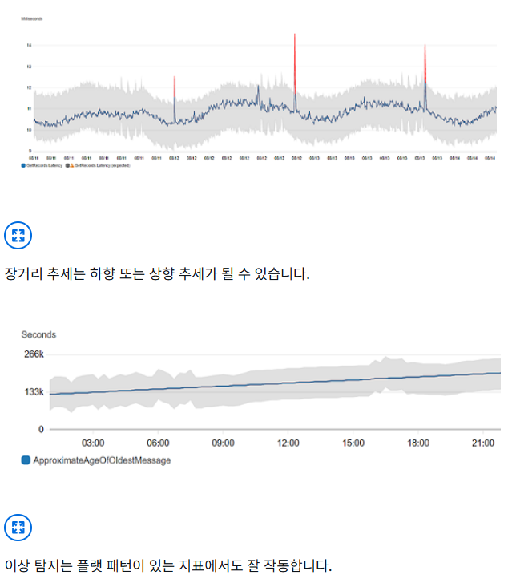

# 26년 5월 [Amazon AWS Certified Generative AI Developer - Professional(AIP-C01) 기출문제를 통해 AWS의 개념을 파악과 동시에 자격증 취득 목표]

1. 문제 및 정답 확인
2. 문제 설명
3. 정답 해설
4. 출제 의도 분석
5. 관련 AWS 공식 링크 공유

---

## 학습 개념 및 요약
## 생성형 AI(GenAI) 심화 운영 및 아키텍처 요약 (Q11~Q20)

* **Q11 유연한 거버넌스 및 흐름 제어**
* **Bedrock Flows & Detect Mode:** 입출력 양식을 표준화하고, 가드레일을 '차단'이 아닌 '감지(Detect)' 모드로 설정하여 답변을 유지하면서 위험만 모니터링하는 유연한 흐름 제어를 학습함.

* **Q12 자동화된 모델 평가 체계**
* **LLM-as-a-judge:** 상위 모델이 하위 모델의 답변을 채점하는 자동 평가와 전문 인적 검토를 결합하여, RAG의 정확도를 높이고 할루시네이션 탐지 비용을 절감하는 하이브리드 검증법을 익힘.

* **Q13 규제 준수와 가용성 확보**
* **Cross-Region Inference (CRI):** 데이터 레지던시(유럽 내 보관)를 준수하면서도, '추론 프로파일'과 SCP 확장을 통해 타 리전의 모델 자원을 빌려 쓰는 최신 추론 최적화 전략을 학습함.

* **Q14 정밀 가드레일 튜닝**
* **정의 및 샘플 문구 활용:** 가드레일 설정 시 단순 키워드가 아닌 구체적인 정의와 예시를 포함하여 오탐(False Positive)을 줄이고, 입출력 양방향에서 PII 마스킹을 수행하는 정교한 보안 설계를 익힘.

* **Q15 RAG 성능 및 정확도 최적화**
* **Knowledge Bases & Latency Config:** 기업 내부 카탈로그 기반의 RAG를 구현하여 할루시네이션을 방지하고, `PerformanceConfig` 설정을 통해 응답 지연 시간을 최소화하는 성능 튜닝법을 학습함.

* **Q16 지능형 에이전트 오케스트레이션**
* **Bedrock AgentCore:** 대화 문맥(Memory) 유지와 외부 시스템 호출(Action Groups)을 코드 없이 자동화하여, 복잡한 업무를 스스로 판단하고 실행하는 확장성 있는 에이전트 구조를 분석함.

* **Q17 복잡한 관계형 데이터 검색**
* **Graph RAG & Neptune:** 단순 벡터 검색으로 찾기 힘든 데이터 간의 다단계(Multi-hop) 관계를 분석하기 위해, 지식 그래프를 활용하여 복잡한 연결 고리를 3초 이내에 탐색하는 고난도 기술을 학습함.

* **Q18 실시간 운영 모니터링**
* **Contextual Grounding & Anomaly Detection:** 답변의 근거를 실시간 검증하여 할루시네이션을 막고, CloudWatch 이상 탐지로 비정상적인 토큰 소비와 비용 폭증을 조기에 감지하는 운영 방안을 익힘.

* **Q19 데이터 리니지 및 감사**
* **Glue Data Catalog & CloudTrail:** 다양한 데이터 소스를 중앙 카탈로그에 등록하고 메타데이터 태깅을 통해 생성 결과물의 출처(Traceability)를 보장하며, 전체 파이프라인의 접근 기록을 감사하는 체계를 학습함.

* **Q20 워크플로 병렬 처리**
* **Step Functions Parallel State:** 여러 단계의 분석(금융, 감성, 규제)을 순차적이 아닌 동시에 실행(Parallel)하여 전체 응답 시간을 45초에서 10초 이내로 단축하는 서버리스 최적화 기법을 분석함.

---

## (문제1)
Q11
A company is using Amazon Bedrock to design an application to help researchers apply for
grants. The application is based on an Amazon Nova Pro foundation model (FM). The application
contains four required inputs and must provide responses in a consistent text format. The
company wants to receive a notification in Amazon Bedrock if a response contains bullying
language. However, the company does not want to block all flagged responses.
The company creates an Amazon Bedrock flow that takes an input prompt and sends it to the
Amazon Nova Pro FM. The Amazon Nova Pro FM provides a response.
Which additional steps must the company take to meet these requirements? (Choose two)

[Answer]
A. Use Amazon Bedrock Prompt Management to specify the required inputs as variables. Select
an Amazon Nova Pro FM. Specify the output format for the response. Add the prompt to the
prompts node of the flow.

D. Create an Amazon Bedrock guardrail that applies the insults content filter. Set the filter
response to detect. Add the guardrail to the prompts node of the flow.

## **AWS 자격증 학습 활동 보고서**

### **1. 문제 및 정답 확인**

* **문제:** 연구원들의 보조금 신청을 돕는 앱에서 (1) 4개의 필수 입력을 받고 일관된 텍스트 형식을 유지해야 하며, (2) 괴롭힘(Bullying) 언어가 포함된 경우 알림을 받되, 답변 자체를 무조건 차단하지는 않으려 함. 이를 위해 Amazon Bedrock Flow에 추가해야 할 단계는?
* **정답:** * **A. Amazon Bedrock Prompt Management를 사용하여 필수 입력을 변수로 지정하고, 출력 형식을 설정함. 해당 프롬프트를 Flow의 프롬프트 노드에 추가함.**
* **D. '모욕(Insults)' 콘텐츠 필터를 적용한 Bedrock Guardrail을 생성함. 필터 응답을 '감지(Detect)'로 설정하고 이를 Flow의 프롬프트 노드에 추가함.**

---

### **2. 문제 설명**

* **상황:** AI가 연구원 대신 서류를 써주는데, 사용자가 입력해야 할 4가지 정보(이름, 금액 등)를 빠뜨리지 않게 양식을 관리해야 함. 또한, AI 답변 중에 부적절한 언어가 섞여 있는지 감시는 하고 싶지만, 너무 엄격하게 답변 전체를 막아버리고 싶지는 않은 유연한 관리가 필요한 상황임.
* **핵심:** 프롬프트의 '틀(Template)'을 만드는 기능과, 위험 요소를 '차단'이 아닌 '감지'만 하도록 설정하는 세밀한 안전장치가 핵심임.

---

### **3. 정답 해설**

* **A (Prompt Management):** 일관된 형식을 유지하기 위해 프롬프트를 템플릿화하는 도구임. 4개의 입력을 `{{variable}}` 형태로 지정하면 형식이 깨지지 않고 항상 일정한 결과물을 얻을 수 있음.
* **D (Guardrail - Detect 모드):** 보통 가드레일은 부적절한 말을 하면 답변을 '차단'하고 미리 정해진 거절 문구를 내보냄. 하지만 문제에서는 "차단하지 않고 알림만 받고 싶다"고 했으므로, 필터 동작을 'Detect(감지)'로 설정하여 시스템이 모니터링은 하되 답변은 그대로 내보내게 함.
* **Bedrock Flow와의 결합:** 이 모든 설정(프롬프트 양식 + 감시 규칙)을 작업 흐름(Flow)의 각 단계(Node)에 연결하여 자동화된 프로세스를 완성함.

---

### **4. 문제 출제의도 분석**

* **고도화된 AI 거버넌스:** 무조건적인 차단이 아닌, 비즈니스 요구에 맞춰 감시(Detection)와 **허용** 사이의 균형을 맞출 수 있는지 확인함.
* **프롬프트 엔지니어링의 자산화:** 코드가 아닌 Bedrock 내의 관리 도구를 사용하여 입력 변수와 출력 형식을 표준화하는 능력을 평가함.
* **Bedrock Flow 활용 능력:** 여러 Bedrock 기능(Prompt, Guardrail, Model)을 하나의 시각적 워크플로(Flow)로 엮어 복잡한 비즈니스 로직을 구현할 수 있는지 확인함.

---

### **5. 관련 AWS 링크 공유**

* [Amazon Bedrock Prompt Management 활용하기](https://docs.aws.amazon.com/ko_kr/bedrock/latest/userguide/prompt-management.html)
* [Amazon Bedrock 가드레일의 콘텐츠 필터링 및 감지](https://docs.aws.amazon.com/ko_kr/bedrock/latest/userguide/guardrails-components.html)

---

---

## (문제2)
Q12
A healthcare company is using Amazon Bedrock to build a Retrieval Augmented Generation
(RAG) application that helps practitioners make clinical decisions. The application must achieve
high accuracy for patient information retrievals, identify hallucinations in generated content, and
reduce human review costs.
Which solution will meet these requirements?

D. Deploy a hybrid evaluation system that uses an automated LLM-as-a-judge evaluation to
initially screen responses and targeted human reviews for edge cases. Use Amazon SageMaker
Feature Store to maintain evaluation datasets. Use a built-in Amazon Bedrock evaluation to track
retrieval precision and hallucination rates.

## **AWS 자격증 학습 활동 보고서**

### **1. 문제 및 정답 확인**

* **문제:** 의료 정보를 다루는 RAG 기반 앱에서 (1) 높은 검색 정확도 확보, (2) 생성된 답변의 할루시네이션(환각) 식별, (3) 인적 검토 비용 절감을 모두 충족하는 솔루션은?
* **정답:** **D. LLM-as-a-judge 기반의 자동 평가 시스템을 구축하여 1차 스크리닝을 수행하고, 까다로운 사례(Edge cases)에 대해서만 선택적으로 인적 검토를 진행함. Bedrock의 기본 평가 기능을 사용하여 검색 정밀도와 할루시네이션 비율을 추적함.**

---

### **2. 문제 설명**

* **상황:** 환자의 생명을 다루는 의료 분야이므로 AI의 답변이 완벽해야 함. 하지만 모든 답변을 사람이 일일이 검토하기에는 비용과 시간이 너무 많이 듦.
* **미션:** "AI가 AI를 채점"하게 하여 대부분의 업무를 자동화하고, 정말 애매한 문제만 전문가(의사)가 확인하게 하여 효율성을 극대화해야 함.
* **핵심:** 사람이 다 하는 대신 '자동화된 평가(LLM-as-a-judge)'를 1차 방어선으로 구축하고, Bedrock의 내장 도구로 정확도를 수치화하는 것임.

---

### **3. 정답 해설**

* **LLM-as-a-judge:** 성능이 더 뛰어난 상위 AI 모델에게 "이 답변이 정확한지, 근거 문서와 일치하는지" 점수를 매기게 하는 방식임. 이를 통해 수천 개의 답변을 순식간에 검토할 수 있음.
* **하이브리드 평가:** 자동 평가에서 점수가 낮거나 판단이 어려운 '에지 케이스'만 사람에게 전달함. 전체 검토 비용을 획기적으로 줄이면서도 의료적 안정성을 확보함.
* **Bedrock Evaluation:** Amazon Bedrock에는 답변의 정확도(Accuracy), 정밀도(Precision), 할루시네이션 발생 여부를 측정하는 내장 평가 도구가 있어 성능 지표를 객관적으로 관리할 수 있음.

---

### **4. 문제 출제의도 분석**

* **평가 프로세스의 효율화:** 수동 검토의 한계를 인지하고, 최신 트렌드인 **'자동화된 모델 평가'** 방식을 실무에 제안할 수 있는지 확인함.
* **RAG 품질 관리 지표:** 단순히 답변을 내보내는 것을 넘어, 검색 정밀도(Retrieval Precision)와 근거성(Grounding)을 어떻게 기술적으로 측정할 것인지 평가함.
* **의료 분야의 특수성 이해:** 비용 절감과 높은 정확도라는 상충하는 목표를 '하이브리드(자동+수동)' 방식으로 해결하는 능력을 확인함.

---

### **5. 관련 AWS 링크 공유**

* [Amazon Bedrock 모델 평가(Model Evaluation) 시작하기](https://www.google.com/search?q=https://docs.aws.amazon.com/ko_kr/bedrock/latest/userguide/model-evaluation.html)
* [RAG 애플리케이션의 품질 측정을 위한 지표 이해](https://www.google.com/search?q=https://docs.aws.amazon.com/ko_kr/bedrock/latest/userguide/knowledge-bases-test.html)

---

## (문제3)
Q13
Company configures a landing zone in AWS Control Tower. The company handles sensitive data
that must remain within the European Union. The company must use only the eu-central-1
Region. The company uses SCPs to enforce data residency policies. GenAI developers at the
company are assigned IAM roles that have full permissions for Amazon Bedrock.
The company must ensure that GenAI developers can use the Amazon Nova Pro model through
Amazon Bedrock only by using cross-Region inference (CRI) and only in eu-central-1. The
company enables model access for the GenAI developer IAM roles in Amazon Bedrock. However,
when a GenAI developer attempts to invoke the model through the Amazon Bedrock Chat/Text
playground, the GenAI developer receives the following error.
User: arn:aws:sts::123456789012:assumed-role/AssumedDevRole/DevUserName
Action: bedrock:InvokeModelWithResponseStream
On resource(s): arn:aws:bedrock:eu-west-3::foundation-model/amazon.nova-pro-v1:0
Context: a service control policy explicitly denies the action
The company needs a solution to resolve the error. The solution must retain the company's
existing governance controls and must provide precise access control. The solution must comply
with the company's existing data residency policies.
Which combination of solutions will meet these requirements? (Choose two)

B. Extend the existing SCPs to enable CRI for the eu.amazon.nova-pro-v1:0 inference profile.
D. Validate that the GenAI developer IAM roles have permissions to invoke Amazon Nova Pro
through the eu.amazon.nova-pro.v1:0 inference profile on all European Union AWS Regions that
can serve the model.

## **AWS 자격증 학습 활동 보고서**

### **1. 문제 및 정답 확인**

* **문제:** 데이터 레지던시(유럽 연합 내 보관)를 위해 `eu-central-1` 리전만 사용하도록 SCP로 제한된 환경임. 개발자가 Amazon Nova Pro 모델을 교차 리전 추론(Cross-Region Inference, CRI)을 통해 사용하려 할 때 SCP 거부 에러가 발생함. 기존 거버넌스와 데이터 정책을 유지하면서 이를 해결하는 방법은?
* **정답:** * **B. 기존 SCP를 확장하여 `eu.amazon.nova-pro-v1:0` 추론 프로파일(Inference profile)에 대해 CRI를 허용하도록 설정함.**
* **D. GenAI 개발자 IAM 역할이 모델을 제공할 수 있는 모든 EU 리전에서 `eu.amazon.nova-pro-v1:0` 추론 프로파일을 통해 모델을 호출할 수 있는 권한이 있는지 확인함.**

---

### **2. 문제 설명**

* **상황:** 회사는 "무조건 프랑크푸르트(`eu-central-1`) 리전만 써라"라고 빗장을 걸어둠(SCP). 하지만 특정 AI 모델은 성능이나 가용성을 위해 근처의 다른 유럽 리전 자원을 빌려 쓰는 '교차 리전 추론(CRI)' 기능이 필요함.
* **문제점:** 현재의 SCP는 다른 리전으로의 접근을 무조건 막고 있기 때문에, AI가 옆 동네 리전의 힘을 빌리러 가는 길목에서 차단당해 에러가 발생한 것임.
* **핵심:** '유럽 연합 내'라는 원칙은 지키되, AI가 유럽 내 다른 리전(`eu-west-3` 등)의 자원을 안전하게 빌려 쓸 수 있도록 **추론 프로파일**이라는 특수 통로만 SCP에서 예외적으로 열어주는 것임.

---

### **3. 정답 해설**

* **Inference Profile (추론 프로파일):** CRI를 사용할 때 리전 이름이 포함된 특수한 ID(예: `eu.amazon...`)를 사용함. 이를 통해 AWS는 여러 리전의 부하를 분산하면서도 데이터는 약속된 지역(유럽 내)을 벗어나지 않게 관리함.
* **B (SCP 확장):** 현재 SCP가 모든 타 리전 작업을 막고 있으므로, "유럽 내 모델 추론 프로파일을 사용하는 작업"만은 허용하도록 정책을 수정해야 함.
* **D (IAM 권한 확인):** 모델을 실제로 호출하는 것은 개발자의 IAM 역할임. 이 역할이 단순히 `eu-central-1`뿐만 아니라, 실제 추론이 일어날 수 있는 다른 EU 내 대상 리전들에서도 권한을 가지고 있어야 에러 없이 동작함.

---

### **4. 문제 출제의도 분석**

* **데이터 레지던시와 신기술의 조화:** 엄격한 보안 정책(SCP) 하에서 Amazon Bedrock의 최신 기능인 교차 리전 추론(CRI)을 어떻게 안전하게 도입하는지 아는지 확인함.
* **추론 프로파일(Inference Profiles) 이해:** CRI를 구현할 때 리소스 ARN이 개별 리전이 아닌 시스템 정의 프로파일 형태로 바뀐다는 기술적 세부 사항을 파악하고 있는지 평가함.
* **트러블슈팅 능력:** 에러 메시지에 찍힌 리전(`eu-west-3`)과 정책 거부 사유를 보고, SCP의 리전 제한 정책이 원인임을 식별할 수 있는지 확인함.

---

### **5. 관련 AWS 링크 공유**

* [Amazon Bedrock 교차 리전 추론(CRI) 사용하기](https://docs.aws.amazon.com/ko_kr/bedrock/latest/userguide/cross-region-inference.html)
* [Amazon Bedrock용 추론 프로파일 관리](https://docs.aws.amazon.com/ko_kr/bedrock/latest/userguide/inference-profiles.html)

---

---

## (문제4)
Q14
A financial services company is developing a customer service AI assistant by using Amazon
Bedrock. The AI assistant must not discuss investment advice with users. The AI assistant must
block harmful content, mask personally identifiable information (PII), and maintain audit trails for
compliance reporting. The AI assistant must apply content filtering to both user inputs and model
responses based on content sensitivity.
The company requires an Amazon Bedrock guardrail configuration that will effectively enforce
policies with minimal false positives. The solution must provide multiple handling strategies for
multiple types of sensitive content.
Which solution will meet these requirements?

C. Configure a guardrail and set content filters to medium for harmful content. Set up denied
topics for investment advice and include clear definitions and sample phrases to block.
Configure sensitive information filters to mask PII in responses and to block financial information
in inputs. Enable both input and output evaluations that use custom blocked messages for audits.

## **AWS 자격증 학습 활동 보고서**

### **1. 문제 및 정답 확인**

* **문제:** 금융 서비스 회사가 Bedrock으로 AI 비서를 개발하면서 (1) 투자 조언 금지, (2) 유해 콘텐츠 차단, (3) PII(개인식별정보) 마스킹, (4) 감사 추적(Audit Trail) 유지를 모두 충족하는 최소 오탐(False Positive)의 가드레일 설정 방법은?
* **정답:** **C. 가드레일을 구성하고 유해 콘텐츠 필터를 'Medium'으로 설정함. 투자 조언에 대해 명확한 정의와 샘플 문구를 포함한 '거부된 주제(Denied Topics)'를 설정함. 응답 시 PII를 마스킹하고 입력 시 금융 정보를 차단하도록 민감 정보 필터를 구성함. 감사를 위해 사용자 지정 차단 메시지를 사용하는 입력 및 출력 평가를 모두 활성화함.**

---

### **2. 문제 설명**

* **상황:** 금융 비서가 선을 넘지 않게 안전장치를 달아야 함. "어떤 주식을 살까요?"라는 질문에 답하면 안 되고(투자 조언 금지), 고객의 주민번호 같은 정보는 가려야 하며(PII 마스킹), 나중에 문제가 생겼을 때 확인 가능한 기록(감사)이 남아야 함.
* **미션:** 너무 엄격해서 일반적인 대화까지 막아버리는 '오탐'은 줄이되, 필요한 규정은 확실히 지키는 균형 잡힌 가드레일을 만드는 것임.
* **핵심:** '거부된 주제'에 구체적인 예시를 넣어 정확도를 높이고, 입구(사용자 질문)와 출구(AI 답변)를 모두 검사하는 설계를 하는 것임.

---

### **3. 정답 해설**

* **콘텐츠 필터 (Medium):** 'High'로 설정하면 너무 보수적이라 정상적인 대화도 차단될 수 있고, 'Low'는 위험함. 'Medium'은 보안과 가용성 사이의 적절한 타협점임.
* **Denied Topics (거부된 주제):** 단순히 "투자 조언 금지"라고만 적지 않고, **구체적인 정의와 샘플 문구**를 넣으면 AI가 문맥을 더 정확히 파악하여 오탐을 줄일 수 있음.
* **PII 마스킹 & 금융 정보 차단:** * **응답 시 마스킹:** AI가 실수로 개인정보를 말하려 할 때 `****` 등으로 가려줌.
* **입력 시 차단:** 사용자가 계좌번호 등 민감한 금융 정보를 입력하며 질문하는 것을 입구에서 컷(Block)함.

* **감사(Audit) 활성화:** 입력/출력 평가를 모두 켜고 사용자 지정 차단 메시지를 설정하면, 어떤 가드레일에 의해 답변이 막혔는지 기록이 남아 규제 준수 보고에 활용할 수 있음.

---

### **4. 문제 출제의도 분석**

* **정밀한 정책 강제:** 단순 차단을 넘어 '정의'와 '샘플 문구'를 활용해 **오탐을 최소화**하는 실무적인 가드레일 튜닝 능력을 확인함.
* **다중 필터링 전략:** 유해성, 주제, 민감 정보라는 서로 다른 성격의 위협을 각각의 전문 필터로 적절히 배치할 수 있는지 평가함.
* **금융권 규제 준수:** 데이터 보호(PII 마스킹)와 감사 기록 확보(Audit Trail)라는 금융권 특유의 요구사항을 아키텍처에 녹여낼 수 있는지 확인함.

---

### **5. 관련 AWS 공식 링크**

* [Amazon Bedrock 가드레일: 거부된 주제 설정 가이드](https://www.google.com/search?q=https://docs.aws.amazon.com/ko_kr/bedrock/latest/userguide/guardrails-topics.html)
* [민감한 정보 필터를 사용한 PII 제거 및 차단](https://docs.aws.amazon.com/ko_kr/bedrock/latest/userguide/guardrails-sensitive-filters.html)

---

## (문제5)
Q15
An ecommerce company is developing a generative AI (GenAI) solution that uses Amazon
Bedrock with Anthropic Claude to recommend products to customers. Customers report that
some of the recommended products are not available for sale on the website or are not relevant
to the customer. Customers also report that the solutions takes a long time to generate some
recommendations.
The company investigates the issues and finds that most interactions between customers and the
product recommendation solution are unique. The company confirms that the solutions
recommends products that are not in the company's product catalog. The company must resolve
these issues.
Which solution will meet this requirement?

C. Create an Amazon Bedrock knowledge base. Implement Retrieval Augmented Generation
(RAG). Set the PerformanceConfigLatency parameter to optimized.

## **AWS 자격증 학습 활동 보고서**

### **1. 문제 및 정답 확인**

* **문제:** 이커머스 추천 시스템에서 AI가 (1) 카탈로그에 없는 상품을 추천(할루시네이션)하거나, (2) 관련 없는 상품을 추천하고, (3) 응답 시간이 너무 오래 걸리는 문제가 발생함. 이를 해결하기 위한 가장 적합한 방안은?
* **정답:** **C. Amazon Bedrock 지식 기반(Knowledge Base)을 생성함. RAG(검색 증강 생성)를 구현하고, `PerformanceConfigLatency` 파라미터를 `optimized`로 설정함.**

---

### **2. 문제 설명**

* **상황:** AI가 회사의 실제 판매 목록(카탈로그)을 잘 모르는 상태에서 아는 척하며 가짜 상품을 추천하거나, 엉뚱한 소리를 하느라 답변이 늦어지는 상황임.
* **미션:** AI에게 "이 책(카탈로그) 안에서만 보고 대답해!"라고 정답지를 주고, "최대한 빨리 대답해!"라고 채찍질해야 함.
* **핵심:** 최신 데이터를 참고하게 만드는 **'RAG'** 기술로 정확도를 잡고, 성능 설정(PerformanceConfig)을 통해 속도를 잡는 것임.

---

### **3. 정답 해설**

* **RAG (Retrieval Augmented Generation):** AI 모델이 가진 일반적인 지식에 의존하지 않고, 회사의 실제 '제품 카탈로그' 데이터를 먼저 검색(Retrieval)한 뒤 그 내용을 바탕으로 답변을 생성(Generation)하게 함. 이를 통해 존재하지 않는 상품을 추천하는 현상을 방지함.
* **Bedrock Knowledge Base:** RAG를 구현하기 위한 데이터 소스(S3 등)와 벡터 데이터베이스 연결을 자동화해주는 관리형 서비스임.
* **PerformanceConfigLatency (Optimized):** Amazon Bedrock에서 응답 속도를 최적화하기 위한 설정임. 모델 추론 과정에서 지연 시간(Latency)을 최소화하도록 구성하여 고객이 느끼는 응답 대기 시간을 줄여줌.

---

### **4. 문제 출제의도 분석**

* **할루시네이션(환각) 방지 전략:** 모델의 학습 데이터가 아닌 기업 내부의 '실시간 데이터'를 어떻게 반영할 것인지(RAG) 묻는 전형적인 패턴임.
* **지연 시간(Latency) 최적화 능력:** 단순한 정확도 개선을 넘어, 실제 서비스 운영 시 중요한 요소인 '속도' 문제를 해결하기 위한 구체적인 파라미터 설정을 알고 있는지 확인함.
* **데이터 일관성 확보:** 제품 카탈로그와 AI 추천 간의 정렬(Alignment)을 위해 Knowledge Base를 활용하는 설계 능력을 평가함.

---

### **5. 관련 AWS 공식 링크**

* [Amazon Bedrock 지식 기반(Knowledge Bases) 소개](https://www.google.com/search?q=https://docs.aws.amazon.com/ko_kr/bedrock/latest/userguide/knowledge-bases.html)
* [Amazon Bedrock 모델 추론 성능 최적화](https://docs.aws.amazon.com/ko_kr/bedrock/latest/userguide/inference-parameters.html)

---

## (문제6)
Q16
A company is using AWS Lambda and REST APIs to build a reasoning agent to automate support
workflows. The system must preserve memory across interactions, share the relevant agent state,
and support event-driven invocation and synchronous invocation. The system must also enforce
access control and session-based permissions.
Which combination of steps provides the MOST scalable solution? (Choose two)

A. Use Amazon Bedrock AgentCore to manage memory and session-aware reasoning. Deploy
the agent with built-in identity support, event handling, and observability.
B. Register the Lambda functions and the REST APIs as actions by using Amazon API Gateway
and Amazon EventBridge. Enable Amazon Bedrock AgentCore to invoke the Lambda functions
and the REST APIs without custom orchestration code.

## **AWS 자격증 학습 활동 보고서**

### **1. 문제 및 정답 확인**

* **문제:** 지원 워크플로 자동화를 위한 추론 에이전트(Reasoning Agent)를 구축해야 함. 대화 내용(Memory) 유지, 에이전트 상태 공유, 이벤트 기반 및 동기식 호출 지원, 그리고 세션 기반 권한 제어가 필요함. 가장 확장성 있는 솔루션을 위한 두 가지 단계는?
* **정답:** * **A. Amazon Bedrock AgentCore를 사용하여 메모리 및 세션 인지 추론을 관리함. 내장된 ID 지원, 이벤트 처리 및 관찰성(Observability) 기능을 갖춘 에이전트를 배포함.**
* **B. Lambda 함수와 REST API를 Amazon API Gateway 및 EventBridge를 사용하여 액션(Action)으로 등록함. 커스텀 오케스트레이션 코드 없이 Amazon Bedrock AgentCore가 이를 호출하도록 설정함.**

---

### **2. 문제 설명**

* **상황:** "똑똑한 AI 상담원"을 만드는데, 이 상담원이 앞서 했던 말을 기억해야 하고(메모리), 필요할 때 특정 작업(환불 처리, 메일 발송 등)을 스스로 수행해야 함.
* **미션:** 개발자가 "기억해라", "이럴 땐 저걸 해라"라고 일일이 복잡한 코드를 짜지 않고, AWS의 **에이전트 전용 도구**를 사용해 자동으로 일을 처리하게 만들어야 함.
* **핵심:** 'AgentCore'라는 두뇌가 기억과 판단을 담당하고, 'Action Group'이라는 손발을 통해 외부 기능(Lambda)을 실행하는 구조임.

---

### **3. 정답 해설**

* **Amazon Bedrock AgentCore:** 에이전트의 '중앙 관리자' 역할을 함. 사용자와의 대화 맥락을 기억하고, 다음에 어떤 행동을 할지 결정하는 복잡한 추론 과정을 알아서 처리해줌.
* **Action (액션) 등록:** AI가 판단만 하고 끝나는 게 아니라 실제 업무를 수행하려면 Lambda나 API가 필요함. 이를 '액션 그룹'으로 등록해두면, 에이전트가 상황에 맞춰 "지금은 환불 Lambda를 실행해야겠군!"이라며 스스로 판단해 호출함.
* **최소한의 커스텀 코드:** 이전에는 대화 기록을 DB에 저장하고 불러오는 코드를 직접 짰어야 했지만, Bedrock 에이전트를 쓰면 이런 오케스트레이션(조율) 과정이 자동화되어 확장성이 매우 뛰어남.

---

### **4. 문제 출제의도 분석**

* **에이전트 오케스트레이션 이해:** 복잡한 워크플로를 수동으로 코딩하는 방식과 Bedrock Agent와 같은 **관리형 에이전트 서비스**를 사용하는 방식의 차이를 알고 있는지 확인함.
* **메모리 및 세션 관리:** AI가 대화의 문맥을 유지하기 위해 필요한 '메모리' 기능을 인프라 단에서 어떻게 효율적으로 처리하는지 평가함.
* **이벤트 기반 아키텍처:** API Gateway와 EventBridge를 활용해 동기/비동기 작업을 유연하게 연결하는 설계 능력을 확인함.

---

### **5. 관련 AWS 공식 링크**

* [Amazon Bedrock 에이전트란 무엇입니까?](https://docs.aws.amazon.com/ko_kr/bedrock/latest/userguide/agents.html)
* [에이전트 메모리를 사용한 대화 유지 관리](https://docs.aws.amazon.com/ko_kr/bedrock/latest/userguide/agents-memory.html)

---

## (문제7)
Q17
A financial services company is developing a Retrieval Augmented Generation (RAG) application
to help investment analysts query complex financial relationships across multiple investment
vehicles, market sectors, and regulatory environments. The dataset contains highly
interconnected entities that have multi-hop relationships. The analysts must be able to examine
the relationships holistically to provide accurate investment guidance. The application must
deliver comprehensive answers that capture indirect relationships between financial entities. The
application must produce responses in less than 3 seconds.
Which solution will meet these requirements with the LEAST operational overhead?

A. Use Amazon Bedrock Knowledge Bases with Graph RAG and Amazon Neptune Analytics to
store the financial data. Analyze the multi-hop relationships between entities and automatically
identify related information across documents.

## **AWS 자격증 학습 활동 보고서**

### **1. 문제 및 정답 확인**

* **문제:** 투자 분석가가 복잡한 금융 관계(투자 수단, 시장 부문, 규제 환경 등)를 쿼리할 수 있는 RAG 앱을 개발 중임. 데이터셋은 **엔티티 간의 고도로 연결된 다단계(Multi-hop) 관계**를 포함하고 있으며, 이를 종합적으로 분석해 3초 이내에 답변을 제공해야 함. 가장 효율적인 솔루션은?
* **정답:** **A. Amazon Bedrock Knowledge Bases에서 Graph RAG와 Amazon Neptune Analytics를 사용하여 금융 데이터를 저장함. 엔티티 간의 다단계 관계를 분석하고 문서 간의 관련 정보를 자동으로 식별함.**

---

### **2. 문제 설명**

* **상황:** "A 회사가 B 회사의 지분을 가졌고, B 회사는 C 시장에 투자했는데, C 시장의 규제가 바뀌면 A 회사에 어떤 영향이 있는가?"와 같은 꼬리에 꼬리를 무는 복잡한 질문에 답해야 함.
* **문제점:** 일반적인 검색(벡터 검색)은 단어의 유사성만 찾기 때문에 이런 복잡한 '관계의 사슬'을 따라가는 데 한계가 있고 속도도 느려질 수 있음.
* **핵심:** 점(엔티티)과 선(관계)으로 이루어진 **'그래프(Graph)'** 구조를 활용해 데이터 사이를 빠르게 점프하며 정보를 찾는 **Graph RAG** 기술을 사용하는 것임.

---

### **3. 정답 해설**

* **Graph RAG:** 기존 RAG가 문서의 구절을 찾는 방식이라면, Graph RAG는 문서 내의 핵심 개념들을 추출해 그들 사이의 지식 지도(Knowledge Graph)를 만든 뒤 이를 바탕으로 답변함. 다단계(Multi-hop) 질문에 매우 강력함.
* **Amazon Neptune Analytics:** 그래프 데이터를 초고속으로 분석하는 엔진임. 수백만 개의 관계 사이를 빠르게 탐색하여 문제의 요구사항인 '3초 이내 응답'을 가능하게 함.
* **Bedrock Knowledge Bases 통합:** 이 복잡한 그래프 생성 및 검색 과정을 Bedrock이 관리형 서비스로 제공하므로, 개발자가 직접 복잡한 로직을 짤 필요 없이 **운영 오버헤드를 최소화**할 수 있음.

---

### **4. 문제 출제의도 분석**

* **최신 RAG 기법 인지:** 단순 벡터 검색의 한계를 이해하고, 고도로 연결된 데이터를 처리하기 위한 **Graph RAG**의 필요성을 아는지 확인함.
* **특수 데이터베이스 활용:** 관계형(RDS)이나 문서형(S3)이 아닌, 관계 중심 데이터를 처리하는 그래프 데이터베이스(Neptune)의 용도를 평가함.
* **성능과 복잡도의 균형:** 복잡한 쿼리를 빠른 시간 내에 처리해야 하는 고난도 비즈니스 요구사항을 AWS 최신 AI 스택으로 해결할 수 있는지 확인함.

---

### **5. 관련 AWS 공식 링크**

* [Amazon Bedrock Knowledge Bases에서 Graph RAG 사용하기](https://www.google.com/search?q=https://docs.aws.amazon.com/ko_kr/bedrock/latest/userguide/knowledge-bases-graph-rag.html)
* [Amazon Neptune Analytics를 통한 그래프 데이터 분석](https://www.google.com/search?q=https://docs.aws.amazon.com/ko_kr/neptune/latest/userguide/neptune-analytics.html)

---

## (문제8)
Q18
A healthcare company uses Amazon Bedrock to deploy an application that generates summaries
of clinical documents. The application experiences inconsistent response quality with occasional
factual hallucinations. Monthly costs exceed the company's projections by 40%. A GenAI
developer must implement a near real-time monitoring solution to detect hallucinations, identify
abnormal token consumption, and provide early warnings of cost anomalies. The solution must
require minimal custom development work and maintenance overhead.
Which solution will meet these requirements?

C. Configure Amazon Bedrock to store model invocation logs in an Amazon S3 bucket. Enable
text output logging. Configure Amazon Bedrock guardrails to run contextual grounding checks to
detect hallucinations. Create Amazon CloudWatch anomaly detection alarms for token usage
metrics.

## **AWS 자격증 학습 활동 보고서**

### **1. 문제 및 정답 확인**

* **문제:** 의료 문서 요약 앱에서 (1) 사실적 할루시네이션 발생, (2) 예상보다 40% 높은 비용 발생 문제를 겪고 있음. 할루시네이션 탐지, 토큰 소비 모니터링, 비용 이상 징후 조기 경고를 **최소한의 개발 노력**으로 해결하는 방법은?
* **정답:** **C. Amazon Bedrock의 모델 호출 로그를 S3 버킷에 저장하도록 구성하고 텍스트 출력 로깅을 활성화함. 할루시네이션 탐지를 위해 Bedrock 가드레일의 '맥락적 근거 확인(Contextual grounding checks)'을 구성함. 토큰 사용량 메트릭에 대해 CloudWatch 이상 탐지(Anomaly detection) 알람을 생성함.**

---

### **2. 문제 설명**

* **상황:** AI가 의료 데이터를 요약하면서 거짓말(할루시네이션)을 하고, 돈은 돈대로 더 쓰고 있는 비상 상황임.
* **미션:** "AI가 헛소리를 하는지" 실시간으로 감시하고, "평소보다 돈을 너무 많이 쓰면" 즉시 알려주는 경보 시스템을 만들어야 함.
* **핵심:** 직접 코드를 짜서 검사하지 말고, Bedrock 가드레일의 **'근거 확인'** 기능과 CloudWatch의 **'인공지능 알람'** 기능을 활용하는 것임.

---

### **3. 정답 해설**

* **모델 호출 로그 (S3):** AI가 어떤 질문에 어떤 답을 했는지 모든 기록을 남기는 것임. 나중에 문제가 생겼을 때 원인을 파악하는 기초 자료가 됨.
* **맥락적 근거 확인 (Contextual Grounding Checks):** Bedrock 가드레일의 핵심 기능 중 하나로, AI의 답변이 원문(근거 문서)에 실제로 포함된 내용인지 점수를 매겨 검증함. 근거 없는 답변(할루시네이션)이 나가는 것을 입구에서 막을 수 있음.
* **CloudWatch 이상 탐지 알람:** 토큰 사용량 데이터를 학습하여, 평소와 다른 비정상적인 사용 패턴(비용 폭증 징후)이 나타나면 자동으로 알람을 보냄. 사람이 일일이 기준값을 정할 필요가 없어 관리가 매우 쉬움.

---

### **4. 문제 출제의도 분석**

* **운영 및 모니터링 역량:** 성능(품질)과 비용(토큰 사용량)이라는 두 마리 토끼를 잡기 위한 AWS 표준 모니터링 도구 활용법을 아는지 확인함.
* **최소 운영 오버헤드:** 사용자 정의 스크립트가 아닌, **가드레일**과 **CloudWatch 이상 탐지** 같은 관리형 기능을 우선적으로 선택할 수 있는지 평가함.
* **의료 보안 및 신뢰성:** 할루시네이션이 치명적인 의료 분야에서 **Contextual Grounding**이 얼마나 중요한 도구인지 인지하고 있는지 확인함.

---

### **5. 관련 AWS 공식 링크**

* [Amazon Bedrock 가드레일: 맥락적 근거 확인(Contextual Grounding)](https://www.google.com/search?q=https://docs.aws.amazon.com/ko_kr/bedrock/latest/userguide/guardrails-contextual-grounding.html)
* [CloudWatch 이상 탐지(Anomaly Detection) 사용하기](https://docs.aws.amazon.com/ko_kr/AmazonCloudWatch/latest/monitoring/CloudWatch_Anomaly_Detection.html)

---

## (문제9)
Q19
A company is building a generative AI (GenAI) application that produces content based on a
variety of internal and external data sources. The company wants to ensure that the generated
output is fully traceable. The application must support data source registration and enable
metadata tagging to attribute content to its original source. The application must also maintain
audit logs of data access and usage throughout the pipeline.
Which solution will meet these requirements?

D. Use AWS Glue Data Catalog to register all data sources. Apply metadata tags to attribute data
sources. Use AWS CloudTrail to log access and activity across services.

## **AWS 자격증 학습 활동 보고서**

### **1. 문제 및 정답 확인**

* **문제:** 내부 및 외부의 다양한 데이터 소스를 사용하여 콘텐츠를 생성하는 GenAI 애플리케이션에서 (1) 결과물의 **추적성(Traceability)** 보장, (2) 데이터 소스 등록 및 메타데이터 태깅을 통한 출처 표시, (3) 전체 파이프라인의 데이터 액세스 및 사용 감사 로그 유지가 필요할 때 가장 적절한 솔루션은?
* **정답:** **D. AWS Glue Data Catalog를 사용하여 모든 데이터 소스를 등록함. 데이터 소스에 메타데이터 태그를 적용하여 속성을 부여함. AWS CloudTrail을 사용하여 서비스 전반의 액세스 및 활동을 로깅함.**

---

### **2. 문제 설명**

* **상황:** AI가 만든 답변이 "어디서 나온 정보인지" 꼬리표를 달아 관리하고 싶음. 수많은 데이터 소스(S3, 데이터베이스 등)를 한곳에서 관리하고, 누가 이 데이터를 썼는지 기록을 남겨야 하는 상황임.
* **미션:** 데이터의 '주소록'을 만들고(등록), 각 주소에 '설명'을 달고(태깅), 누가 방문했는지 '방명록'을 남기는(로깅) 시스템을 구축해야 함.
* **핵심:** 데이터의 통합 관리 창구인 'AWS Glue'와 보안 감사 기록관인 'CloudTrail'을 조합하는 것임.

---

### **3. 정답 해설**

* **AWS Glue Data Catalog:** AWS의 데이터 자산 관리 서비스임. 다양한 소스에 흩어진 데이터를 하나의 중앙 목록(Catalog)에 등록하여, AI 애플리케이션이 데이터를 조회할 때 일관된 방식으로 접근하고 출처를 파악할 수 있게 함.
* **메타데이터 태깅:** 데이터 소스마다 "이건 인사팀 데이터", "이건 외부 뉴스 기사" 같은 정보를 태그로 달아두면, 나중에 생성된 콘텐츠가 어떤 성격의 소스에서 유래했는지 추적하기 매우 쉬워짐.
* **AWS CloudTrail:** 누가 언제 Glue 데이터 카탈로그를 조회했는지, 어떤 API를 호출했는지 모든 활동을 기록함. 이는 "추적성"과 "감사 로그" 요구사항을 충족하는 가장 강력한 도구임.

---

### **4. 문제 출제의도 분석**

* **데이터 거버넌스 역량:** AI가 사용하는 데이터의 무결성과 출처를 관리하는 **데이터 리니지(Data Lineage)** 개념을 아는지 확인함.
* **중앙 집중식 메타데이터 관리:** 여러 리소스를 개별적으로 관리하지 않고, **Glue Data Catalog**라는 단일 진입점을 통해 인프라를 구조화할 수 있는지 평가함.
* **감사 및 규정 준수:** "Traceable(추적 가능)"이라는 키워드를 보고 즉각적으로 **CloudTrail** 로깅을 떠올릴 수 있는지 확인함.

---

### **5. 관련 AWS 공식 링크**

* [AWS Glue 데이터 카탈로그란 무엇입니까?](https://docs.aws.amazon.com/ko_kr/glue/latest/dg/populate-data-catalog.html)
* [AWS CloudTrail을 통한 데이터 거버넌스 및 감사](https://docs.aws.amazon.com/ko_kr/awscloudtrail/latest/userguide/cloudtrail-concepts.html)

---

## (문제10)
Q20
A financial services company needs to build a document analysis system that uses Amazon
Bedrock to process quarterly reports. The system must analyze financial data, perform sentiment
analysis, and validate compliance across batches of reports. Each batch contains 5 reports.
Each report requires multiple foundation model (FM) calls. The solution must finish the analysis
within 10 seconds for each batch. Current sequential processing takes 45 seconds for each
batch.
Which solution will meet these requirements?

B. Use AWS Step Functions with a Parallel state to invoke separate AWS Lambda functions for
each analysis type simultaneously. Configure Amazon Bedrock client timeouts. Use Amazon
CloudWatch metrics to track execution time and model inference latency.

## **AWS 자격증 학습 활동 보고서**

### **1. 문제 및 정답 확인**

* **문제:** 금융 분기 보고서 배치를 분석하는 시스템에서 (1) 금융 데이터 분석, (2) 감성 분석, (3) 규정 준수 검토를 수행해야 함. 현재 순차적(Sequential) 처리 시 45초가 소요되지만, 이를 **10초 이내**로 단축해야 할 때 가장 적절한 솔루션은?
* **정답:** **B. AWS Step Functions의 병렬(Parallel) 상태를 사용하여 각 분석 유형에 대한 별도의 AWS Lambda 함수를 동시에 호출함. Amazon Bedrock 클라이언트 타임아웃을 구성하고, CloudWatch 메트릭을 사용하여 실행 시간 및 모델 추론 지연 시간을 추적함.**

---

### **2. 문제 설명**

* **상황:** 해야 할 일이 세 가지(데이터 분석, 감성 분석, 규정 검토)인데, 한 사람이 순서대로 하나씩 하니 시간이 너무 오래 걸림(45초).
* **미션:** 세 가지 일을 세 사람(Lambda)에게 동시에 시켜서(병렬 처리) 가장 오래 걸리는 일의 시간만큼만 기다리게 하여 전체 시간을 10초 이내로 줄여야 함.
* **핵심:** 여러 작업을 동시에 지휘하는 마에스트로 역할인 'AWS Step Functions'의 **'Parallel State'** 기능을 사용하는 것임.

---

### **3. 정답 해설**

* **AWS Step Functions (Parallel State):** 워크플로 엔진인 Step Functions에서 제공하는 기능으로, 여러 작업을 독립된 경로로 나누어 **동시에 실행**하게 함. 45초 걸리던 작업을 가장 긴 단일 작업 시간(예: 8초) 수준으로 단축할 수 있음.
* **별도의 Lambda 함수:** 각 분석 목적에 맞는 전용 Lambda를 두어 책임 범위를 나누고, 병렬 실행 시 간섭이 없도록 설계함.
* **Client Timeouts:** 네트워크 지연 등으로 인해 특정 호출이 무한정 대기하는 것을 방지하여 전체 배치의 응답성을 보장함.
* **CloudWatch 모니터링:** 10초라는 엄격한 성능 목표(SLA)를 지키고 있는지 실시간으로 감시하고 병목 구간을 파악함.

---

### **4. 문제 출제의도 분석**

* **성능 최적화 역량:** 순차 처리를 병렬 처리로 전환하여 애플리케이션의 처리량(Throughput)과 응답 속도(Latency)를 개선하는 설계 능력을 확인함.
* **서버리스 오케스트레이션:** 복잡한 로직을 하나의 큰 함수로 짜는 대신, Step Functions를 이용해 작은 단위로 나누고 조율하는 **마이크로서비스 아키텍처** 이해도를 평가함.
* **실시간 요구사항 충족:** "10초 이내"라는 구체적인 성능 제약을 해결하기 위한 기술적 수단(Parallel State)을 아는지 확인함.

---

### **5. 관련 AWS 공식 링크**

* [AWS Step Functions의 병렬(Parallel) 상태 사용법](https://docs.aws.amazon.com/ko_kr/step-functions/latest/dg/amazon-states-language-parallel-state.html)
* [Amazon Bedrock과 AWS Step Functions 통합하기](https://docs.aws.amazon.com/ko_kr/step-functions/latest/dg/connect-bedrock.html)

---