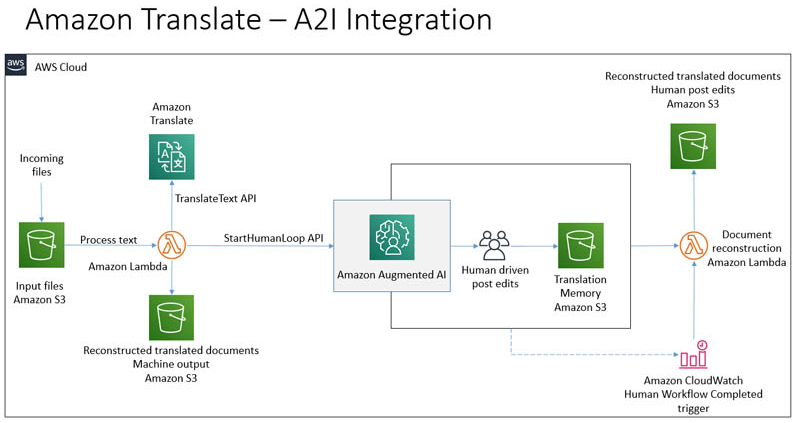

# 26년 7월 [Amazon AWS Certified Generative AI Developer - Professional(AIP-C01) 기출문제를 통해 AWS의 개념을 파악과 동시에 자격증 취득 목표]

1. 문제 및 정답 확인
2. 문제 설명
3. 정답 해설
4. 출제 의도 분석
5. 관련 AWS 공식 링크 공유

---

## 학습 개념 및 요약
* Q31 애플리케이션 관찰성 확보, "CloudWatch Application Insights & EMF: 임베디드 메트릭 형식(EMF)으로 커스텀 지표를 수집하고 이상 탐지(Anomaly Detection)를 설정하여, FM 성능 저하 패턴을 10분 이내 감지하는 모니터링 기법을 학습함."
* Q32 대용량 문서 RAG 고도화, "Semantic Chunking & RetrieveAndGenerate: 컨텍스트 창 한계를 우회하기 위해 95% 백분위수 임계값 기반 의미론적 청킹을 적용하고, 관리형 API로 최적의 청크를 동적 추출하여 요약 품질을 높이는 법을 익힘."
* Q33 초저지연 오토스케일링, "Provisioned Throughput & Auto Scaling: 50만 건의 대규모 동시 접속과 200ms 미만 지연 시간을 충족하기 위해 저지연 모델에 전용 처리량을 할당하고 자동 확장 정책을 연동하는 아키텍처를 분석함."
* Q34 관리형 모델 평가 및 시각화, "Bedrock Model Evaluation & BERTScore: 정기 스케줄 기반으로 S3 데이터셋을 접근해 BERTScore/RWK 지표로 모델 정확도를 자동 평가하고, CloudWatch 대시보드에 시각화하는 파이프라인을 학습함."
* Q35 서버리스 인간 개입(HITL), "Step Functions & Task Token: 규제 준수를 위해 AI 추천 생성 시 `waitForTaskToken`으로 실행을 일시 중지하고, 기술자의 승인 응답을 받아 DynamoDB에 감사 기록을 남기는 검토 워크플로를 익힘."
* Q36 금융 데이터 규정 준수, "Textract & A2I & PII Redaction: 동일 리전 내에서 OCR 처리 중 신뢰도가 낮은 문서만 사람 검토(A2I)로 라우팅하고, Lambda로 PII를 마스킹하여 리전별 데이터 레지던시를 완벽 준수하는 구조를 분석함."
* Q37 Q Business 엔터프라이즈 보안, "S3 Prefix ACL & IAM Identity Center: S3 버킷 루트의 `acl.json` 단일 설정 파일로 부서별 폴더(Prefix)와 IAM Identity Center 그룹 간 권한을 매핑하여 문서 수준 접근 제어를 최소 공수로 구현하는 법을 학습함."
* Q38 원스톱 근거 기반 답변, "Knowledge Base & RetrieveAndGenerate: 승인된 임상 문서만 지식 기반에 연결하고, `RetrieveAndGenerate` API 단일 호출로 환각을 차단함과 동시에 답변의 출처(Citations)를 자동 반환하는 패턴을 익힘."
* Q39 엔드투엔드 실시간 스트리밍, "Transcribe Partial Results & WebSocket: 음성 인식의 중간 결과(Partial Results) 추출, Bedrock 응답 스트리밍, API Gateway WebSocket을 결합하여 1초 미만 지연 시간의 양방향 상담 보조 아키텍처를 학습함."
* Q40 멀티모달 심층 보안 검구, "Comprehend PII & Rekognition & Step Functions: 이미지 유해성(Rekognition), 텍스트 PII(Comprehend), AI 출력 제어(Bedrock Guardrails)를 Step Functions 서버리스 파이프라인으로 통합하는 다중 보안 체계를 익힘."

---

## (문제1)
Q31
A company has a recommendation system. The system's applications run on Amazon EC2
instances. The applications make API calls to Amazon Bedrock foundation models (FMs) to
analyze customer behavior and generate personalized product recommendations.
The system is experiencing intermittent issues. Some recommendations do not match customer
preferences. The company needs an observability solution to monitor operational metrics and
detect patterns of operational performance degradation compared to established baselines. The
solution must also generate alerts with correlation data within 10 minutes when FM behavior
deviates from expected patterns.
Which solution will meet these requirements?

[Answer]
C. Enable Amazon CloudWatch Application Insights for the application resources. Create custom
metrics for recommendation quality, token usage, and response latency by using the CloudWatch
embedded metric format with dimensions for request types and user segments. Configure
CloudWatch anomaly detection on the model metrics. Establish log pattern analysis by using
CloudWatch Logs Insights.

### **1. 문제 및 정답 확인**

* **문제:** EC2 기반 추천 시스템이 Bedrock 모델을 호출할 때 일부 추천 결과가 고객 선호도와 맞지 않는 성능 저하 현상이 발생함. 관찰성(Observability) 솔루션을 구축하여 표준 베이스라인 대비 성능 저하 패턴을 감지하고, 이상 발생 시 10분 이내에 연관 데이터(Correlation data)와 함께 알림을 생성하는 방법은?
* **정답:** **C. 애플리케이션 리소스에 대해 Amazon CloudWatch Application Insights를 활성화함. 요청 유형 및 사용자 세그먼트에 대한 차원(Dimension)과 함께 CloudWatch 임베디드 메트릭 형식(EMF)을 사용하여 추천 품질, 토큰 사용량, 응답 지연 시간에 대한 커스텀 메트릭을 생성함. 모델 메트릭에 대해 CloudWatch 이상 탐지(Anomaly detection)를 구성함. CloudWatch Logs Insights를 사용하여 로그 패턴 분석을 설정함.**

---

### **3. 초심자용 정답 해설**

* **CloudWatch Application Insights:** 애플리케이션의 상태를 종합적으로 관찰하고, 이상 징후가 발견되었을 때 관련 로그와 메트릭을 하나로 묶어 연관 데이터(Correlation data) 형태의 알림을 제공하는 모니터링 도구임.
* **임베디드 메트릭 형식 (EMF, Embedded Metric Format):** 애플리케이션 로그 출력에 특정 구조의 JSON을 심어두면, CloudWatch가 이를 자동으로 맞춤형 지표(Custom Metrics)로 변환해 주는 기능임. 추가적인 API 호출 비용 없이 정확한 추천 품질이나 토큰 사용량을 기록할 수 있음.
* **CloudWatch Anomaly Detection (이상 탐지):** 과거 지표 데이터를 머신러닝으로 학습하여 고정된 수치가 아닌 '상대적 이상 패턴'을 감지함. 베이스라인 대비 모델의 응답이나 지연 시간이 튈 때 10분 이내에 정확한 알림을 발송해 줌.

---

### **4. 문제 출제의도 분석**

* **엔터프라이즈 AI 관찰성(Observability) 구현:** 단순 서비스 가동 여부를 넘어, 추천 품질이나 토큰 소비 패턴 같은 애플리케이션 수준의 이상을 통합 감지할 수 있는지 확인함.
* **고성능 데이터 추출 패턴:** 애플리케이션 성능에 영향을 주지 않고 로그에서 비동기로 지표를 추출하는 **EMF(Embedded Metric Format)** 패턴의 활용 능력을 평가함.
* **연관 분석 및 자동 알림:** 문제 원인 규명을 단속적 로그 조회가 아닌 CloudWatch의 자동 연관 분석(Correlation) 기능으로 단축할 수 있는지 확인함.

---

### **5. 관련 AWS 공식 링크**

* [CloudWatch Application Insights를 통한 모니터링 설정](https://docs.aws.amazon.com/ko_kr/AmazonCloudWatch/latest/monitoring/appinsights-what-is.html)
* [CloudWatch 임베디드 메트릭 형식(EMF)으로 지표 수집하기](https://docs.aws.amazon.com/ko_kr/AmazonCloudWatch/latest/monitoring/CloudWatch_Embedded_Metric_Format.html)

---

## (문제2)
Q32
An enterprise application uses an Amazon Bedrock foundation model (FM) to process and
analyze 50 to 200 pages of technical documents. Users are experiencing inconsistent responses
and receiving truncated outputs when processing documents that exceed the FM's context
window limits.
Which solution will resolve this problem?

[Answer]
C. Use semantic chunking with a breakpoint percentile threshold of 95% and a buffer size of 3
sentences. Use the Amazon Bedrock RetrieveAndGenerate API call to dynamically select the
most relevant chunks based on embedding similarity scores.

## **AWS 자격증 학습 활동 보고서**

### **1. 문제 및 정답 확인**

* **문제:** 50~200페이지에 달하는 대용량 기술 문서를 Bedrock FM으로 분석할 때, 모델의 컨텍스트 창(Context Window) 한도를 초과하여 답변이 잘리거나(Truncated) 일관성이 떨어지는 문제(Inconsistent responses)가 발생함. 이를 해결하는 방법은?
* **정답:** **C. 백분위수 임계값(Breakpoint percentile threshold) 95%와 버퍼 크기 3개 문장을 적용한 의미론적 청킹(Semantic Chunking)을 사용함. 임베딩 유사도 점수를 기반으로 가장 관련성 높은 청크를 동적으로 선택하기 위해 Amazon Bedrock의 `RetrieveAndGenerate` API 호출을 사용함.**

---

### **2. 초심자용 문제 설명**

* **상황:** AI에게 전공 서적 한 권 분량(200페이지)의 책을 한 번에 읽고 답하라고 하니, AI의 한 번에 읽을 수 있는 용량(컨텍스트 창)을 넘어서서 뒤쪽 내용이 잘려 나가고 엉뚱한 답을 내놓고 있음.
* **미션:** 책 전체를 통째로 읽히지 말고, 문맥이 끊기지 않도록 단락별로 예쁘게 잘라서(**Semantic Chunking**) 질문과 가장 관련 있는 페이지 조각만 쏙쏙 뽑아(**RetrieveAndGenerate**) AI에게 넘겨주어야 함.
* **핵심:** 글자 수로 무식하게 자르는 대신 의미 단위로 자르는 **의미론적 청킹**과, Bedrock의 관리형 RAG API인 `RetrieveAndGenerate`를 조합하는 것임.

---

### **3. 초심자용 정답 해설**

* **의미론적 청킹 (Semantic Chunking):** 단락이나 고정된 글자 수(예: 500자)로 무작위로 잘라버리면 문장의 맥락이 깨짐. 의미론적 청킹은 임베딩 기술을 활용해 문장 간의 의미 변화를 감지하여 내용의 주제가 바뀌는 시점(Breakpoint)에서 깔끔하게 단락을 잘라냄.
* **Breakpoint Percentile & Buffer:** 임계값 95%와 버퍼 크기 3문장을 설정하면, 의미가 확실히 달라지는 상위 5%의 구획 지점에서만 자르고 앞뒤 3문장의 문맥을 함께 보관하므로 정보 손실을 방지함.
* **`RetrieveAndGenerate` API:** Bedrock에서 제공하는 완전 관리형 RAG API임. 질문이 들어오면 지식 기반(Knowledge Base)에서 유사도 점수가 가장 높은 청크만 검색(Retrieve)해낸 뒤, 이를 바탕으로 정확한 답변을 생성(Generate)하여 200페이지짜리 문서도 잘림 없이 완벽히 처리함.

---

### **4. 문제 출제의도 분석**

* **대용량 문서 처리(Context Window Limit) 우회:** 모델의 컨텍스트 한계를 RAG 패턴으로 극복하는 지식을 테스트함.
* **RAG 전처리 기법 고도화:** 단순 고정 크기(Fixed-size) 청킹의 한계를 인지하고, 고급 RAG 기술인 **Semantic Chunking**의 매개변수를 이해하고 있는지 평가함.
* **AWS 관리형 RAG API 활용:** 검색과 생성을 단일 엔드포인트로 처리해 주는 **`RetrieveAndGenerate`** API를 선택하여 개발 공수를 줄일 수 있는지 확인함.

---

### **5. 관련 AWS 공식 링크**

* [Amazon Bedrock Knowledge Bases의 의미론적 청킹(Semantic Chunking) 전략](https://www.google.com/search?q=https://docs.aws.amazon.com/ko_kr/bedrock/latest/userguide/knowledge-bases-chunking.html)
* [Amazon Bedrock RetrieveAndGenerate API 설명서](https://docs.aws.amazon.com/ko_kr/bedrock/latest/APIReference/API_agent-runtime_RetrieveAndGenerate.html)

---

## (문제3)
Q33
A company is developing a generative AI (GenAI) application that analyzes customer service calls
in real-time and generates suggested responses for human customer service agents. The
application must process 500,000 concurrent calls during peak hours with less than 200 ms
end-to-end latency for each suggestion. The company uses existing architecture to transcribe
customer call audio streams. The application must not exceed a pre-defined monthly compute
budget and must maintain auto scaling capabilities.
Which solution will meet these requirements?

[Answer]
B. Deploy a low-latency, real-time optimized model on Amazon Bedrock. Purchase provisioned
throughput and set up automatic scaling policies.

## **AWS 자격증 학습 활동 보고서**

### **1. 문제 및 정답 확인**

* **문제:** 실시간 고객 통화 음성 분석 기반 응답 추천 앱에서 (1) 피크 타임 시 50,000명의 동시 접속 요청 처리, (2) 200ms 미만의 극도로 낮은 엔드 투 엔드 지연 시간, (3) 정해진 월간 컴퓨팅 예산 초과 금지 및 오토스케일링(Auto Scaling) 유지를 만족하는 아키텍처는?
* **정답:** **B. Amazon Bedrock에 저지연 실시간 최적화 모델(Low-latency, real-time optimized model)을 배포함. 프로비저닝된 처리량(Provisioned Throughput)을 구매하고 자동 확장 정책(Auto scaling policies)을 설정함.**

---

### **2. 초심자용 문제 설명**

* **상황:** 상담원이 손님과 전화하는 도중 실시간(200ms 이하)으로 "이렇게 답하세요"라고 알려주는 AI 비서임. 피크 시간대에 수십만 건의 동시 통화가 한꺼번에 몰려와도 서버가 버벅이거나 멈추면 안 되고, 미리 정해둔 한 달 예산 한도(Provisioned) 내에서 안정적으로 작동해야 함.
* **미션:** 예기치 못한 스로틀링(Throttling) 에러나 지연 시간 폭증을 막기 위해 전용 자원(**Provisioned Throughput**)을 확보하고, 트래픽 변화에 맞춰 자동으로 자원이 조절되도록(**Auto Scaling**) 설정해야 함.
* **핵심:** 고성능 저지연 전용 모델 선택과 예측 가능한 비용을 보장하는 **Provisioned Throughput + Auto Scaling**의 결합임.

---

### **3. 초심자용 정답 해설**

* **Provisioned Throughput (프로비저닝된 처리량):** 대규모 대동시 접속 환경(50만 건)과 극도로 엄격한 Latency(200ms 미만) 조건에서는 온디맨드(On-demand) 호출 시 대기열 지연이나 Throttling이 발생할 수 있음. 전용 가상 전용 처리량을 미리 구매함으로써 최우선 보장 처리 성능을 확보하고 비용 예측 가능성을 높임.
* **Application Auto Scaling 연동:** Provisioned Throughput에도 오토스케일링 정책(Target Tracking 등)을 적용할 수 있음. 이를 통해 통화량이 적을 때는 최소 단위로 유지하고 피크 시간대에는 지정된 예산 한도 내에서 자동으로 유닛(Unit)을 늘려 가용성을 보장함.
* **Low-latency Real-time Optimized Model:** 단순 요약이 아닌 실시간 대화 보조 용도이므로 Claude Haiku나 Titan Light 같은 상대적으로 가볍고 빠른 모델을 지정하여 200ms 미만의 지연 시간을 달성함.

---

### **4. 문제 출제의도 분석**

* **초고성능/저지연 생성형 AI 설계:** 200ms 이하라는 매우 까다로운 SLA 조건에 대응하기 위해 온디맨드가 아닌 **Provisioned Capacity**를 선택하는 판단 능력을 평가함.
* **비용 관리(FinOps)와 가용성의 조화:** 예산 제약(Pre-defined budget) 내에서 서비스 가용성을 유지하기 위해 **Provisioned Throughput의 Auto Scaling** 정책을 접목하는 아키텍처 역량을 확인함.

---

### **5. 관련 AWS 공식 링크**

* [Amazon Bedrock의 프로비저닝된 처리량(Provisioned Throughput) 및 스케일링](https://docs.aws.amazon.com/ko_kr/bedrock/latest/userguide/prov-throughput.html)
* [Amazon Bedrock의 스케일링 및 처리량 모범 사례](https://www.google.com/search?q=https://docs.aws.amazon.com/ko_kr/bedrock/latest/userguide/scaling-throughput-best-practices.html)

---

## (문제4)
Q34
An ecommerce company is building an internal platform to develop generative AI applications by
using Amazon Bedrock foundation models (FMs). Developers need to select models based on
evaluations that are aligned to ecommerce use cases. The platform must display accuracy
metrics for text generation and summarization in dashboards. The company has custom
ecommerce datasets to use as standardized evaluation inputs.
Which combination of steps will meet these requirements with the LEAST operational overhead?
(Choose two)

[Answer]
B. Import the datasets to an Amazon S3 bucket. Provide appropriate IAM permissions and a VPC
endpoint configuration to give the evaluation jobs access to the datasets.
C. Configure an AWS Lambda function to create model evaluation jobs on a schedule in the
Amazon Bedrock console. Provide the URI of the S3 bucket that contains the datasets as an input.
Configure the evaluation jobs to measure the real world knowledge (RWK) score for text
generation and BERT Score for summarization. Configure a second Lambda function to check
the status of the jobs and publish custom logs to Amazon CloudWatch. Create a custom Amazon
CloudWatch Logs Insights dashboard.

## **AWS 자격증 학습 활동 보고서**

### **1. 문제 및 정답 확인**

* **문제:** 이커머스 기업 내부 생태계 구축을 위해 Bedrock 기반 FMs를 이커머스 맞춤형 데이터셋으로 정기 평가하고자 함. 텍스트 생성 정확도 및 요약 품질 지표를 CloudWatch 대시보드에 시각화하는 솔루션 중 **최소 운영 오버헤드**로 구현 가능한 조합은?
* **정답:** * **B. S3 버킷에 평가 데이터셋을 업로드하고, 평가 작업이 안전하게 접근할 수 있도록 적절한 IAM 권한 및 VPC 엔드포인트(VPC Endpoint)를 구성함.**
* **C. AWS Lambda 함수를 구성하여 Amazon Bedrock 콘솔/API를 통해 모델 평가 작업(Model Evaluation Jobs)을 정기 스케줄로 실행함. 데이터셋 S3 URI를 전달하고, 텍스트 생성용 RWK(Real World Knowledge) 및 요약용 BERTScore 지표를 측정하도록 설정함. 작업 상태를 확인하고 CloudWatch에 커스텀 로그를 남기는 두 번째 Lambda 함수를 생성하여 CloudWatch Logs Insights 대시보드를 구축함.**

---

### **2. 초심자용 문제 설명**

* **상황:** AI 모델이 이커머스 데이터(상품 설명, 고객 리뷰 등)를 얼마나 잘 요약하고 정확하게 답변하는지 지속적으로 점수를 매겨 대시보드로 보고 싶음.
* **미션:** 개발자가 채점 프로그램(Evaluation Framework)을 밑바닥부터 구축할 필요 없이, AWS Bedrock이 내장 제공하는 **'모델 평가 작업(Model Evaluation Jobs)'** 기능을 스케줄러(Lambda)로 자동 호출하여 지표를 CloudWatch에 시각화해야 함.
* **핵심:** 표준 패키지 평가 지표(BERTScore, Real World Knowledge)를 활용하고, 보안 연결(VPC Endpoint)을 통해 S3 데이터셋을 평가 자동화 파이프라인과 연결하는 것임.

---

### **3. 초심자용 정답 해설**

* **Bedrock 모델 평가 (Model Evaluation Jobs):** Bedrock은 모델의 정확도, 요약 품질, 독성 등을 평가할 수 있는 관리형 평가 기능을 제공함. 별도 오픈소스 채점 서버를 띄울 필요 없이 S3의 평가 데이터셋만 지정해 주면 자동 평가가 실행됨.
* **BERTScore & Real World Knowledge (RWK):** * **BERTScore:** AI가 만든 요약 문장과 원본 정답 문장 사이의 의미적 유사도를 판단하는 표준 평가 지표임.
* **RWK (Real World Knowledge):** AI가 얼마나 사실에 기반한 정확한 지식을 생성하는지 평가하는 지표임.

* **VPC 엔드포인트 & CloudWatch Dashboard:** S3 데이터셋 접근 시 보안을 강화하기 위해 VPC 엔드포인트를 사용하고, 평가 로그를 CloudWatch Logs Insights로 수집하여 시각화함으로써 최소한의 개발 및 운영 공수(Least Operational Overhead)로 관찰성을 확보함.

---

### **4. 문제 출제의도 분석**

* **관리형 AI 평가 서비스 활용:** 평가 파이프라인 구축 시 오픈소스(예: Ragas, Deepeval)를 직접 EC2에 띄워 운영하는 비용/공수를 피하고, AWS의 **Bedrock Model Evaluation** 내장 기능을 선택할 수 있는지 확인함.
* **정량적 NLP 지표 이해:** 텍스트 요약 성능 평가에 널리 쓰이는 **BERTScore** 및 지식 정확도 평가용 **RWK** 지표의 적절한 쓰임새를 이해하는지 평가함.
* **보안 및 서버리스 오케스트레이션:** S3 데이터 보안을 위한 **VPC 엔드포인트**와 Lambda/CloudWatch 기반의 **서버리스 모니터링 체계**를 올바르게 결합하는지 검증함.

---

### **5. 관련 AWS 공식 링크**

* [Amazon Bedrock 모델 평가(Model Evaluation) 시작하기](https://www.google.com/search?q=https://docs.aws.amazon.com/ko_kr/bedrock/latest/userguide/model-evaluation.html)
* [Amazon Bedrock 지표 및 평가 알고리즘(BERTScore 등)](https://docs.aws.amazon.com/ko_kr/bedrock/latest/userguide/model-evaluation-metrics.html)

---

## (문제5)
Q35
An elevator service company has developed an AI assistant application by using Amazon
Bedrock. The application generates elevator maintenance recommendations to support the
company's elevator technicians. The company uses Amazon Kinesis Data Streams to collect the
elevator sensor data.
New regulatory rules require that a human technician must review all AI-generated
recommendations. The company needs to establish human oversight workflows to review and
approve AI recommendations. The company must store all human technician review decisions for
audit purposes.
Which solution will meet these requirements?

[Answer]
B. Create an AWS Step Functions workflow that has a human approval step that uses the
waitForTaskToken API to pause execution. After a human technician completes a review, use an
AWS Lambda function to call the SendTaskSuccess API that has the approval decision. Store all
review decisions in Amazon DynamoDB.

## **AWS 자격증 학습 활동 보고서**

### **1. 문제 및 정답 확인**

* **문제:** 승강기 유지보수 AI 시스템에서 새로운 법적 규제에 따라 AI가 생성한 모든 추천 내용을 인간 기술자가 직접 검토 및 승인(Human-in-the-loop)해야 함. 검토 단계 동안 프로세스를 일시 중지하고 승인/거절 결과를 감사 목적으로 보관하는 최적의 시스템 구축 방법은?
* **정답:** **B. `waitForTaskToken` API를 사용하여 실행을 일시 중지하는 인간 승인 단계(Human approval step)가 포함된 AWS Step Functions 워크플로를 생성함. 인간 기술자가 검토를 완료한 후 AWS Lambda 함수를 사용하여 승인 결정이 포함된 `SendTaskSuccess` API를 호출함. 모든 검토 결정 사항은 Amazon DynamoDB에 저장함.**

---

### **2. 초심자용 문제 설명**

* **상황:** AI가 "이 엘리베이터의 3번 부품을 교체하세요"라고 추천했을 때, 즉시 실행하지 않고 사람(기술자)에게 결재를 올려야 함. 사람이 "승인" 버튼을 누르기 전까지 결재 시스템은 대기 상태여야 하고, 결과는 데이터베이스에 꼼꼼히 기록되어야 함.
* **미션:** 서버 자원(비용)을 계속 허공에 태우면서 대기하지 않고, 사람이 결재할 때까지 워크플로를 일시 정지(Pause)시켰다가 신호가 오면 다시 재개하는 시스템을 가장 깔끔하게 만들어야 함.
* **핵심:** Step Functions의 **`waitForTaskToken` (작업 토큰 대기)** 패턴을 활용하여 인간의 인터랙션을 서버리스 환경에서 제어하는 것임.

---

### **3. 초심자용 정답 해설**

* **Step Functions & `waitForTaskToken`:** Step Functions에서 외부 작업(사람의 승인, 외부 API 응답 등)을 기다릴 때 사용하는 핵심 패턴임. 워크플로는 `TaskToken`이라는 고유 열쇠표를 발행한 뒤 실행을 일시 정지함. 대기하는 동안 컴퓨팅 비용이 전혀 발생하지 않음.
* **`SendTaskSuccess` 호출:** 사람이 웹/앱 화면에서 [승인] 또는 [거절] 버튼을 누르면, 백엔드의 Lambda 함수가 발행했던 `TaskToken`과 승인 데이터를 가지고 `SendTaskSuccess` API를 호출함. 이를 통해 일시 정지되어 있던 Step Functions가 다음 단계로 진행됨.
* **Amazon DynamoDB:** 기술자가 어떤 결정을 내렸는지(승인/반려, 사유, 시각 등)를 감사(Audit) 목적으로 초고속 밀리초 단위로 안전하게 기록함.

---

### **4. 문제 출제의도 분석**

* **Human-in-the-Loop (HITL) 패턴 구현:** 규제 준수나 안전성이 중요한 생성형 AI 아키텍처에서 필수적인 **인간의 개입 및 검토 체계**를 오케스트레이션할 수 있는지 확인함.
* **비동기 워크플로 제어 (Callback Pattern):** 사람이 검토하는 데 수 분에서 수 시간이 걸릴 수 있으므로, 서버리스 워크플로를 비동기로 효율적으로 대기시키는 **Task Token 패턴**을 이해하고 있는지 평가함.
* **규정 준수(Compliance) 데이터 저장:** 감사 트레일을 위해 신뢰성 높고 확장에 용이한 NoSQL 저장소(DynamoDB)를 적절히 배치할 수 있는지 검증함.

---

### **5. 관련 AWS 공식 링크**

* [AWS Step Functions에서 작업 토큰(Task Token)으로 콜백 구현하기](https://www.google.com/search?q=https://docs.aws.amazon.com/ko_kr/step-functions/latest/dg/connect-to-resource.html%23connect-wait-token)
* [Step Functions 및 Lambda를 활용한 인간 승인 워크플로 패턴](https://www.google.com/search?q=https://aws.amazon.com/ko/blogs/compute/implementing-serverless-human-in-the-loop-workflows-with-aws-step-functions/)

---

## (문제6)
Q36
A bank is building a generative AI (GenAI) application that uses Amazon Bedrock to assess loan
applications by using scanned financial documents. The application must extract structured data
from the documents. The application must redact personally identifiable information (PII) before
inference. The application must use foundation models (FMs) to generate approvals. The
application must route low-confidence document extraction results to human reviewers who are
within the same AWS Region as the loan applicant.
The company must ensure that the application complies with strict Regional data residency and
auditability requirements. The application must be able to scale to handle 25,000 applications
each day and provide 99.9% availability.
Which combination of solutions will meet these requirements? (Choose three)

[Answer]
A. Deploy Amazon Textract and Amazon Augmented AI (Amazon A2I) within the same Region to
extract relevant data from the scanned documents. Route low-confidence pages to human
reviewers.

B. Use AWS Lambda functions to detect and redact PII from submitted documents before
inference. Apply Amazon Bedrock guardrails to prevent inappropriate or unauthorized content in
model outputs. Configure Region-specific IAM roles to enforce data residency requirements and
to control access to the extracted data.

D. Store uploaded documents in Amazon S3 and apply object metadata. Configure IAM policies
to store original documents within the same Region as each applicant. Enable object tagging for
future audits.

## **AWS 자격증 학습 활동 보고서**

### **1. 문제 및 정답 확인**

* **문제:** 금융 문서 스캔본을 처리하는 대출 심사 GenAI 앱에서 (1) 구조화된 데이터 추출 및 낮은 신뢰도(Low-confidence) 결과의 동일 리전 내 사람 검토(Human Review), (2) 추론 전 개인정보(PII) 마스킹, (3) 엄격한 리전별 데이터 레지던시(Data Residency) 준수 및 감사 가능성(Auditability), (4) 일일 25,000건 처리 및 99.9% 가용성 달성을 만족하는 복합 솔루션(3가지 선택)은?
* **정답:**
* **A. 스캔된 문서에서 관련 데이터를 추출하기 위해 동일한 리전 내에 Amazon Textract 및 Amazon Augmented AI(Amazon A2I)를 배포함. 신뢰도가 낮은 페이지를 사람 검토자에게 라우팅함.**
* **B. 추론 전에 제출된 문서에서 PII를 탐지하고 마스킹(Redact)하기 위해 AWS Lambda 함수를 사용함. 모델 출력에서 부적절하거나 무단 콘텐츠를 방지하기 위해 Amazon Bedrock 가드레일을 적용함. 데이터 레지던시 요구사항을 시행하고 추출된 데이터에 대한 접근을 제어하기 위해 리전별 IAM 역할을 구성함.**
* **D. 업로드된 문서를 Amazon S3에 저장하고 객체 메타데이터를 적용함. 각 신청자와 동일한 리전 내에 원본 문서를 저장하도록 IAM 정책을 구성함. 향후 감사를 위해 객체 태깅(Object Tagging)을 활성화함.**

---

### **2. 초심자용 문제 설명**

* **상황:** 대출 신청자가 제출한 스캔 서류(주민등록증, 소득증명서 등)를 AI가 분석해 대출을 승인하는 은행 시스템임. 금융권은 규제가 매우 까다로워서 개인정보(PII)를 AI에게 그냥 넘기면 안 되고, 서류 글자가 흐릿해 AI가 헷갈려 하면(**Low-confidence**) 반드시 같은 지역(AWS Region)에 있는 사람이 직접 확인해야 함. 또한, 모든 서류는 해당 국가/지역 밖으로 유출되면 안 됨(**Data Residency**).
* **미션:** "문서 읽기(Textract) -> 사람 검토(A2I) -> 개인정보 삭제(Lambda) -> 안전한 저장 및 태깅(S3/IAM) -> AI 추론 및 검증(Bedrock)"의 전 과정을 **동일한 AWS 리전 내**에서 완전 관리형 서비스로 묶어 구축해야 함.

---

### **3. 초심자용 정답 해설**

* **Amazon Textract + Amazon A2I (선택지 A):** Textract는 스캔된 이미지/PDF에서 텍스트와 표를 정확히 뽑아냄. 이때 AI의 신뢰도 점수(Confidence score)가 설정값보다 낮으면 Amazon A2I(Augmented AI)가 자동으로 작업 흐름을 멈추고 같은 리전 내의 사람이 직접 검토(Human Review)하도록 결재창을 띄워줌.
* **PII 마스킹 + Bedrock Guardrails + IAM (선택지 B):** LLM(Bedrock)에 데이터를 전달하기 직전, Lambda 함수가 주민번호나 전화번호 같은 PII를 `***`로 마스킹함. Bedrock Guardrails는 AI가 엉뚱한 거절 사유나 유출성 답을 내놓지 못하게 2차 방어망을 치고, 리전별 IAM 역할로 데이터 외부 유출을 철저히 차단함.
* **S3 메타데이터/태깅 + 동일 리전 저장 (선택지 D):** 원본 문서 저장소로 S3를 사용하며, 법적 감사(Audit) 시 언제든지 문서를 추적할 수 있도록 객체 태깅(Object Tagging) 및 메타데이터를 부착함. IAM 정책으로 리전 밖으로의 문서 복사를 차단하여 데이터 레지던시 규정을 100% 준수함.

---

### **4. 문제 출제의도 분석**

* **데이터 레지던시 및 규정 준수(Compliance):** 금융/의료 등 엄격한 규제 환경에서 **데이터가 특정 리전을 벗어나지 않도록** IAM, S3, Textract/A2I를 단일 리전 내로 격리하는 설계를 다룰 수 있는지 확인함.
* **통합 ML Pipeline (OCR + HITL + GenAI):** 단순 LLM 호출을 넘어 Amazon Textract(OCR) $\rightarrow$ Amazon A2I(Human-in-the-Loop) $\rightarrow$ Lambda(PII Redaction) $\rightarrow$ Bedrock(LLM Inference)으로 이어지는 고도화된 엔드투엔드 파이프라인 구축 능력을 평가함.
* **개인정보 보호 및 가드레일:** LLM 학습이나 추론 과정에 PII가 노출되지 않도록 전처리(Lambda) 및 후처리 보안(Guardrails)을 2중으로 적용하는 능력을 점검함.

---

### **5. 관련 AWS 공식 링크**

* [Amazon Augmented AI(A2I)를 활용한 인간 검토 워크플로 구축](https://www.google.com/search?q=https://docs.aws.amazon.com/ko_kr/a2i/latest/dev/what-is-a2i.html)
* [Amazon Textract와 A2I 연동을 통한 문서 처리 자동화](https://www.google.com/search?q=https://docs.aws.amazon.com/ko_kr/a2i/latest/dev/a2i-textract-task-type.html)

---

## (문제7)
Q37
A software company is using Amazon Q Business to build an AI assistant that allows employees
to access company information and personal information by using natural language prompts.
The company stores this information in an Amazon S3 bucket.
Each department in the company has a dedicated prefix in the S3 bucket. Each object name
includes the S3 prefix of the department that it belongs to. Each department can belong to only
a single group in AWS IAM Identity Center. Each employee belongs to a single department.
The company configures Amazon Q Business to access data stored in an S3 bucket as a data
source. The company needs to ensure that the AI assistant respects access controls based on
the user's IAM Identity Center group membership.
Which solution will meet this requirement with the LEAST operational overhead?

[Answer]
B. Create a single JSON file named acl.json at the top level of the S3 bucket. Add access control
entries that map each department's S3 prefix to its corresponding IAM Identity Center group.
Indicate the location of the JSON file in the Access Control section of the data source settings.

## **AWS 자격증 학습 활동 보고서**

### **1. 문제 및 정답 확인**

* **문제:** Amazon Q Business를 사용하여 S3 내 부서별 데이터(S3 prefix 기반)를 자연어로 검색하는 AI 비서를 구축 중임. IAM Identity Center의 부서별 그룹 권한에 따라 사용자가 본인 부서 데이터만 접근할 수 있도록 접근 제어(ACL)를 최소 운영 오버헤드(Least Operational Overhead)로 적용하는 방법은?
* **정답:** **B. S3 버킷 최상위 레벨에 `acl.json`이라는 단일 JSON 파일을 생성함. 각 부서의 S3 프리픽스(Prefix)를 해당 IAM Identity Center 그룹에 매핑하는 접근 제어 항목(ACE)을 추가함. 데이터 소스 설정의 접근 제어(Access Control) 섹션에 해당 JSON 파일의 위치를 지정함.**

---

### **2. 초심자용 문제 설명**

* **상황:** "영업팀" 직원이 Q Business 챗봇에 질문하면 영업팀 문서만 검색되어 나오고, "인사팀" 직원이 질문하면 인사팀 문서만 검색되어 나와야 함.
* **미션:** 수만 개의 S3 개별 파일마다 일일이 접근 권한 메타데이터 파일(`*.metadata.json`)을 만들어 붙이는 엄청난 노가다를 피하고, 단 하나의 공통 설정 파일(`acl.json`)로 폴더(Prefix) 단위 접근 권한을 깔끔하게 통제해야 함.
* **핵심:** Amazon Q Business S3 커넥터가 지원하는 **`acl.json` 파일**을 버킷 최상단에 두고, `[부서 폴더 경로 $\rightarrow$ IAM Identity Center 그룹 ID]` 매핑 규칙을 한 번에 정의하는 것임.

---

### **3. 초심자용 정답 해설**

* **Amazon Q Business S3 Connector ACL:** Amazon Q Business는 S3 데이터를 인덱싱할 때 사용자별/그룹별 접근 제어 목록(ACL)을 읽어와 검색 결과에 보안 필터(Security Filter)를 자동으로 적용함.
* **`acl.json` 최상위 단일 파일 매핑:** 개별 파일마다 메타데이터를 추가하는 대신, S3 버킷 루트에 `acl.json`을 두고 프리픽스 패턴(예: `sales/*` $\rightarrow$ `Sales-Group-ID`)을 작성해 두면 S3 커넥터가 이를 읽어 해당 프리픽스 하위의 모든 객체에 동일한 IAM Identity Center 그룹 접근 권한을 적용함.
* **최소 운영 오버헤드:** 복잡한 IAM Policy 조건문(Condition keys)이나 개별 메타데이터 파일 생성 및 유지보수 작업을 할 필요가 없어 운영 공수가 가장 적음.

---

### **4. 문제 출제의도 분석**

* **Enterprise GenAI 검색 보안(Document-level Security):** Enterprise 검색(RAG) 솔루션인 Amazon Q Business에서 데이터 보안 필터링을 구현할 수 있는지 확인함.
* **Amazon Q Business S3 커넥터 메커니즘:** S3 커넥터가 IAM Identity Center 연동 시 사용자 그룹 자격 증명 기반으로 검색 결과를 필터링하는 ACL 크롤링 방식(`acl.json`)을 이해하고 있는지 평가함.
* **운영 효율성 고려:** 파일 단위 설정 방식과 프리픽스/폴더 단위 공통 파일 설정 방식의 차이를 인지하여 **운영 오버헤드를 최소화**하는 최선의 답변을 선택할 수 있는지 검증함.

---

### **5. 관련 AWS 공식 링크**

* [Amazon Q Business S3 커넥터를 활용한 데이터 검색 및 ACL 접근 제어 설정](https://www.google.com/search?q=https://aws.amazon.com/ko/blogs/machine-learning/discover-insights-from-amazon-s3-with-amazon-q-s3-connector/)
* [Amazon Q Business S3 커넥터 가이드](https://docs.aws.amazon.com/ko_kr/amazonq/latest/qbusiness-ug/s3-api.html)

---

## (문제8)
Q38
A healthcare company is using Amazon Bedrock to build a system to help practitioners make
clinical decisions. The system must provide treatment recommendations to physicians based
only on approved medical documentation and must cite specific sources. The system must not
hallucinate or produce factually incorrect information.
Which solution will meet these requirements with the LEAST operational overhead?

[Answer]
B. Deploy an Amazon Bedrock knowledge base and connect it to approved clinical source
documents. Use the Amazon Bedrock RetrieveAndGenerate API to return citations from the
knowledge base.

## **AWS 자격증 학습 활동 보고서**

### **1. 문제 및 정답 확인**

* **문제:** 의료진의 임상 결정을 지원하기 위해 Amazon Bedrock 기반 AI 시스템을 구축 중임. 시스템은 **승인된 의료 문서에만 근거하여** 치료법을 추천하고 **출처(Citation)를 명시**해야 함. 환각(Hallucination) 및 사실이 아닌 정보 생성을 방지하면서 최소 운영 오버헤드(Least Operational Overhead)로 구현하는 방법은?
* **정답:** **B. Amazon Bedrock 지식 기반(Knowledge base)을 배포하고 이를 승인된 임상 출처 문서에 연결함. 지식 기반에서 출처 인용(Citations) 정보를 함께 반환하기 위해 Amazon Bedrock의 `RetrieveAndGenerate` API를 사용함.**

---

### **2. 초심자용 문제 설명**

* **상황:** 의료 AI 비서는 절대 헛소리를 하면 안 됨. 오직 병원이 승인한 임상 가이드라인 문서만 참고해서 답변을 생성해야 하고, 답변을 줄 때 "어느 문서, 몇 페이지를 보고 이 처방을 추천하는지" 정확히 출처를 달아줘야 함.
* **미션:** 개발자가 직접 벡터 검색(Vector Search) 코드를 짜고, 답변 생성 커스텀 로직을 만들어 연결하는 번거로움 없이 **AWS의 완전 관리형 RAG API** 하나로 검색 + 답변 + 출처 표기를 한 번에 처리해야 함.
* **핵심:** 'Bedrock Knowledge Base'에 승인 문서만 인덱싱하여 답변의 범위를 제한(Grounding)하고, 원스톱 API인 `RetrieveAndGenerate`를 통해 출처(Citation) 데이터를 자동으로 리턴받는 것임.

---

### **3. 초심자용 정답 해설**

* **Bedrock Knowledge Base (RAG 기반 Grounding):** 근거가 되는 검증된 문서만 지식 기반에 등록해 두고 이를 기반으로만 답변을 생성하게 하므로, LLM의 자체 지식에 의존하다 발생하는 환각 현상(Hallucination)을 근본적으로 차단함.
* **`RetrieveAndGenerate` API 단일 호출:** 이 API는 (1) 질문과 관련된 문서 조각(Chunk)을 지식 기반에서 검색(Retrieve)하고, (2) 검색된 근거 문맥을 바탕으로 LLM 답변을 생성(Generate)하며, (3) 해당 답변의 출처 단락과 S3 문서 URI가 포함된 **`citations` JSON 데이터**를 한 번의 호출로 자동 생성해 줌.
* **최소 운영 오버헤드:** 검색(Retrieve API)을 따로 호출하고, 이를 프롬프트로 가공하여 모델(Converse/InvokeModel API)에 넘기고, 출처를 파싱하는 복잡한 커스텀 파이프라인 코드를 작성할 필요가 전혀 없음.

---

### **4. 문제 출제의도 분석**

* **의료/법률 등 미션 크리티컬 도메인의 RAG 패턴:** 환각 방지를 위한 Grounding 및 출처 인용(Source Attribution) 요구사항을 지식 기반(Knowledge Base) 아키텍처로 구현하는지 확인함.
* **AWS 관리형 API 활용 능력:** `Retrieve`와 `InvokeModel`을 수동 조합하는 오버헤드를 인지하고, **`RetrieveAndGenerate`** 관리형 API 단 하나로 검색-생성-인용 과정을 원스톱 처리하여 **운영 오버헤드를 최소화**할 수 있는지 평가함.

---

### **5. 관련 AWS 공식 링크**

* [Amazon Bedrock RetrieveAndGenerate API 설명서](https://docs.aws.amazon.com/bedrock/latest/APIReference/API_agent-runtime_RetrieveAndGenerate.html)
* [Amazon Bedrock 지식 기반을 활용한 데이터 검색 및 답변 생성](https://docs.aws.amazon.com/ko_kr/bedrock/latest/userguide/knowledge-base.html)

---

## (문제9)
Q39
A financial services company is developing a real-time generative AI (GenAI) assistant to support
human call center agents. The GenAI assistant must transcribe live customer speech, analyze
context, and provide incremental suggestions to call center agents while a customer is still
speaking. To preserve responsiveness, the GenAI assistant must maintain end-to-end latency
under 1 second from speech to initial response display. The architecture must use only managed
AWS services and must support bidirectional streaming to ensure that call center agents receive
updates in real time.
Which solution will meet these requirements?

[Answer]
B. Use Amazon Transcribe streaming with partial results enabled to deliver fragments of
transcribed text before customers finish speaking. Forward text fragments to Amazon Bedrock by
using the InvokeModelWithResponseStream API. Stream responses to call center agents through
an Amazon API Gateway WebSocket API.

## **AWS 자격증 학습 활동 보고서**

### **1. 문제 및 정답 확인**

* **문제:** 실시간 고객 통화 분석 기반 상담원 보조 GenAI 앱에서 (1) 고객이 말을 끝내기 전 라이브 음성을 텍스트로 변환(Partial results)하고 context 분석 후 제안 제공, (2) 1초 미만의 엄격한 엔드 투 엔드 지연 시간 유지, (3) 양방향 스트리밍(Bidirectional Streaming) 및 AWS 관리형 서비스 사용 요구사항을 만족하는 최적 솔루션은?
* **정답:** **B. 고객이 말을 끝내기 전에 변환된 텍스트 조각을 전달하기 위해 중간 결과(Partial results)가 활성화된 Amazon Transcribe 스트리밍을 사용함. `InvokeModelWithResponseStream` API를 사용하여 텍스트 조각을 Amazon Bedrock으로 전달함. Amazon API Gateway WebSocket API를 통해 상담원에게 응답을 스트리밍함.**

---

### **2. 초심자용 문제 설명**

* **상황:** 상담원이 손님의 말을 들으면서 동시에 화면으로 AI의 추천 답변을 실시간으로 봐야 함. 손님이 말을 다 끝낼 때까지 기다렸다가 처리하면 1초 지연 시간(Latency) 제한을 맞출 수 없음.
* **미션:** 음성이 들리는 즉시 단어 조각 단위로 텍스트로 바꾸고(**Transcribe Partial Results**), 이를 AI에게 실시간 토큰 단위로 밀어 넣은 뒤(**Bedrock ResponseStream**), 화면 결합 해제 방식인 양방향 웹소켓 통로(**API Gateway WebSocket**)를 통해 상담원 화면에 쪼개서 실시간으로 띄워줘야 함.
* **핵심:** 전 과정이 끊김 없이 흐르는 **파이프라인 스트리밍(Pipeline Streaming)** 아키텍처를 구현하는 것임.

---

### **3. 초심자용 정답 해설**

* **Amazon Transcribe Streaming (Partial Results):** 음성 파일 전체가 들어올 때까지 대기하지 않고, 실시간 음성 스트림에서 중간 변환 결과(Partial results)를 밀리초 단위로 즉시 출력함.
* **Bedrock `InvokeModelWithResponseStream`:** 전체 문장이 완성되길 기다리지 않고, AI가 답변 토큰을 생성하는 즉시 실시간 조각(Chunk) 형태로 응답을 흘려보냄.
* **API Gateway WebSocket API:** 클라이언트(상담원 화면)와 서버 간의 지속적인 양방향 연결을 유지함. HTTP 폴링(Polling) 방식과 달리 서버가 새로운 AI 응답 조각을 생성할 때마다 딜레이 없이 1초 미만의 속도로 푸시(Push)해 줄 수 있음.

---

### **4. 문제 출제의도 분석**

* **초저지연 실시간 생성형 AI 파이프라인:** 음성 인식(STT) $\rightarrow$ LLM 추론 $\rightarrow$ 사용자 클라이언트 전달까지 전 과정에 **스트리밍 기술**을 완벽히 적용할 수 있는지 확인함.
* **양방향 서버리스 통신:** 실시간 응답 푸시를 위해 **API Gateway WebSocket**의 쓰임새와 패턴을 이해하고 있는지 평가함.
* **1초 미만 SLA 단축 기법:** Transcribe의 **Partial results** 옵션을 통해 전체 문장이 끝나기 전 선제적 추론을 시작하는 고도의 지연 시간 최적화 역량을 검증함.

---

### **5. 관련 AWS 공식 링크**

* [Amazon Transcribe 스트리밍 사용 가이드](https://docs.aws.amazon.com/ko_kr/transcribe/latest/dg/streaming.html)
* [API Gateway WebSocket API를 활용한 실시간 스트리밍 구현](https://docs.aws.amazon.com/ko_kr/apigateway/latest/developerguide/apigateway-websocket-api.html)

---

## (문제10)
Q40
A media company is launching a platform that allows thousands of users every hour to upload
images and text content. The platform uses Amazon Bedrock to process the uploaded content to
generate creative compositions.
The company needs a solution to ensure that the platform does not process or produce
inappropriate content. The platform must not expose personally identifiable information (PII) in
the compositions. The solution must integrate with the company's existing Amazon S3 storage
workflow.
Which solution will meet these requirements with the LEAST infrastructure management
overhead?

[Answer]
D. Create an AWS Step Functions workflow that uses built-in Amazon Bedrock guardrails to filter
content. Use Amazon Comprehend PII detection to pre-process the content. Use Amazon
Rekognition image moderation.

## **AWS 자격증 학습 활동 보고서**

### **1. 문제 및 정답 확인**

* **문제:** 미디어 회사에서 수천 명의 사용자가 매시간 이미지와 텍스트를 업로드하고 Bedrock을 통해 창의적인 저작물을 생성함. 부적절한 콘텐츠 처리/생성을 방지하고, PII(개인식별정보) 노출을 차단하며, 기존 S3 워크플로와 통합하는 **최소 인프라 관리 오버헤드(LEAST infrastructure management overhead)** 솔루션은?
* **정답:** **D. 콘텐츠를 필터링하기 위해 내장된 Amazon Bedrock 가드레일(Bedrock Guardrails)을 사용하는 AWS Step Functions 워크플로를 생성함. 콘텐츠를 전처리하기 위해 Amazon Comprehend PII 탐지를 사용함. 이미지 모더레이션을 위해 Amazon Rekognition을 사용함.**

---

### **2. 초심자용 문제 설명**

* **상황:** 사용자가 텍스트뿐만 아니라 **이미지까지 함께 업로드**하는 멀티모달 환경임.
* **미션:** 1. 텍스트 내 개인정보(PII) 제거 $\rightarrow$ **Amazon Comprehend**
2. 업로드된 이미지 내 유해/부적절 요소 검사 $\rightarrow$ **Amazon Rekognition**
3. AI 생성 전후의 방어막 및 가드레일 적용 $\rightarrow$ **Amazon Bedrock Guardrails**
4. 이 모든 과정을 서버 관리 없이(Serverless) 하나로 연결 $\rightarrow$ **AWS Step Functions**
* **핵심:** 각 분야에 특화된 AWS 완전 관리형 AI 서비스(Comprehend, Rekognition, Bedrock)를 Step Functions로 조합하여 관리 오버헤드를 극소화하는 것임.

---

### **3. 초심자용 정답 해설**

* **Amazon Comprehend (PII 탐지/마스킹):** 텍스트 전처리 단계에서 이름, 전화번호, 이메일, 주민번호 등 개인식별정보(PII)를 자동으로 탐지하고 마스킹하여 AI 추론 과정 및 결과물에 PII가 노출되지 않도록 보호함.
* **Amazon Rekognition (이미지 모더레이션):** 사용자가 업로드한 이미지 파일에 성인물, 폭력성, 유해 요소가 포함되어 있는지 전문적으로 검사하는 시각 AI 엔진임.
* **Amazon Bedrock Guardrails:** LLM/FM에 전달되는 프롬프트 공격(Prompt Injection)을 차단하고, AI가 생성해 내는 최종 결과물에 부적절한 단어나 문맥이 포함되지 않도록 2차 방어막(Safety Net) 역할을 수행함.
* **AWS Step Functions 오케스트레이션:** EC2나 ECS 같은 서버 인프라를 직접 관리할 필요 없이, S3 이벤트 트리거를 통해 [이미지 검사 $\rightarrow$ PII 마스킹 $\rightarrow$ Bedrock 추론]의 파이프라인을 완전 관리형 서버리스로 엮어내므로 **운영 오버헤드가 가장 적음**.

---

### **4. 문제 출제의도 분석**

* **다중 모달리티(Multi-modal) 보안 및 모더레이션:** 텍스트와 이미지가 결합된 서비스에서 각 미디어 타입에 맞는 최선의 관리형 AI 서비스(Comprehend, Rekognition)를 배치할 수 있는지 평가함.
* **심층 방어(Defense-in-Depth) 보안 체계:** 데이터 입력 전처리(Comprehend/Rekognition)와 LLM 입출력 단계(Bedrock Guardrails)를 다층으로 구성하여 PII 유출과 유해 콘텐츠 생성을 완벽히 차단하는지 확인함.
* **서버리스 파이프라인 설계:** 파이프라인 통합 시 직접 커스텀 서버를 구축하지 않고 **AWS Step Functions**를 활용하여 최소 운영 공수로 아키텍처를 완성하는 역량을 검증함.

---

### **5. 관련 AWS 공식 링크**

* [Amazon Comprehend를 활용한 PII 탐지 및 마스킹](https://docs.aws.amazon.com/ko_kr/comprehend/latest/dg/how-pii.html)
* [Amazon Rekognition 이미지 모더레이션 가이드](https://docs.aws.amazon.com/ko_kr/rekognition/latest/dg/moderation.html)
* [Amazon Bedrock Guardrails 모범 사례](https://docs.aws.amazon.com/ko_kr/bedrock/latest/userguide/guardrails.html)

---