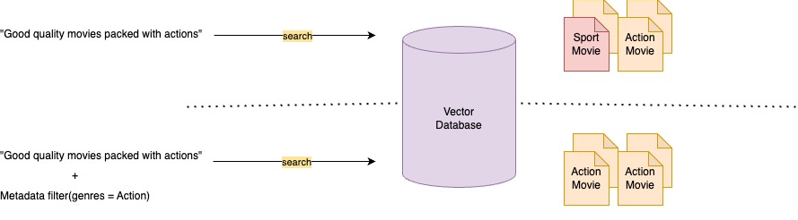

# 26년 8월 [Amazon AWS Certified Generative AI Developer - Professional(AIP-C01) 기출문제를 통해 AWS의 개념을 파악과 동시에 자격증 취득 목표]

1. 문제 및 정답 확인
2. 문제 설명
3. 정답 해설
4. 출제 의도 분석
5. 관련 AWS 공식 링크 공유

---

## 학습 개념 및 요약
---
* Q41 사내 자산 기반 AI 코딩 보조, "Amazon Q Developer Customizations: 사내 고유 라이브러리, 자체 알고리즘, 스타일 가이드를 Q Developer Pro에 인덱싱하여 프로젝트 코드 수정 없이 개발팀 전원에 표준 코딩 스타일을 적용하는 법을 학습함."
* Q42 반복 프롬프트 비용/속도 최적화, "Prompt Caching & Latency Optimization: 트래픽 폭증 시 40%의 반복되는 컨텍스트를 프롬프트 캐싱으로 처리하여 토큰 비용 및 지연 시간을 극적으로 절감하고, Latency-optimized 설정으로 응답 성능을 보장하는 기법을 익힘."
* Q43 법률/전문 데이터 RAG 고도화, "Semantic Boundary Chunking: 고정 토큰 길이 청킹으로 발생하던 법률 문맥 단절 문제를 해결하기 위해, 완성된 조항 및 논리 단락 단위의 의미론적 경계 청킹을 적용하고 벡터 인덱스를 재구축하는 패턴을 분석함."
* Q44 대화형 AI 비동기 상태 제어, "Step Functions Callback & DynamoDB On-Demand: 모호한 질문 대응을 위해 Step Functions Standard의 `.waitForTaskToken`으로 비동기 명확화 대기를 관리하고, DynamoDB On-Demand와 SSE로 대화 기록을 자동 확장 및 암호화 보관하는 아키텍처를 학습함."
* Q45 최소 공수 데이터 ETL 및 품질 관리, "AWS Glue Data Quality & Catalog: Bedrock 로드 전 비구조화 데이터의 스키마를 크롤러로 자동 카탈로그화하고, Glue Data Quality를 통해 커스텀 청킹 및 데이터 품질 모니터링을 최소 개발 노력으로 구현하는 법을 익힘."
* Q46 검색 대상 좁히기, "Metadata-aware Filtering: S3 메타데이터 인덱싱을 통해 날짜/유형별 필터링을 활성화하여, 아키텍처 변경 없이 Vector Search 탐색 범위를 줄이고 검색 속도와 정확도를 향상시키는 법을 학습함."
* Q47 소규모 데이터셋 고정밀 검색, "MemoryDB & Flat Algorithm: 소규모 데이터셋에 대해 100% 정밀한 정답을 찾기 위해 Flat(Exact) 알고리즘과 초저지연 인메모리 DB인 MemoryDB for Redis를 조합하는 아키텍처를 익힘."
* Q48 서버리스 RAG 전처리 파이프라인, "OpenSearch Serverless & Step Functions: 50GB 대화 데이터의 PII 세탁(Comprehend), 임베딩 생성(Bedrock), 인덱싱을 Step Functions와 OpenSearch Serverless로 오버헤드 없이 구성하는 법을 분석함."
* Q49 동적 모델 스위칭 및 A/B 테스트, "AWS AppConfig & Feature Flags: 코드 재배포 없이 고객 등급별 모델 동적 라우팅 및 A/B 테스트를 구현하고, JSON Schema 검증으로 매개변수 오류를 차단하는 AppConfig 활용법을 학습함."
* Q50 피크 타임 트래픽 자동 분산, "Cross-Region Inference Profiles: 시간당 30,000건의 트래픽 급증 시 스로틀링과 타임아웃을 방지하기 위해 크로스 리전 추론 프로파일로 여러 리전에 트래픽을 자동 분산하는 고가용성 기법을 익힘."
---

## (문제1)
Q41
A company has set up Amazon Q Developer Pro licenses for all developers at the company. The
company maintains a list of approved resources that developers must use when developing
applications. The approved resources include internal libraries, proprietary algorithmic
techniques, and sample code with approved styling.
A new team of developers is using Amazon Q Developer to develop a new Java-based
application. The company must ensure that the new developer team uses the company's
approved resources. The company does not want to make project-level modifications.
Which solution will meet these requirements?

[Answer]
D. Create an Amazon Q Developer customization that includes the approved data sources.
Ensure that the developers use the customization to develop the application.

### **1. 문제 및 정답 확인**

* **문제:** 사내 개발자들이 Amazon Q Developer를 활용해 Java 기반 앱을 개발할 때, 사내 내부 라이브러리, 자체 알고리즘 기법, 승인된 스타일의 샘플 코드 등 사내 승인된 리소스(Approved resources)를 기반으로 코드를 추천받도록 설정하고자 함. 프로젝트 수준의 코드 수정이나 개별 설정 없이 이를 전사적/팀적으로 적용하는 가장 적절한 방법은?
* **정답:** **D. 승인된 데이터 소스(Approved data sources)가 포함된 Amazon Q Developer 사용자 지정(Customization)을 생성함. 개발자들이 해당 커스터마이징을 사용하여 애플리케이션을 개발하도록 설정함.**

---

### **2. 문제 설명**

* **상황:** AI 코드 보조 도구인 Amazon Q Developer가 일반적인 오픈소스나 표준 패턴만 추천하는 것이 아니라, "우리 회사만의 전용 인프라 라이브러리와 공통 코드 스타일"을 학습해서 자동 완성 추천을 해주길 바라는 상황임.
* **미션:** 개발자가 프로젝트 코드(`pom.xml`이나 로컬 설정 파일 등)를 일일이 수정하지 않고, 관리자가 중앙에서 사내 코드베이스(S3, GitHub, GitLab 등)를 등록해 AI 모델을 '우리 회사 전용 스타일'로 커스텀 파인튜닝(Customization)하여 제공해야 함.
* **핵심:** Amazon Q Developer Pro에서 제공하는 **'Customizations'** 기능을 활용하여 사내 비공개 코드베이스를 인덱싱하고 팀원들에게 할당하는 것임.

---

### **3. 정답 해설**

* **Amazon Q Developer Customizations:** 사내 코드 저장소(S3, AWS CodeCommit, GitHub Pro/Enterprise, GitLab 등)를 연동하여 Amazon Q Developer가 해당 코드를 학습/인덱싱하도록 만드는 기능임.
* **프로젝트 독립성 (No project-level modifications):** 개발자가 개별 코드 프로젝트 파일에 스크립트를 추가하거나 설정을 바꿀 필요 없이, Q Developer Pro 관리 콘솔에서 커스터마이징을 생성하고 접근 권한(IAM/Identity Center)을 부여받은 개발자가 IDE에서 지정된 Customization 프로파일을 선택하기만 하면 됨.
* **보안 및 규정 준수:** 승인된 알고리즘과 보안 스타일 가이드라인이 반영된 코드만 AI가 자동 완성 추천으로 제안하므로, 신규 개발자 팀이 사내 표준 규정을 자연스럽게 준수할 수 있음.

---

### **4. 문제 출제의도 분석**

* **Enterprise AI 코딩 보조 도구 고도화:** 단순 범용 LLM 기반 코드 추천을 넘어, 기업 고유의 비공개 자산을 AI에 안전하게 학습시키는 **Amazon Q Developer Customization** 아키텍처를 아는지 평가함.
* **운영 오버헤드 최적화:** 개별 프로젝트 단위의 커스텀 파이프라인 수정을 배제하고, 조직 단위(Pro license)의 중앙 관리형 설정을 적용할 수 있는지 확인함.

---

### **5. 관련 AWS 공식 링크**

* [Amazon Q Developer 커스터마이징(Customizations) 안내](https://www.google.com/search?q=https://docs.aws.amazon.com/ko_kr/amazonq/latest/qdeveloper-ug/customizations.html)
* [Amazon Q Developer Pro 사용자 지정 코드 추천 설정](https://www.google.com/search?q=https://aws.amazon.com/ko/blogs/aws/customize-amazon-q-developer-inline-code-suggestions-with-your-private-codebase/)

---

## (문제2)
Q42
An ecommerce company is using Amazon Bedrock to build a customer service AI assistant. The
AI assistant needs to process over 50,000 customer inquiries every day. The AI assistant
occasionally experiences traffic spikes of up to 150,000 inquiries every day during promotional
events. Analysis shows that 40% of inquiries follow similar patterns that share the same context.
A GenAI developer must design a solution that will ensure low latency and consistent
performance for the AI assistant during traffic spikes.
Which solution will meet these requirements MOST cost-effectively?

[Answer]
A. Configure latency-optimized inference by setting the latency parameter to optimized in the
performance configuration of the request to Amazon Bedrock. Use prompt caching to handle the
repetitive inquiries.

### **1. 문제 및 정답 확인**

* **문제:** 일일 50,000건(프로모션 시 150,000건)의 문의를 처리하는 고객 서비스 AI 비서에서 문의의 40%가 동일한 문맥(Context)을 공유하는 반복 패턴임. 트래픽 폭증 시 낮은 지연 시간과 일관된 성능을 보장하는 **가장 비용 효율적인(MOST cost-effectively)** 해결책은?
* **정답:** **A. Amazon Bedrock에 보내는 요청의 성능 구성(Performance configuration)에서 latency 파라미터를 optimized로 설정하여 지연 시간 최적화 추론을 구성함. 반복되는 문의를 처리하기 위해 프롬프트 캐싱(Prompt Caching)을 사용함.**

---

### **2. 문제 설명**

* **상황:** 프로모션 행사 기간에 3배 이상의 손님이 몰리면서 AI 비서의 응답 속도가 느려질 위험이 있음. 분석해 보니 문의의 40%가 "배송 기간이 얼마나 걸리나요?", "행사 쿠폰은 어떻게 쓰나요?"처럼 똑같은 기본 정보(시스템 프롬프트, 공지사항 컨텍스트)를 공유하고 있음.
* **미션:** AI에게 매번 똑같은 긴 설명 문서를 다시 읽히느라 돈과 시간을 쓰지 말고, **자주 쓰는 문맥을 메모리(Cache)에 저장**해 두고 재사용하여 응답 속도와 비용을 동시에 잡아야 함.
* **핵심:** Bedrock의 프롬프트 캐싱(Prompt Caching)으로 캐시된 입력 토큰 비용 단가를 획기적으로 낮추고, **지연 시간 최적화(Latency-optimized inference)** 설정을 켜는 것임.

---

### **3. 정답 해설**

* **Prompt Caching (프롬프트 캐싱):** 시스템 프롬프트, FAQ 모음, 대형 가이드라인 문서처럼 매 요청마다 반복해서 입력되는 공통 컨텍스트를 메모리에 캐싱해 둠. 캐시된 토큰은 일반 입력 토큰에 비해 비용이 최대 80~90% 감소하며, 매번 토큰을 새로 분석하지 않으므로 지연 시간(Latency)도 크게 단축됨.
* **Latency-optimized Inference:** Bedrock 성능 설정에서 지연 시간 최적화 옵션을 지정하면, 트래픽 폭증(Traffic Spikes) 상황에서도 응답 속도를 최우선으로 확보하도록 컴퓨팅 자원을 할당함.
* **최고의 비용 효율성:** 프로비저닝된 처리량(Provisioned Throughput)을 무작정 넉넉하게 산 놓는 방식은 평소 트래픽 시 유휴 비용이 발생하지만, 캐싱 및 지연 시간 최적화 옵션을 활용하면 필요한 만큼만 쓰면서 반복 트래픽의 비용과 속도를 최적화할 수 있음.

---

### **4. 문제 출제의도 분석**

* **생성형 AI 비용 최적화(FinOps) 기법:** 반복되는 대용량 프롬프트 컨텍스트를 처리할 때 **Prompt Caching**의 비용 절감 효과 및 속도 향상 메커니즘을 이해하고 있는지 확인함.
* **트래픽 변동성(Traffic Spikes) 대응:** 무조건적인 고비용 전용 자원 할당 대신, 요청 파라미터 제어(Performance configuration)를 통해 서비스 SLA를 유지하는 안목을 평가함.

---

### **5. 관련 AWS 공식 링크**

* [Amazon Bedrock 프롬프트 캐싱(Prompt Caching) 안내](https://docs.aws.amazon.com/ko_kr/bedrock/latest/userguide/prompt-caching.html)
* [Amazon Bedrock 모델 추론 성능 옵션 설정](https://www.google.com/search?q=https://docs.aws.amazon.com/ko_kr/bedrock/latest/userguide/inference-performance.html)

---

## (문제3)
Q43
A legal research company has a Retrieval Augmented Generation (RAG) application that uses
Amazon Bedrock and Amazon OpenSearch Service. The application stores 768-dimensional
vector embeddings for 15 million legal documents, including statutes, court rulings, and case
summaries.
The company's current chunking strategy segments text into fixed-length blocks of 500 tokens.
The current chunking strategy often splits contextually linked information such as legal arguments,
court opinions, or statute references across separate chunks. Researchers report that generated
outputs frequently omit key context or cite outdated legal information.
Recent application logs show a 40% increase in response times. The p95 latency metric exceeds
2 seconds. The company expects storage needs for the application to grow from 90 GB to 360
GB within a year.
The company needs a solution to improve retrieval relevance and system performance at scale.
Which solution will meet these requirements?

[Answer]
C. Update the chunking strategy to use semantic boundaries such as complete legal arguments,
clauses, or sections rather than fixed token limits. Regenerate vector embeddings to align with
the new chunk structure.

### **1. 문제 및 정답 확인**

* **문제:** OpenSearch 기반 RAG 앱에서 고정 크기(500 토큰) 청킹을 사용하다 보니 판례, 법률 조항 등의 핵심 맥락이 잘려 나가 출처가 빠지거나 오래된 정보를 인용하는 문제가 발생함. 데이터 규모가 90GB에서 360GB로 커지는 상황에서 검색 관련성(Relevance)과 시스템 성능을 동시에 개선하는 방법은?
* **정답:** **C. 고정된 토큰 제한 대신 완결된 법적 주장, 조항, 절과 같은 의미론적 경계(Semantic boundaries)를 사용하도록 청킹 전략을 업데이트함. 새로운 청크 구조에 맞게 벡터 임베딩을 다시 생성함.**

---

### **2. 문제 설명**

* **상황:** 법률 문서는 "제1조 2항에 의거하여..."처럼 문맥 전체가 연결되어야 의미가 명확해짐. 그런데 500자 단위로 무식하게 싹둑 잘라버리니(Fixed-length chunking), 법론의 전반부와 후반부가 서로 다른 조각으로 찢어져 AI가 엉뚱한 답을 내놓고 속도도 느려짐.
* **미션:** 단어 수로 자르지 말고, 법률 문서의 특성에 맞게 "조항 단위, 판결문 단락 단위"로 맥락이 완성되는 지점(Semantic boundaries)을 기준으로 예쁘게 잘라서 다시 학습(Embedding)시켜야 함.
* **핵심:** 고정 크기 청킹의 한계를 극복하고, 문서의 의미 구조를 보존하는 **의미론적 청킹(Semantic Chunking)** 및 도메인 맞춤 경계 분할을 적용하는 것임.

---

### **3. 정답 해설**

* **Fixed-length vs. Semantic Boundary Chunking:** * **고정 크기(Fixed-length):** 문장이나 논리가 진행 중이어도 설정한 토큰 수가 되면 무조건 끊어버림. 이로 인해 RAG 검색 시 문맥의 파편만 검색되어 AI가 환각을 일으키거나 유용한 정보를 누락함.
* **의미론적 경계(Semantic Boundary):** 문단, 법률 조항(Clause), 완결된 논리 구조 단위로 데이터를 쪼갬. 검색 결과의 정밀도(Precision)와 재현율(Recall)이 극적으로 상승함.

* **임베딩 재생성 (Regenerate Embeddings):** 청크의 구조와 단위가 변경되었으므로, 해당 청크의 문맥을 완벽히 반영하는 벡터 임베딩을 새로 생성하여 OpenSearch 인덱스를 재구축해야 함. 이를 통해 검색 결과의 품질과 속도를 대폭 개선할 수 있음.

---

### **4. 문제 출제의도 분석**

* **RAG 파이프라인의 핵심인 청킹(Chunking) 전략 평가:** RAG 성능 저하 및 높은 지연 시간의 근본 원인이 잘못된 청킹 전략에 있음을 파악하고, 도메인 특성에 맞는 **Semantic Chunking**으로 해결할 수 있는지 확인함.
* **검색 품질(Relevance) 최적화:** 무조건 모델을 바꾸거나 인프라를 증설하는 대신, 데이터 전처리 단계(Chunking & Embedding)를 교정하여 최소한의 리소스로 검색 품질을 끌어올리는 실무 능력을 평가함.

---

### **5. 관련 AWS 공식 링크**

* [Amazon Bedrock Knowledge Bases의 청킹 전략 및 의미론적 분할](https://www.google.com/search?q=https://docs.aws.amazon.com/ko_kr/bedrock/latest/userguide/knowledge-bases-chunking.html)
* [Amazon OpenSearch Service를 활용한 RAG 성능 최적화](https://www.google.com/search?q=https://aws.amazon.com/ko/blogs/machine-learning/optimize-generative-ai-applications-with-amazon-opensearch-service-and-rag/)

---

## (문제4)
Q44
A company is developing a generative AI (GenAI)-powered customer support application that
uses Amazon Bedrock foundation models (FMs). The application must maintain conversational
context across multiple interactions with the same user. The application must run clarification
workflows to handle ambiguous user queries. The company must store encrypted records of
each user conversation to use for personalization. The application must be able to handle
thousands of concurrent users while responding to each user quickly.
Which solution will meet these requirements?

[Answer]
B. Use an AWS Step Functions Standard workflow to orchestrate clarification workflows. Include
Wait for a Callback patterns to manage the workflows. Store conversation history in Amazon
DynamoDPurchase on-demand capacity and configure server-side encryption.

### **1. 문제 및 정답 확인**

* **문제:** Amazon Bedrock 기반 고객 지원 시스템에서 (1) 대화 문맥(Context) 유지, (2) 모호한 질문 대응을 위한 명확화 워크플로(Clarification workflow) 오케스트레이션, (3) 개인화를 위한 암호화된 대화 기록 저장, (4) 수천 명의 동시 사용자 처리 및 빠른 응답 속도를 만족하는 아키텍처는?
* **정답:** **B. 명확화 워크플로(Clarification workflows)를 오케스트레이션하기 위해 AWS Step Functions Standard 워크플로를 사용함. 워크플로를 관리하기 위해 작업 토큰 대기(Wait for a Callback) 패턴을 포함함. Amazon DynamoDB에 대화 기록을 저장하고 온디맨드 용량(On-demand capacity)을 구매/설정하며 서버 측 암호화(SSE)를 구성함.**

---

### **2. 문제 설명**

* **상황:** AI 고객 비서가 손님과 대화할 때, 손님의 질문이 모호하면 "A를 원하시나요, B를 원하시나요?"라고 되물어본 뒤(Clarification) 손님이 답변할 때까지 일시 대기해야 함. 또한 손님의 이전 대화 내용을 암호화하여 저장하고, 트래픽 폭주 시에도 멈추지 않아야 함.
* **미션:** 손님이 되물음에 답할 때까지 워크플로를 일시 정지시켰다가 다시 재개하는 콜백 대기 패턴(Wait for a Callback)과, 수천 명의 동시 접속자 트래픽을 밀리초 단위로 자동 확장 및 암호화 처리해 주는 NoSQL 데이터베이스(**DynamoDB On-Demand + SSE**)를 조립하는 것임.
* **핵심:** 장기 실행 및 콜백 대기를 지원하는 Step Functions Standard Workflow (`.waitForTaskToken`)와 자동 스케일링 및 보안을 지원하는 **DynamoDB On-demand**의 조합임.

---

### **3. 정답 해설**

* **Step Functions Standard Workflow & Wait for a Callback:** 사용자의 질문이 모호할 때 명확화(Clarification) 단계를 거쳐 사용자의 추가 답변을 대기해야 함. Express Workflow와 달리 **Standard Workflow**는 `.waitForTaskToken` (Wait for a Callback) 통합 패턴을 지원하여, 사용자가 응답할 때까지 수 분~수 일 동안 대기 상태를 유지(비용 발생 없음)할 수 있음.
* **DynamoDB On-Demand Capacity:** 수천 명의 동시 접속 사용자가 실시간으로 대화 기록(Session Context)을 조회/업데이트할 때, 용량을 미리 예측할 필요 없이 트래픽에 맞춰 밀리초 단위로 자동 확장되므로 높은 가용성과 낮은 지연 시간을 보장함.
* **Server-Side Encryption (SSE):** 대화 기록에 개인화 데이터 및 개인정보가 포함될 수 있으므로, DynamoDB의 서버 측 암호화(SSE)를 활성화하여 암호화 저장 규정 요구사항을 완벽히 준수함.

---

### **4. 문제 출제의도 분석**

* **대화형 AI 상태 오케스트레이션(State Orchestration):** 단순 단발성 API 호출을 넘어, 비동기 대기(Callback) 및 분기 로직이 필요한 명확화 워크플로를 **Step Functions**로 구현할 수 있는지 평가함.
* **대용량 동시 접속 데이터 아키텍처:** 세션 대화 이력을 빠른 속도와 높은 동시성으로 처리하기 위해 NoSQL 저장소인 **DynamoDB On-demand**를 적용하는 능력을 점검함.

---

### **5. 관련 AWS 공식 링크**

* [AWS Step Functions 작업 토큰 기반 콜백 대기 패턴](https://www.google.com/search?q=https://docs.aws.amazon.com/ko_kr/step-functions/latest/dg/connect-to-resource.html%23connect-wait-token)
* [Amazon DynamoDB 온디맨드 용량 모드 안내](https://www.google.com/search?q=https://docs.aws.amazon.com/ko_kr/amazondynamodb/latest/developerguide/HowItWorks.ReadWriteCapacityMode.html)

---

## (문제5)
Q45
A financial services company needs to pre-process unstructured data such as customer
transcripts, financial reports, and documentation. The company stores the unstructured data in
Amazon S3 to support an Amazon Bedrock application.
The company must validate data quality, create auditable metadata, monitor data metrics, and
customize text chunking to optimize foundation model (FM) performance.
Which solution will meet these requirements with the LEAST development effort?

[Answer]
B. Set up an AWS Glue crawler to catalog data sources. Create AWS Glue ETL jobs to run custom
transformation scripts. Use AWS Glue Data Quality to validate and monitor data quality. Load
processed data into Amazon Bedrock.

### **1. 문제 및 정답 확인**

* **문제:** S3에 저장된 고객 녹취록, 재무 보고서 등의 비구조화 데이터를 Amazon Bedrock 애플리케이션용으로 전처리하려 함. 데이터 품질 검증, 감사 가능한 메타데이터 생성, 데이터 지표 모니터링, FM 성능 최적화를 위한 커스텀 텍스트 청킹(Custom text chunking)을 최소 개발 노력(LEAST development effort)으로 구현하는 솔루션은?
* **정답:** **B. 데이터 소스를 카탈로그화하기 위해 AWS Glue 크롤러(Crawler)를 설정함. 커스텀 변환 스크립트를 실행하기 위해 AWS Glue ETL 작업을 생성함. 데이터 품질을 검증하고 모니터링하기 위해 AWS Glue Data Quality를 사용함. 처리된 데이터를 Amazon Bedrock에 로드함.**

---

### **2. 문제 설명**

* **상황:** AI 모델(Bedrock)에 데이터를 넣기 전에, 수많은 보고서와 문서 데이터의 **품질이 괜찮은지 검사**하고, 데이터를 예쁘게 잘라내며(**Custom Chunking**), 데이터가 언제 어디서 들어왔는지 기록(Audit Metadata)을 남겨야 함.
* **미션:** 개발자가 파이썬 코드로 검증 로직, 모니터링 시스템, 메타데이터 DB를 밑바닥부터 일일이 개발하지 않고, AWS의 완전 관리형 데이터 전처리/ETL 서비스 집합체인 **'AWS Glue'** 파이프라인 패키지를 가져와서 설정해야 함.
* **핵심:** 데이터 카탈로그 생성(Crawler), 커스텀 청킹 및 데이터 변환(Glue ETL), 자동화된 품질 모니터링(Glue Data Quality)의 조합임.

---

### **3. 정답 해설**

* **AWS Glue Data Quality:** 일일이 데이터 검증 코드를 작성할 필요 없이, 선언적 규칙(DQDL)을 통해 "빈 값이 없어야 함", "특정 유형의 데이터여야 함" 등의 규칙을 설정하여 데이터 품질을 자동으로 검증하고 모니터링 지표를 생성함. 개발 공수를 획기적으로 줄여줌.
* **AWS Glue Crawler & Data Catalog:** S3에 들어온 다양한 비구조화 데이터의 스키마와 메타데이터를 자동으로 수집하여 데이터 카탈로그로 관리함. 이 메타데이터는 감사(Audit) 가능한 추적성 데이터가 됨.
* **AWS Glue ETL Jobs:** PySpark나 Python 기반의 커스텀 청킹(Custom Chunking) 스크립트를 대규모 분산 환경에서 효율적으로 실행하여 데이터를 가공한 뒤 Bedrock 지식 기반(Knowledge Base)이나 S3로 로드함.

---

### **4. 문제 출제의도 분석**

* **데이터 엔지니어링 및 RAG 전처리 파이프라인:** LLM의 성능을 결정짓는 가장 핵심 요소인 '데이터 전처리(ETL)'를 AWS의 데이터 전용 관리형 서비스인 **AWS Glue 생태계**로 구현할 수 있는지 평가함.
* **개발 공수(Least Development Effort) 최소화:** 무분별한 커스텀 Lambda/EC2 개발 대신, **AWS Glue Data Quality** 및 **Glue Data Catalog**의 내장 기능을 활용하여 가공 및 모니터링 시스템 구축 시간을 단축할 수 있는지 확인함.

---

### **5. 관련 AWS 공식 링크**

* [AWS Glue Data Quality 가이드 및 모니터링](https://www.google.com/search?q=https://docs.aws.amazon.com/ko_kr/glue/latest/dg/data-quality.html)
* [AWS Glue를 활용한 대규모 RAG 전처리 파이프라인 구축](https://www.google.com/search?q=https://aws.amazon.com/ko/blogs/big-data/build-a-rag-based-generative-ai-solution-using-aws-glue-and-amazon-bedrock/)

---

## (문제6)
Q46
A company uses Amazon Bedrock to build a Retrieval Augmented Generation (RAG) system. The
RAG system uses an Amazon Bedrock knowledge base that is based on an Amazon S3 bucket as
the data source for emergency news video content. The system retrieves transcripts, archived
reports, and related documents from the S3 bucket.
The RAG system uses state-of-the-art embedding models and a high-performing retrieval setup.
However, users report slow responses and irrelevant results, which cause decreased user
satisfaction. The company notices that vector searches are evaluating too many documents
across too many content types and over long periods of time.
The company determines that the underlying models will not benefit from additional fine tuning.
The company must improve retrieval accuracy by applying smarter constraints. The company
wants a solution that requires minimal changes to the existing architecture.
Which solution will meet these requirements?

[Answer]
C. Enable metadata-aware filtering within the Amazon Bedrock knowledge base by indexing S3
object metadata.

### **1. 문제 및 정답 확인**

* **문제:** S3 버킷 기반의 Amazon Bedrock Knowledge Base를 사용하는 응급 뉴스 비디오 RAG 시스템에서 vector search 대상 문서가 너무 많아 응답 속도가 느려지고 관련 없는 결과가 반환됨. 기존 아키텍처 변경을 최소화(minimal changes)하면서 검색 정확도와 속도를 높이는 방법은?
* **정답:** **C. S3 객체 메타데이터를 인덱싱하여 Amazon Bedrock Knowledge Base 내에서 메타데이터 인식 필터링(Metadata-aware filtering)을 활성화함.**

---

### **2. 문제 설명**

* **상황:** RAG 검색 시 전체 S3 문서(대본, 과거 리포트, 관련 문서 등) 전체를 대상으로 무식하게 유사도 검색(Vector Search)을 돌리고 있음. 이로 인해 불필요한 기간/형식의 데이터까지 다 뒤져보느라 속도가 느리고 관련 없는 답이 검색됨.
* **미션:** 기존 시스템 구조는 그대로 유지하면서, "최신 뉴스만", "비디오 대본만"처럼 조건을 걸어 검색 대상을 좁혀줄 수 있는 스마트한 검색 조건(Filter)을 붙여야 함.
* **핵심:** S3 데이터에 메타데이터(날짜, 콘텐츠 유형 등)를 부여하고, Bedrock Knowledge Base의 내장 기능인 '메타데이터 필터링(Metadata Filtering)'을 켜는 것임.

---

### **3. 정답 해설**

* **Amazon Bedrock Metadata Filtering:** S3 버킷에 저장된 데이터 원본 옆에 별도의 `.metadata.json` 파일이나 S3 메타데이터 태그를 두고 인덱싱하면, Bedrock Knowledge Base가 이를 메타데이터로 인식함.
* **검색 범위 축소 (Smarter Constraints):** Vector Search를 수행하기 전/후에 메타데이터(예: `content_type = 'transcript'`, `year >= 2024`) 조건으로 1차 필터링을 거치므로, 탐색해야 할 벡터 공간이 획기적으로 줄어듦.
* **최소한의 아키텍처 변경:** 파이프라인이나 DB 엔진, 모델 변경 없이 기존 S3 데이터 소스의 메타데이터 설정 및 API 요청 시 필터 조건 파라미터만 추가하므로 **아키텍처 변경 및 개발 공수가 가장 적음(Minimal changes)**.

---

### **4. 문제 출제의도 분석**

* **RAG 검색 효율성 및 성능 최적화:** 무조건적인 모델 변경이나 파인튜닝 대신, 메타데이터 기반 프레임 필터링(Pre-filtering/Post-filtering)을 통해 검색 지연 시간을 줄이고 재현율(Recall)을 높이는 패턴을 아는지 평가함.
* **Bedrock Knowledge Base 고급 기능 활용:** AWS 관리형 RAG 솔루션이 기본 지원하는 **Metadata Indexing**의 기능적 메커니즘을 이해하고 있는지 확인함.

---

### **5. 관련 AWS 공식 링크**

* [Amazon Bedrock Knowledge Bases 메타데이터 필터링 기능 가이드](https://www.google.com/search?q=https://docs.aws.amazon.com/ko_kr/bedrock/latest/userguide/knowledge-base-metadata.html)
* [AWS 블로그 - Bedrock Knowledge Bases를 활용한 메타데이터 기반 접근 제어 및 검색 최적화](https://aws.amazon.com/blogs/machine-learning/access-control-for-vector-stores-using-metadata-filtering-with-knowledge-bases-for-amazon-bedrock/)

---

## (문제7)
Q47
A financial services company is creating a Retrieval Augmented Generation (RAG) application
that uses Amazon Bedrock to generate summaries of market activities. The application relies on
a vector database that stores a small proprietary dataset that has a low index count. The
application must perform similarity searches. The Amazon Bedrock model's responses must
maximize accuracy and maintain high performance.
The company needs to configure the vector database and integrate it with the application.
Which solution will meet these requirements?

[Answer]
A. Launch an Amazon MemoryDB cluster and configure the index by using the Flat algorithm.
Configure a horizontal scaling policy based on performance metrics.

### **1. 문제 및 정답 확인**

* **문제:** 시장 활동 요약용 RAG 앱에서 작은 규모의 자체 데이터셋(소형 인덱스 수)을 벡터 DB에 저장하려 함. 유사도 검색 시 정확도를 극대화(Maximize accuracy)하고 고성능을 유지하기 위한 벡터 DB 알고리즘 및 구성 방식은?
* **정답:** **A. Amazon MemoryDB 클러스터를 시작하고 플랫(Flat) 알고리즘을 사용하여 인덱스를 구성함. 성능 지표를 기반으로 수평 스케일링 정책을 구성함.**

---

### **2. 문제 설명**

* **상황:** 데이터양이 매우 적은(Small dataset) 환경에서는 검색 결과를 대충 유추해 내는 가깝기만 한 값(Approximate)보다, 근사치 오차 없이 100% 가장 정확한 정답 문서(Exact Nearest Neighbor)를 찾는 것이 핵심임.
* **미션:** 데이터를 압축하거나 생략하여 근사치로 찾는 HNSW나 IVF 같은 알고리즘 대신, 데이터 소형에 최적화되어 100% 정확한 정답을 찾아내는 **Flat 알고리즘**과 초고속 인메모리 DB인 **MemoryDB for Redis**를 조합해야 함.
* **핵심:** 소규모 데이터셋 + 최고 정확도 요구사항 $\rightarrow$ **Flat (Brute-force/Exact) 알고리즘** 적용.

---

### **3. 정답 해설**

* **Flat Algorithm (전수 조사 / Exact k-NN):** 데이터의 벡터들을 근사화(Approximation)하거나 그래프 형태로 트리 구조화하지 않고, 전체 벡터와 일일이 실제 거리를 계산하는 Brute-force 방식임. 근사치 오차가 전혀 없어 정확도(Accuracy)가 100%에 달함. 데이터 인덱스 개수가 적을 때는 전수 조사를 해도 속도가 매우 빠름.
* **Amazon MemoryDB for Redis (Vector Search):** 인메모리(In-Memory) 기반 DB이므로 마이크로초 단위의 읽기/쓰기 지연 시간을 자랑함. Flat 알고리즘의 유일한 단점인 연산량을 인메모리 파워로 커버하여 높은 성능을 유지함.
* **HNSW (Hierarchical Navigable Small World)와의 차이:** 데이터가 수백만~수억 건으로 거대할 때는 HNSW 같은 근사치 검색(ANN) 알고리즘을 써야 하지만, 문제처럼 데이터셋이 작고 정확도가 최우선일 때는 **Flat 알고리즘**이 정답임.

---

### **4. 문제 출제의도 분석**

* **벡터 검색 알고리즘 특성 이해 (Flat vs. HNSW):** 무조건 HNSW 알고리즘을 고르는 잘못된 패턴을 스크리닝하고, 데이터 크기와 요구되는 정확도 수준에 따른 **벡터 색인 알고리즘(Flat Index)** 선택 능력을 평가함.
* **초저지연 인메모리 벡터 DB 활용:** 메모리 기반 초고속 처리가 가능한 **Amazon MemoryDB for Redis**의 벡터 검색(Vector Search) 통합 능력을 검증함.

---

### **5. 관련 AWS 공식 링크**

* [Amazon MemoryDB for Redis 벡터 검색(Vector Search) 가이드](https://docs.aws.amazon.com/ko_kr/memorydb/latest/devguide/vector-search.html)
* [AWS 블로그 - Amazon MemoryDB를 활용한 초저지연 벡터 검색 구현](https://www.google.com/search?q=https://aws.amazon.com/blogs/database/vector-search-for-amazon-memorydb-is-now-generally-available/)

---

## (문제8)
Q48
A GenAI developer is building a Retrieval Augmented Generation (RAG)-based customer support
application that uses Amazon Bedrock foundation models (FMs). The application needs to
process 50 GB of historical customer conversations that are stored in an Amazon S3 bucket as
JSON files. The application must use the processed data as its retrieval corpus. The application's
data processing workflow must extract relevant data from customer support documents, remove
customer personally identifiable information (PII), and generate embeddings for vector storage.
The processing workflow must be cost-effective and must finish within 4 hours.
Which solution will meet these requirements with the LEAST operational overhead?

[Answer]
D. Implement a data processing pipeline that uses AWS Step Functions to orchestrate a workload
that uses Amazon Comprehend to detect PII and Amazon Bedrock to generate embeddings.
Directly integrate the workflow with Amazon OpenSearch Serverless to store vectors and provide
similarity search capabilities.

### **1. 문제 및 정답 확인**

* **문제:** S3에 JSON 형태로 저장된 50GB 규모의 고객 대화 이력을 처리하여 RAG 검색 코퍼스를 구축하려 함. 데이터 처리 워크플로는 (1) 고객 개인식별정보(PII) 삭제, (2) 벡터 저장용 임베딩 생성, (3) 비용 효율성 및 4시간 이내 완료, (4) 최소 운영 오버헤드(LEAST operational overhead)를 충족해야 함. 최적의 솔루션은?
* **정답:** **D. Amazon Comprehend를 사용하여 PII를 탐지하고 Amazon Bedrock을 사용하여 임베딩을 생성하는 워크로드 프로세스를 오케스트레이션하기 위해 AWS Step Functions 데이터 처리 파이프라인을 구현함. 벡터를 저장하고 유사도 검색 기능을 제공하기 위해 해당 워크플로를 Amazon OpenSearch Serverless와 직접 통합함.**

---

### **2. 문제 설명**

* **상황:** 50GB 분량의 대용량 고객 대화 텍스트 데이터를 RAG 시스템용 벡터 데이터베이스로 옮겨야 하는 대규모 Batch 데이터 처리 상황임.
* **미션:** 데이터를 다룰 때 개인정보(PII)를 자동으로 지워야 하고, 임베딩을 뽑아서 검색 엔진에 넣어야 함. 서버를 직접 띄우고 운영하는 고생 없이 **완전 관리형 서버리스(Serverless)** 서비스들만 엮어서 최단 시간에 최소 공수로 구축해야 함.
* **핵심:** Step Functions(파이프라인 제어) + Comprehend(PII 마스킹) + Bedrock(임베딩 생성) + OpenSearch Serverless(벡터 저장소)의 완전 서버리스 조합임.

---

### **3. 정답 해설**

* **Amazon OpenSearch Serverless:** 검색 인프라(클러스터, 노드, 샤드)를 직접 프로비저닝하거나 관리할 필요 없이, 트래픽과 데이터 양에 따라 자동으로 용량이 확장/축소되는 완전 관리형 벡터 저장소임. 운영 오버헤드가 사실상 0에 가까움.
* **Amazon Comprehend & Amazon Bedrock:** PII 탐지 전용 머신러닝 모델인 Comprehend와 고성능 임베딩 모델을 제공하는 Bedrock을 사용해, 50GB의 비구조화 대화 데이터를 안전하고 정확하게 벡터로 변환함.
* **AWS Step Functions 오케스트레이션:** 대용량 S3 데이터를 분산 병렬 처리(`Map` 상태 활용 등)로 4시간 이내에 빠르게 처리하도록 제어하며, 오류 발생 시 재시도(Retry) 및 예외 처리를 자동으로 담당함.

---

### **4. 문제 출제의도 분석**

* **엔터프라이즈 RAG 전처리 파이프라인의 서버리스 구성:** 인프라 관리 부담(Operational Overhead)을 줄이기 위해 EC2나 EMR 기반 커스텀 파이프라인 대신 **OpenSearch Serverless**와 **Step Functions** 중심의 서버리스 파이프라인을 선택할 수 있는지 평가함.
* **보안 compliance(개인정보 보호):** RAG 인덱싱 전 **Amazon Comprehend**를 통한 PII 마스킹 단계를 필수 전처리 과정으로 배치할 수 있는지 확인함.

---

### **5. 관련 AWS 공식 링크**

* [Amazon OpenSearch Serverless 벡터 엔진 안내](https://www.google.com/search?q=https://docs.aws.amazon.com/ko_kr/opensearch-service/latest/developerguide/serverless-vector-engine.html)
* [Amazon Comprehend를 활용한 PII(개인식별정보) 탐지 및 세탁](https://docs.aws.amazon.com/ko_kr/comprehend/latest/dg/how-pii.html)

---

## (문제9)
Q49
A financial services company is developing a generative AI (GenAI) application that serves both
premium customers and standard customers. The application uses AWS Lambda functions
behind an Amazon API Gateway REST API to process requests. The company needs to
dynamically switch between AI models based on which customer tier each user belongs to. The
company also wants to perform A/B testing for new features without redeploying code. The
company needs to validate model parameters like temperature and maximum token limits before
applying changes.
Which solution will meet these requirements with the LEAST operational overhead?

[Answer]
C. Use AWS AppConfig to manage model configurations. Use feature flags to perform A/B
testing. Define JSON schema validation rules for model parameters. Configure Lambda functions
to retrieve configurations by using the AWS AppConfig Agent.

### **1. 문제 및 정답 확인**

* **문제:** 프리미엄 및 일반 고객 등급에 따라 AI 모델을 동적으로 전환하고, 코드 재배포 없이 A/B 테스트를 수행하며, Temperature 및 Maximum Token Limit 등의 모델 매개변수 변경 전 검증(Validation)을 수행하는 **최소 운영 오버헤드(LEAST operational overhead)** 솔루션은?
* **정답:** **C. 모델 구성을 관리하기 위해 AWS AppConfig를 사용함. A/B 테스트를 수행하기 위해 기능 플래그(Feature flags)를 사용함. 모델 매개변수에 대해 JSON 스키마 검증 규칙을 정의함. AWS AppConfig Agent를 사용하여 구성을 가져오도록 Lambda 함수를 구성함.**

---

### **2. 문제 설명**

* **상황:** 프리미엄 고객에게는 성능이 뛰어난 고비용 AI 모델(예: Claude Opus)을 연결하고, 일반 고객에게는 가성비 모델(예: Claude Haiku)을 연결하려 함. 또한 신규 AI 기능을 일부 사용자에게만 테스트(A/B Testing)하고 싶음.
* **미션:** 개발자가 코드를 수정해서 매번 빌드/배포(Redeploy)하는 번거로움 없이, **설정값 변경만으로 실시간으로 모델을 교체하고 설정값을 안전하게 검증**해 주는 인프라 체계를 구축해야 함.
* **핵심:** 동적 설정 및 기능 플래그(Feature Flags), JSON Schema 기반 설정값 검증을 제공하는 완전 관리형 서비스인 **AWS AppConfig**와 **AppConfig Extension/Agent**를 활용하는 것임.

---

### **3. 정답 해설**

* **AWS AppConfig & Feature Flags:** 애플리케이션 코드를 재배포하지 않고도 동적으로 설정값(Dynamic Configuration)을 업데이트할 수 있음. 고객 등급별 라우팅이나 특정 백엔드 모델 지정, A/B 테스트 트래픽 분할을 **Feature Flag** 제어판 클릭만으로 안전하게 처리함.
* **JSON Schema Validation:** Temperature가 범위(0~1)를 벗어나거나 Max Tokens 한도가 이상하게 입력되는 사태를 방지하기 위해, 설정값을 적용하기 전 **JSON Schema Validator**를 통해 유효성을 자동 검증함으로써 배포 오류 및 장애를 완벽히 차단함.
* **AWS AppConfig Agent for Lambda:** Lambda 함수 내부의 execution environment 내에서 로컬 캐시 형태로 동작하여, AppConfig 설정 데이터를 밀리초 단위로 초고속 조회(High performance)할 수 있게 도와주며 개발 공수와 비용을 극도로 아껴줌.

---

### **4. 문제 출제의도 분석**

* **동적 모델 라우팅 및 런타임 구성 관리:** LLM 애플리케이션 운영 시 필수적인 **Dynamic Model Routing** 및 **A/B Testing** 패턴을 코드 변경(Redeploy) 없이 안전하게 스위칭하는 **AWS AppConfig** 구현 능력을 평가함.
* **FinOps 및 차등화 서비스 아키텍처:** 사용자 Tier(프리미엄 vs 일반)별로 서로 다른 모델 및 매개변수를 적용하는 최신 엔터프라이즈 MLOps 아키텍처 역량을 검증함.

---

### **5. 관련 AWS 공식 링크**

* [AWS AppConfig 및 Feature Flags 공식 가이드](https://docs.aws.amazon.com/ko_kr/appconfig/latest/userguide/what-is-appconfig.html)
* [AWS Lambda용 AWS AppConfig Extension/Agent 활용법](https://www.google.com/search?q=https://docs.aws.amazon.com/ko_kr/appconfig/latest/userguide/appconfig-integration-lambda.html)

---

## (문제10)
Q50
A company is using Amazon Bedrock and Anthropic Claude 3 Haiku to develop an AI assistant.
The AI assistant normally processes 10,000 requests each hour but experiences surges of up
30,000 requests each hour during peak usage periods. The AI assistant must respond within 2
seconds while operating across multiple AWS Regions.
The company observes that during peak usage periods, the AI assistant experiences throughput
bottlenecks that cause increased latency and occasional request timeouts. The company must
resolve the performance issues.
Which solution will meet this requirement?

[Answer]
B. Implement token batching to reduce API overhead. Use cross-Region inference profiles to
automatically distribute traffic across available Regions.

### **1. 문제 및 정답 확인**

* **문제:** Amazon Bedrock과 Anthropic Claude 3 Haiku 모델 기반 AI 비서가 피크 타임에 시간당 10,000건에서 30,000건으로 트래픽이 급증할 때, 스로틀링(Throttling) 병목 현상으로 지연 시간이 증가하고 타임아웃 오류가 발생함. 멀티 리전 환경에서 2초 이내 응답 속도를 유지하도록 성능 문제를 해결하는 방법은?
* **정답:** **B. API 오버헤드를 줄이기 위해 토큰 일괄 처리(Token batching)를 구현함. 이용 가능한 여러 리전으로 트래픽을 자동 분산하기 위해 크로스 리전 추론 프로파일(Cross-Region inference profiles)을 사용함.**

---

### **2. 문제 설명**

* **상황:** 특정 한 리전(예: us-east-1)의 Claude 3 Haiku 할당량(Quota)만 사용하다 보니, 피크 시간에 손님이 한꺼번에 몰려서 "사용량이 너무 많습니다(Throttling)" 에러가 터지고 속도가 느려지는 상황임.
* **미션:** 개발자가 직접 여러 리전의 모델 호출 코드를 분기 처리하는 복잡한 로직을 작성할 필요 없이, AWS가 제공하는 '다중 리전 추론 통합 관리 기능'을 사용하여 여유가 있는 리전으로 트래픽을 자동으로 넘겨줘야 함.
* **핵심:** Bedrock의 최신 트래픽 분산 기능인 '크로스 리전 추론 프로파일(Cross-Region Inference Profiles)'과 요청 오버헤드를 줄이는 토큰 패킹/배칭(Token Batching)을 적용하는 것임.

---

### **3. 정답 해설**

* **Cross-Region Inference Profiles (크로스 리전 추론 프로파일):** 단일 리전의 모델 ID(예: `anthropic.claude-3-haiku...`) 대신, 크로스 리전 프로파일 ID(예: `us.anthropic.claude-3-haiku...`)를 호출하면, Amazon Bedrock이 지연 시간 및 여러 AWS 리전의 모델 할당량을 실시간으로 계산하여 최적의 리전으로 트래픽을 **자동으로 라우팅/분산**해 줌.
* **스로틀링 방지 및 가용성 보장:** 단일 리전 한도(Service Quotas) 초과로 인한 요청 거절/타임아웃을 방지하고, 피크 타임 트래픽 급증(30,000 tph) 시에도 2초 이내의 안정적인 응답 속도를 유지함.
* **Token Batching (토큰 일괄 처리):** 잦은 API 호출에 따른 네트워크 커넥션 핸드셰이크 오버헤드를 줄여 자원 사용 효율성을 극대화함.

---

### **4. 문제 출제의도 분석**

* **Bedrock의 최신 대규모 트래픽 분산 메커니즘 평가:** 단일 리전 용량 한계를 극복하기 위해 AWS가 제공하는 관리형 라우터 기능인 **Cross-Region Inference**를 아키텍처에 적절히 적용할 수 있는지 확인함.
* **글로벌 AI 애플리케이션 SLA(2초 이내 Latency) 유지:** 대용량 피크 트래픽 환경에서 스로틀링 없이 오토스케일링 효과를 누리는 **CRI(Cross-Region Inference)** 전략 수립 능력을 점검함.

---

### **5. 관련 AWS 공식 링크**

* [Amazon Bedrock 크로스 리전 추론(Cross-Region Inference) 안내](https://docs.aws.amazon.com/ko_kr/bedrock/latest/userguide/inference-profiles-support.html)
* [AWS 블로그 - Cross-Region Inference를 통한 Bedrock 애플리케이션 처리량 및 가용성 극대화](https://www.google.com/search?q=https://aws.amazon.com/blogs/machine-learning/increase-throughput-and-availability-with-cross-region-inference-in-amazon-bedrock/)

---