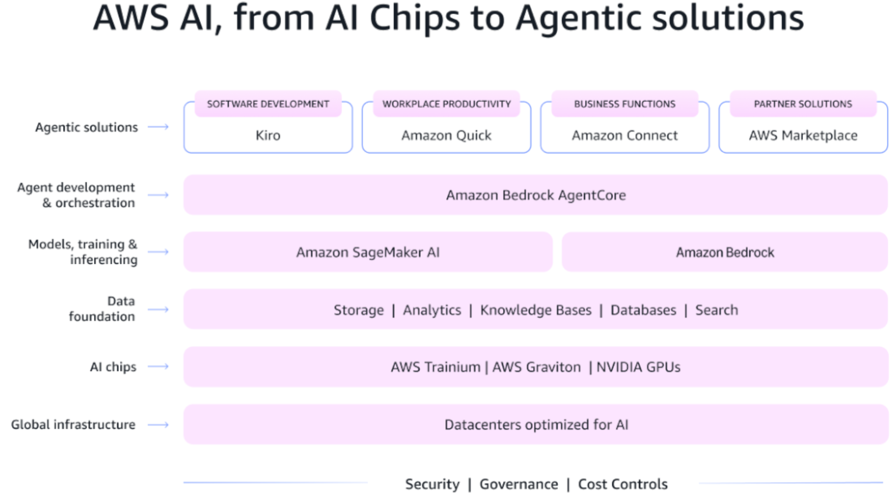
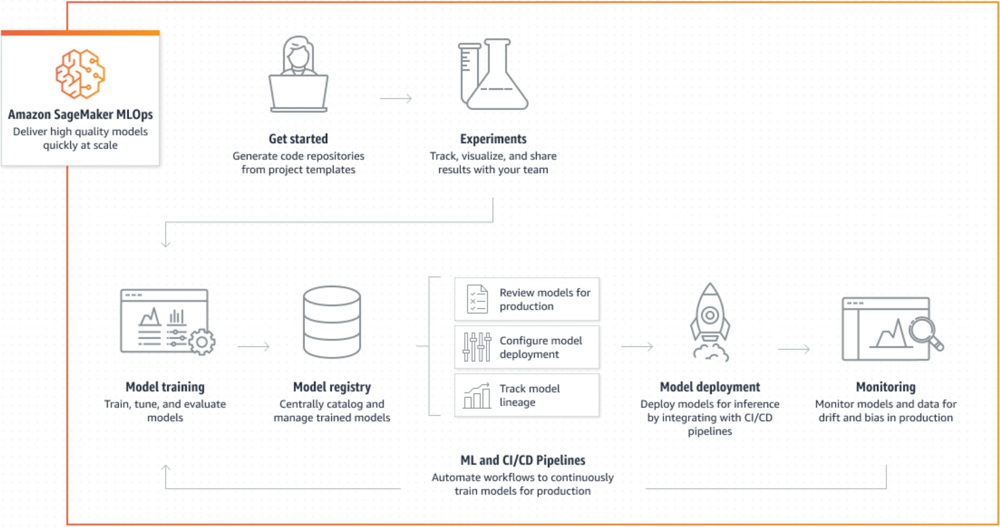
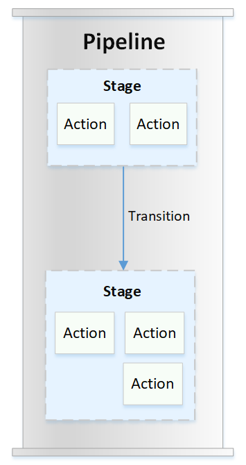

# 26년 9월 [Amazon AWS Certified Generative AI Developer - Professional(AIP-C01) 기출문제를 통해 AWS의 개념을 파악과 동시에 자격증 취득 목표]

1. 문제 및 정답 확인
2. 문제 설명
3. 정답 해설
4. 출제 의도 분석
5. 관련 AWS 공식 링크 공유

---

## 학습 개념 및 요약
---
* Q51 중복 질문 캐싱 및 지연 시간 최적화, "Semantic Caching & Approximate k-NN: 의미가 유사한 질문에 대한 중복 모델 호출을 줄이고 속도를 높이기 위해 OpenSearch의 근사 k-NN 알고리즘 기반 의미론적 캐싱을 구현하는 법을 학습함."
* Q52 AI 에이전트 외부 데이터 보안 연동, "MCP Server & Cognito OAuth: API Gateway 프록시와 Streamable HTTP를 통해 Lambda 기반 MCP 서버를 구축하고, Cognito OAuth 2.1로 인가된 에이전트만 접근하도록 제어하는 보안 연동을 익힘."
* Q53 다중 에이전트 순차 제어 및 예외 처리, "Step Functions & Graceful Degradation: 3개의 Bedrock 에이전트와 Lambda를 순차 실행하고, 서비스 중단 시 Retry/Catch 분기를 통해 시스템 다운을 방지하는 우아한 성능 저하 아키텍처를 분석함."
* Q54 시각적 생성형 AI 파이프라인 구축, "Amazon Bedrock Flows: 외부 파이프라인 없이 Bedrock Flows 내의 S3 노드, 표현식(Expression) 노드, 에이전트 단계를 조합해 S3 데이터 추출 및 AI 검토 워크플로를 시각적으로 구성하는 법을 학습함."
* Q55 엔터프라이즈 AI 품질 평가 및 규정 준수, "Bedrock Evaluations & Guardrails & A2I: Claude를 활용한 대규모 자동 채점(Judge), 규정 준수를 위한 가드레일, 중요 건에 대한 사람의 수동 검토(A2I)를 결합한 하이브리드 평가 체계를 익힘."
* Q56 대규모 다중 에이전트 협업 체계, "Supervisor/Collaborator Agents & KB Isolation: 의도 분류를 담당하는 감독자 에이전트와 부서별 협력자 에이전트를 구성하고, IAM 필터링으로 분리된 지식 기반(RAG)을 할당하여 도메인 정확도를 높이는 패턴을 분석함."
* Q57 다중 환경 모델 스위칭 및 자동 배포, "AWS CDK & CodePipeline: CDK의 `fromFoundationModelId()`로 모델 파라미터를 유연하게 주입하고, CodePipeline을 통해 개발/운영 환경 코드 배포 없이 모델을 동적 전환하는 CI/CD 인프라를 학습함."
* Q58 격리된 멀티 테넌트 실시간 RAG, "Direct Data Ingestion & Multi-account KB: 호텔별 데이터를 다중 계정 KB로 보안 격리하고, 실시간 예약 정보는 Direct API로, 정적 문서는 스케줄 기반으로 수집하는 하이브리드 동기화 전략을 익힘."
* Q59 무중단 모델 스위칭 및 롤아웃 설정, "AWS AppConfig & Dynamic Configuration: Lambda 코드 재배포 없이 런타임에 모델 제공업체를 동적 전환하고, 에러 시 롤백 및 검증이 가능한 안전한 구성 배포 아키텍처를 학습함."
* Q60 스트리밍 환경의 대규모 장애 복원력, "Exponential Backoff & Circuit Breaker: 피크 타임 과부하 방지를 위해 지터 기반 백오프와 서킷 브레이커를 적용하고, 끊긴 스트리밍 청크를 버퍼링하여 지능적으로 재개하는 고가용성 예외 처리 기법을 분석함."
---

## (문제1)
Q51
A company uses Amazon Bedrock to develop an AI assistant to provide customer support.
Analysis shows that 40% of customer queries use varied phrasing or wording to ask the same
questions.
The company wants a solution to reduce redundant model calls. The solution must ensure that
semantically equivalent questions receive consistent answers. The solution must ensure low
latency.
Which solution will meet these requirements?

[Answer]
C. Deploy Amazon OpenSearch Service that has k-nearest neighbor (k-NN) capabilities to store
query-response text pairs. Use an approximate k-NN technique to find similar queries and their
responses.

### **1. 문제 및 정답 확인**

* **문제:** 고객 지원 AI 비서의 분석 결과, 문의의 40%가 표현이나 단어만 다를 뿐 의미론적으로 똑같은 질문을 하고 있음. 중복되는 모델 호출을 줄이고, 의미가 같은 질문에는 일관된 답변을 제공하며, 낮은 지연 시간(Low latency)을 보장하는 해결책은?
* **정답:** **C. k-최근접 이웃(k-NN) 기능이 있는 Amazon OpenSearch Service를 배포하여 질문-답변(Query-response) 텍스트 쌍을 저장함. 근사 k-NN(Approximate k-NN) 기법을 사용하여 유사한 질문과 그에 대한 답변을 찾음.**

---

### **2. 문제 설명**

* **상황:** 고객들이 "비밀번호 어떻게 바꿔요?", "패스워드 변경 방법 알려주세요", "비번 재설정" 등 겉보기엔 달라도 결국 똑같은 질문을 반복해서 물어봄(전체의 40%). 매번 AI(Bedrock)를 새로 호출해 답변을 만들면 요금도 비싸고, 속도도 느리며, 똑같은 질문인데도 매번 미묘하게 다른 대답을 내놓을 수 있음.
* **미션:** 글자가 100% 똑같지 않아도 "의미가 비슷하면" 예전에 만들어둔 모범 정답을 꺼내서(캐싱) 즉시 대답하게 만들어야 함. 모델 호출 비용을 아끼고 속도는 밀리초(ms) 단위로 당겨야 함.
* **핵심:** 단순 캐싱이 아닌 '의미론적 캐싱(Semantic Caching)'을 구현하기 위해 OpenSearch의 벡터 검색(k-NN) 기능을 활용하는 것임.

---

### **3. 정답 해설**

* **의미론적 캐싱 (Semantic Caching):** 일반적인 IT 시스템의 캐시(Cache)는 입력된 글자가 토시 하나 안 틀리고 똑같아야 작동함. 하지만 의미론적 캐시는 질문을 벡터(숫자 배열)로 변환해 저장하므로, "비번 찾기"와 "비밀번호 재설정"이 의미상 같다고 판단해 저장된 답변을 바로 반환함.
* **Amazon OpenSearch & k-NN:** 기존에 들어왔던 '질문-답변 쌍'을 벡터 형태로 OpenSearch에 저장함. 새로운 질문이 들어오면 k-NN(k-Nearest Neighbor, 가장 가까운 이웃 찾기) 알고리즘으로 기존 데이터베이스에서 의미가 가장 유사한 과거 질문을 찾아냄.
* **Approximate k-NN (근사 검색):** 데이터가 많을 때 모든 데이터를 일일이 비교하는 전수 조사(Exact k-NN, Flat)를 하면 시간이 오래 걸림. 따라서 요구사항인 낮은 지연 시간(Low latency)을 달성하기 위해, 약간의 오차를 허용하더라도 결과를 순식간에 찾아내는 근사치 검색(Approximate k-NN) 기법을 사용하는 것이 정답임.

---

### **4. 문제 출제의도 분석**

* **생성형 AI 비용 및 속도 최적화:** LLM 인프라에서 발생하는 중복 쿼리 병목을 해결하기 위한 최신 아키텍처 패턴인 **Semantic Caching**의 원리를 이해하고 있는지 평가함.
* **벡터 검색 알고리즘 특성:** 초저지연(Low latency) 요구사항을 충족하기 위해 전수 조사가 아닌 **Approximate k-NN (ANN)** 알고리즘을 선택하는 검색 엔진 튜닝 능력을 점검함.

---

### **5. 관련 AWS 공식 링크**

* [AWS 블로그 - Amazon OpenSearch Service를 활용한 LLM 의미론적 캐싱(Semantic Caching) 구현](https://www.google.com/search?q=https://aws.amazon.com/ko/blogs/machine-learning/implement-semantic-caching-with-amazon-opensearch-service-and-amazon-bedrock/)
* [Amazon OpenSearch Service의 k-NN 검색 가이드](https://docs.aws.amazon.com/ko_kr/opensearch-service/latest/developerguide/knn.html)
---

## (문제2)
Q52
A company uses AWS Lambda functions to build an AI agent solution. A GenAI developer must
set up a Model Context Protocol (MCP) server that accesses user information. The GenAI
developer must also configure the AI agent to use the new MCP server. The GenAI developer
must ensure that only authorized users can access the MCP server.
Which solution will meet these requirements?

[Answer]
C. Use a Lambda function to host the MCP server. Create an Amazon API Gateway HTTP API that
proxies requests to the Lambda function. Configure the AI agent solution to use the Streamable
HTTP transport to make requests through the HTTP API. Use Amazon Cognito to enforce OAuth
2.1.

### **1. 문제 및 정답 확인**

* **문제:** AWS Lambda 함수를 사용하여 AI 에이전트 솔루션을 구축 중임. 사용자 정보에 접근하는 **MCP(Model Context Protocol) 서버**를 설정하고, AI 에이전트가 이 새 MCP 서버를 사용하도록 구성해야 함. 또한 **인가된 사용자(Authorized users)만** MCP 서버에 접근할 수 있도록 보안을 적용하는 방법은?
* **정답:** **C. Lambda 함수를 사용하여 MCP 서버를 호스팅함. Lambda 함수로 요청을 프록시(Proxy)하는 Amazon API Gateway HTTP API를 생성함. AI 에이전트 솔루션이 HTTP API를 통해 요청을 보내도록 스트리밍 가능한 HTTP 전송(Streamable HTTP transport)을 사용하도록 구성함. Amazon Cognito를 사용하여 OAuth 2.1을 강제함.**

---

### **2. 문제 설명**

* **상황:** AI 비서가 사용자 데이터(예: 내 프로필, 주문 내역)를 읽어오려면 AI와 데이터베이스를 연결하는 표준 규격인 MCP(Model Context Protocol)라는 '공용 플러그'가 필요함. 이 플러그(서버)를 AWS 클라우드에 띄워야 함.
* **미션:** 서버를 관리할 필요 없는 Lambda로 플러그를 만들고, 외부에서 이 플러그에 접속할 수 있도록 API 통로(API Gateway)를 열어주어야 함. 단, 아무나 플러그를 꽂으면 안 되므로, 보안 요원(Cognito)을 배치해 허가증(OAuth)을 검사해야 함.
* **핵심:** 원격 MCP 서버 통신을 위한 **Streamable HTTP (SSE 등)** 프로토콜과 서버리스 엔드포인트(API Gateway + Lambda), 그리고 인가 처리를 위한 Amazon Cognito(OAuth)의 조합임.

---

### **3. 정답 해설**

* **MCP (Model Context Protocol):** AI 모델이 외부 도구나 데이터 소스에 안전하게 연결할 수 있도록 해주는 오픈 표준 프로토콜임. 로컬에서는 `stdio`로 통신하지만, 클라우드 원격 서버로 구축할 때는 HTTP 기반 스트리밍 전송 방식(SSE: Server-Sent Events 등)을 사용함.
* **API Gateway + Lambda:** MCP 서버의 비즈니스 로직(사용자 정보 조회 등)은 Lambda에 작성하고, AI 에이전트가 인터넷을 통해 접근할 수 있도록 API Gateway HTTP API를 프록시로 연결함.
* **Amazon Cognito (OAuth 강제):** "인가된 사용자만 접근 가능해야 한다"는 보안 요구사항을 충족하기 위한 핵심 서비스임. API Gateway에 Cognito 권한 부여자를 연결하여, 유효한 OAuth 토큰을 가진 요청만 Lambda(MCP 서버)로 통과시킴.

---

### **4. 문제 출제의도 분석**

* **최신 AI 연동 표준(MCP) 이해도:** Anthropic 등이 주도하는 최신 AI 연동 규격인 **Model Context Protocol**의 원격 클라우드 호스팅 아키텍처(HTTP Transport)를 이해하고 있는지 평가함.
* **서버리스 API 보안 아키텍처:** 외부와 통신하는 AI 에이전트의 데이터 소스 접근 경로(API Gateway + Lambda)에 **Amazon Cognito**를 붙여 인증/인가(OAuth)를 구현하는 정석적인 클라우드 보안 패턴을 검증함.

---

### **5. 관련 AWS 공식 링크**

* [Amazon API Gateway 및 HTTP API에 대한 JWT/Cognito 권한 부여](https://docs.aws.amazon.com/ko_kr/apigateway/latest/developerguide/http-api-jwt-authorizer.html)
* [AWS 블로그 - 서버리스 아키텍처를 활용한 생성형 AI 에이전트 도구 연동 (MCP 개념 포함)](https://www.google.com/search?q=https://aws.amazon.com/ko/blogs/compute/building-generative-ai-agents-with-aws-serverless-services/)

---

## (문제3)
Q53
A company wants to create an annual rewards program for its customers. The rewards that
customers earn vary based on different parameters such as the categories of the items ordered
and the customers' purchase history.
The company needs a generative AI (GenAI) solution that uses three Amazon Bedrock agents to
help customers during online catalog browsing. The agents must use knowledge bases and
action groups to handle the search, recommendation, and order modules. The modules must
operate sequentially. An AWS Lambda function must calculate estimated rewards for each
recommended item. The solution must provide graceful degradation during service disruptions.
Which solution will meet these requirements with the MOST operational efficiency?

[Answer]
B. Create an AWS Step Functions state machine with four tasks that run the agents and the
rewards Lambda function. Set up retry and catch branches for each of the task steps.

### **1. 문제 및 정답 확인**

* **문제:** 고객 보상 프로그램을 위해 3개의 Amazon Bedrock 에이전트(검색, 추천, 주문)와 보상을 계산하는 1개의 Lambda 함수를 **순차적으로(Sequentially)** 실행하는 생성형 AI 솔루션을 구축하려 함. 서비스 중단 시 우아한 성능 저하(Graceful degradation, 유연한 오류 대처)를 제공하면서 가장 높은 운영 효율성(MOST operational efficiency)을 달성하는 아키텍처는?
* **정답:** **B. 에이전트와 보상 Lambda 함수를 실행하는 4개의 작업(Tasks)을 가진 AWS Step Functions 상태 머신(State machine)을 생성함. 각 작업 단계에 대해 재시도(Retry) 및 예외 처리(Catch) 분기를 설정함.**

---

### **2. 문제 설명**

* **상황:** 쇼핑몰에서 3명의 AI 비서(검색 담당 $\rightarrow$ 추천 담당 $\rightarrow$ 주문 담당)와 1개의 계산기(Lambda)가 바통을 넘기며 릴레이 경주를 해야 합니다. 그런데 경기 도중 한 명의 비서가 넘어지거나(API 호출 실패) 오류가 발생했을 때, 전체 시스템이 멈춰버리는 대신 부드럽게 우회하거나 다시 시도하게 만들어야 합니다.
* **미션:** 개발자가 복잡한 파이썬 코드로 "A가 끝나면 B를 부르고, 에러가 나면 C를 해라"라고 일일이 짜는 수고를 덜고, 시각적인 흐름도로 이 4개의 단계를 지휘할 '최고 감독관'을 고용해야 합니다.
* **핵심:** 순차적 프로세스 제어와 에러 핸들링에 특화된 서버리스 감독관인 **AWS Step Functions**를 사용하는 것입니다.

---

### **3. 정답 해설**

* **AWS Step Functions (상태 머신):** 여러 AWS 서비스(Bedrock 에이전트, Lambda 등)를 순서대로 연결하여 오케스트레이션(지휘)하는 완전 관리형 서비스입니다. 시각적인 워크플로를 제공하므로 운영 효율성(Operational efficiency)이 극대화됩니다.
* **순차적 실행 (Sequential Operation):** Step Functions의 기본 구조를 통해 [검색 에이전트] $\rightarrow$ [추천 에이전트] $\rightarrow$ [Lambda 보상 계산] $\rightarrow$ [주문 에이전트]의 작업(Task) 순서를 완벽하게 통제할 수 있습니다.
* **재시도(Retry) 및 예외 처리(Catch) 분기:** API 오류나 타임아웃 같은 일시적 서비스 중단(Service disruptions)이 발생했을 때, Step Functions 내장 기능인 `Retry`로 자동 재시도하거나, `Catch`를 통해 기본(Fallback) 응답을 내보내는 오류 경로로 빠지게 설정할 수 있습니다. 이것이 바로 시스템이 완전히 뻗어버리지 않고 유연하게 대처하는 'Graceful degradation(우아한 성능 저하)'을 구현하는 가장 좋은 방법입니다.

---

### **4. 문제 출제의도 분석**

* **Multi-Agent 오케스트레이션:** 여러 개의 독립적인 AI 에이전트(Bedrock Agents)와 기존 비즈니스 로직(Lambda)을 파이프라인으로 매끄럽게 연결할 때 **Step Functions**가 표준 해답임을 아는지 평가합니다.
* **복원력(Resiliency) 및 예외 처리 아키텍처:** 서비스 장애 상황에서도 고객 경험을 보호하기 위한 **Graceful Degradation**을 코드(Hard-coding)가 아닌 Step Functions의 선언적 로직(Retry/Catch)으로 해결하여 운영 오버헤드를 줄이는 역량을 검증합니다.

---

### **5. 관련 AWS 공식 링크**

* [AWS Step Functions 오류 처리(Retry 및 Catch) 가이드](https://docs.aws.amazon.com/ko_kr/step-functions/latest/dg/concepts-error-handling.html)
* [AWS Step Functions를 활용한 Amazon Bedrock 오케스트레이션](https://www.google.com/search?q=https://aws.amazon.com/ko/blogs/machine-learning/orchestrate-generative-ai-workflows-with-amazon-bedrock-and-aws-step-functions/)

---

## (문제4)
Q54
A company is creating a workflow to review customer-facing communications before the
company sends the communications. The company uses a pre-defined message template to
generate the communications and stores the communications in an Amazon S3 bucket. The
workflow needs to capture a specific portion from the template and send it to an Amazon
Bedrock model. The workflow must store model responses back to the original S3 bucket.
Which solution will meet these requirements?

[Answer]
A. Create a flow in Amazon Bedrock Flows. Configure S3 action nodes at the beginning and end
of the flow to retrieve and store the communications and the model responses. In the middle of
the flow, configure an expression to parse each communication. Configure an agent step to send
the parsed input to the model for review.

### **1. 문제 및 정답 확인**

* **문제:** 고객 발송 전 커뮤니케이션(메시지)을 검토하는 워크플로를 구축하려 함. 메시지는 S3에 저장되어 있으며, 워크플로는 템플릿에서 특정 부분만 추출(Parse)하여 Bedrock 모델로 보내 검토를 받고, 그 결과를 다시 **원래의 S3 버킷에 저장**해야 함. 이 요구사항을 충족하는 솔루션은?
* **정답:** **A. Amazon Bedrock Flows(프롬프트 흐름)에서 플로우(Flow)를 생성함. 흐름의 시작과 끝에 S3 작업 노드(Action nodes)를 구성하여 통신 내용을 검색하고 모델 응답을 저장함. 흐름 중간에 각 통신 내용을 파싱(추출)하는 표현식(Expression)을 구성함. 파싱된 입력을 검토를 위해 모델에 보내도록 에이전트 단계(Agent step)를 구성함.**

---

### **2. 문제 설명**

* **상황:** S3라는 창고에 '고객 발송용 편지'들이 잔뜩 쌓여 있습니다. 이 편지들 전체를 AI에게 주는 것이 아니라, 편지 안에서 "본문 내용"만 가위로 오려내어(추출) AI 심사위원(Bedrock)에게 맞춤법이나 규정 위반이 없는지 검토를 맡기고, AI의 검토 결과 통지서를 다시 S3 창고에 넣어두는 '자동화 컨베이어 벨트'를 만들어야 합니다.
* **미션:** 복잡한 외부 파이프라인(Step Functions나 다수의 Lambda 등)을 구축하는 대신, 생성형 AI 작업에 특화된 시각적 조립 도구를 사용하여 '데이터 읽기 $\rightarrow$ 자르기 $\rightarrow$ AI 검토 $\rightarrow$ 결과 저장'의 파이프라인을 가장 직관적으로 만들어야 합니다.
* **핵심:** Amazon Bedrock 내부에 내장된 시각적 워크플로 빌더인 'Amazon Bedrock Flows(Prompt Flows)'와 그 내부의 전용 노드(S3 노드, Expression 노드)를 활용하는 것입니다.

---

### **3. 정답 해설**

* **Amazon Bedrock Flows:** 다양한 파운데이션 모델(FM), 프롬프트, 지식 기반(Knowledge Bases), 에이전트 등을 드래그 앤 드롭으로 연결해 하나의 생성형 AI 애플리케이션 흐름을 시각적으로 구축하는 관리형 기능입니다.
* **S3 Action Nodes (시작/끝):** 플로우의 시작점에 S3 노드를 배치해 파일을 읽어오고, 끝점에 다시 S3 노드를 배치해 AI의 응답 결과를 저장할 수 있도록 기본 지원합니다. 코딩 없이 S3와의 연동이 해결됩니다.
* **Expression Node (표현식 노드):** 템플릿의 특정 부분만 추출(Parse)해야 한다는 요구사항을 해결합니다. 플로우 중간에 이 노드를 두어 문자열에서 필요한 부분만 정교하게 잘라낼 수 있습니다.
* **Agent Step / Model Node:** 잘라낸 알맹이 텍스트를 AI 모델에게 전달하여 최종 검토 응답을 생성하는 역할을 합니다.

---

### **4. 문제 출제의도 분석**

* **생성형 AI 전용 워크플로 툴(Bedrock Flows) 이해도:** 일반적인 인프라 오케스트레이션(Step Functions)과 차별화되는, Bedrock 내부의 **Prompt Flows** 기능이 제공하는 노드(Node) 생태계를 이해하고 있는지 평가합니다.
* **데이터 흐름 제어:** S3에서 데이터를 가져와 가공(Expression)하고 모델에 전달한 뒤 다시 S3로 내보내는 엔드투엔드 AI 데이터 파이프라인을 Bedrock 내장 기능만으로 구현할 수 있는지 검증합니다.

---

### **5. 관련 AWS 공식 링크**

* [Amazon Bedrock Flows (프롬프트 흐름) 작동 방식 및 노드 안내](https://www.google.com/search?q=https://docs.aws.amazon.com/ko_kr/bedrock/latest/userguide/flows-what-is.html)
* [Amazon Bedrock Flows의 프롬프트 및 표현식(Expression) 노드 구성](https://docs.aws.amazon.com/ko_kr/bedrock/latest/userguide/flows-nodes.html)

---

## (문제5)
Q55
A financial technology company is using Amazon Bedrock to build an assessment system for the
company's customer service AI assistant. The AI assistant must provide financial
recommendations that are factually accurate, compliant with financial regulations, and
conversationally appropriate. The company needs to combine automated quality evaluations at
scale with targeted human reviews of critical interactions.
What solution will meet these requirements?

[Answer]
B. Configure Amazon Bedrock evaluations that use Anthropic Claude Sonnet as a judge model to
assess response accuracy and appropriateness. Configure custom Amazon Bedrock guardrails
to check responses for compliance with financial policies. Add Amazon Augmented AI (Amazon
A2I) human reviews for flagged critical interactions.

### **1. 문제 및 정답 확인**

* **문제:** 핀테크 기업이 고객 서비스 AI 비서의 품질 평가 시스템을 구축하려 함. AI 비서는 사실적으로 정확하고, 금융 규정을 준수하며, 대화체로 적절한 금융 추천을 제공해야 함. 이를 위해 대규모 자동 품질 평가(Automated quality evaluations at scale)와 중요한 상호 작용에 대한 선택적 인적 검토(Targeted human reviews)를 결합하는 솔루션은?
* **정답:** **B. 응답의 정확성과 적절성을 평가하기 위해 Anthropic Claude Sonnet을 심사위원 모델(Judge model)로 사용하는 Amazon Bedrock 평가(Evaluations)를 구성함. 금융 정책 준수 여부를 확인하기 위해 커스텀 Amazon Bedrock 가드레일(Guardrails)을 구성함. 플래그가 지정된 중요한 상호 작용에 대해서는 Amazon Augmented AI(Amazon A2I)를 추가하여 인적 검토(Human reviews)를 수행함.**

---

### **2. 문제 설명**

* **상황:** AI가 고객에게 금융 상품을 추천할 때, 엉뚱한 소리(사실 오류)를 하거나 불법적인 내용(규정 위반)을 말하면 회사가 큰 피해를 입게 됨. 수천 건의 대화를 사람이 다 확인할 수는 없으니 기계가 1차로 채점하고, 위험하거나 중요한 대화만 사람이 직접 확인하는 시스템이 필요함.
* **미션:** 빠르고 저렴한 **'자동 채점(AI-as-a-Judge)'**, 절대 넘으면 안 되는 **'규정 방어막(Guardrails)'**, 그리고 사람의 '수동 결재(Human-in-the-loop)'라는 세 가지 무기를 적절히 조립해야 함.
* **핵심:** Bedrock 자동 평가(Claude를 채점자로 사용) + Bedrock Guardrails(금융 정책 준수 필터링) + Amazon A2I(위험 건에 대한 사람의 검토)의 완벽한 삼각 편대 구성임.

---

### **3. 정답 해설**

* **LLM-as-a-Judge (Bedrock 자동 평가):** 수만 건의 대화 기록을 사람이 전부 읽을 수 없으므로, 똑똑한 모델인 Claude Sonnet을 '채점관'으로 임명하여 다른 AI 비서가 한 대답의 정확성(Accuracy)과 대화의 적절성(Appropriateness)을 자동으로 대규모 채점(At scale)하게 만듭니다.
* **Amazon Bedrock Guardrails (가드레일):** 금융 규정을 위반하는 특정 단어나 주제(예: "무조건 수익 보장", 불법 투자 권유 등)를 사전에 차단하고 필터링하는 강력한 커스텀 규칙 방어막을 세웁니다.
* **Amazon Augmented AI (Amazon A2I):** 자동 평가나 가드레일 과정에서 "신뢰도가 낮거나 매우 위험한(Critical)" 것으로 플래그(Flag)가 꽂힌 건들만 쏙 빼서, 사람 검토자(Human reviewers)의 화면에 띄워 수동으로 확인하게 만드는 AWS의 대표적인 Human-in-the-Loop(HITL) 서비스입니다.

---

### **4. 문제 출제의도 분석**

* **하이브리드 평가 파이프라인 (Automated + Human):** 생성형 AI 출력 검증에 있어서 100% 자동화의 위험성을 인지하고, 자동화(Bedrock Evaluation/Guardrails)와 수동 검토(Amazon A2I)를 결합하는 엔터프라이즈 모범 사례를 묻는 문제입니다.
* **적절한 컴포넌트 매핑:** 정확도 평가(Judge Model) $\rightarrow$ 규정 준수(Guardrails) $\rightarrow$ 예외 처리(A2I)라는 각 요구사항에 가장 알맞은 AWS 서비스를 정확히 짝지을 수 있는지 평가합니다.

---

### **5. 관련 AWS 공식 링크**

* [Amazon Bedrock 자동 모델 평가(Automated Model Evaluation) 가이드](https://docs.aws.amazon.com/ko_kr/bedrock/latest/userguide/model-evaluation.html)
* [Amazon Augmented AI (Amazon A2I) 소개 및 적용 패턴](https://www.google.com/search?q=https://docs.aws.amazon.com/ko_kr/a2i/latest/dev/what-is-a2i.html)
* [Amazon Bedrock 가드레일(Guardrails)을 통한 정책 기반 필터링](https://docs.aws.amazon.com/ko_kr/bedrock/latest/userguide/guardrails.html)

---

## (문제6)
Q56
A healthcare company is using Amazon Bedrock to develop a real-time patient care AI assistant
to respond to queries for separate departments that handle clinical inquiries, insurance
verification, appointment scheduling, and insurance claims. The company wants to use a
multi-agent architecture.
The company must ensure that the AI assistant is scalable and can onboard new features for
patients. The AI assistant must be able to handle thousands of parallel patient interactions. The
company must ensure that patients receive appropriate domain-specific responses to queries.
Which solution will meet these requirements?

[Answer]
A. Isolate data for each agent by using separate knowledge bases. Use IAM filtering to control
access to each knowledge base. Deploy a supervisor agent to perform natural language intent
classification on patient inquiries. Configure the supervisor agent to route queries to specialized
collaborator agents to respond to department-specific queries. Configure each specialized
collaborator agent to use Retrieval Augmented Generation (RAG) with the agent's
department-specific knowledge base.

### **1. 문제 및 정답 확인**

* **문제:** 헬스케어 기업이 임상 문의, 보험 확인, 예약 접수, 보험 청구 등 여러 부서를 위한 실시간 환자 진료 AI 비서를 구축하려 함. 수천 개의 동시 상호 작용을 처리하고 새로운 기능(부서)을 쉽게 추가할 수 있는 확장성을 갖추면서, 환자가 부서별로 정확한 도메인 맞춤형 응답을 받을 수 있도록 하는 **다중 에이전트(Multi-agent) 아키텍처**는 무엇인가?
* **정답:** **A. 별도의 지식 기반(Knowledge bases)을 사용하여 각 에이전트의 데이터를 격리함. 각 지식 기반에 대한 접근을 제어하기 위해 IAM 필터링을 사용함. 환자 문의에 대한 자연어 의도 분류(Intent classification)를 수행할 감독자 에이전트(Supervisor agent)를 배포함. 감독자 에이전트가 부서별 문의를 처리할 전문 협력자 에이전트(Collaborator agents)로 쿼리를 라우팅하도록 구성함. 각 전문 협력자 에이전트는 해당 부서 전용 지식 기반과 함께 RAG(검색 증강 생성)를 사용하도록 구성함.**

---

### **2. 문제 설명**

* **상황:** 큰 종합병원 로비에 AI 안내 데스크를 세우려고 합니다. 진료실, 원무과(보험 청구), 예약 센터의 업무가 완전히 다릅니다. 하나의 만능 AI에게 병원의 모든 업무 매뉴얼을 다 외우게 하면 헷갈려서 엉뚱한 부서의 답변을 섞어 말할 위험이 큽니다.
* **미션:** 부서별로 전문 AI 비서들을 따로 두고, 이들을 총괄하는 '수석 매니저 AI'를 배치하여 환자의 요청을 알맞은 부서로 넘겨주는(Routing) 체계적인 조직도를 그려야 합니다.
* **핵심:** Amazon Bedrock Agents의 최신 기능인 **'다중 에이전트 협업(Multi-agent Collaboration)'** 패턴 즉, **감독자(Supervisor)와 협력자(Collaborator)** 구조를 도입하는 것입니다.

---

### **3. 정답 해설**

* **감독자(Supervisor) & 협력자(Collaborator) 에이전트:** Bedrock의 다중 에이전트 구조입니다. 환자가 질문을 던지면 **감독자 에이전트**가 "이건 예약 관련이군" 하고 의도를 파악(Intent classification)하여 예약 전문 **협력자 에이전트**에게 업무를 토스합니다. 새로운 부서가 생기면 새 협력자 에이전트만 추가하면 되므로 확장성이 매우 뛰어납니다.
* **격리된 지식 기반(Isolated Knowledge Bases):** 원무과 AI와 진료실 AI가 서로의 문서를 참조하다가 오류가 나지 않도록, 부서별로 지식 기반(RAG)을 완벽히 분리(Isolate)하여 도메인 응답의 정확성을 극대화합니다.
* **IAM 필터링을 통한 접근 제어:** 각 협력자 에이전트가 본인 부서의 지식 기반에만 접근할 수 있도록 IAM(Identity and Access Management)을 통해 권한의 경계를 명확히 긋습니다.

---

### **4. 문제 출제의도 분석**

* **다중 에이전트 오케스트레이션 (Multi-Agent Collaboration):** 복잡한 엔터프라이즈 환경에서 단일 에이전트의 한계를 극복하기 위해 **Supervisor - Collaborator 패턴**을 설계하고 라우팅 로직을 구현할 수 있는지 평가합니다.
* **도메인 격리 및 보안:** 부서별 RAG 데이터가 섞여 할루시네이션(환각)을 일으키는 것을 막기 위해 지식 기반 격리(Knowledge Base Isolation)와 IAM 접근 제어 원칙을 이해하고 있는지 검증합니다.

---

### **5. 관련 AWS 공식 링크**

* [Amazon Bedrock 다중 에이전트 협업(Multi-agent Collaboration) 가이드](https://docs.aws.amazon.com/ko_kr/bedrock/latest/userguide/agents-multi-agent-collaboration.html)
* [AWS 블로그 - Amazon Bedrock에서 감독자 및 협력자 에이전트를 활용한 복잡한 워크플로 자동화](https://www.google.com/search?q=https://aws.amazon.com/ko/blogs/machine-learning/automate-complex-workflows-with-multi-agent-collaboration-in-amazon-bedrock/)

---

## (문제7)
Q57
A company uses an AI assistant application to summarize the company's website content and
provide information to customers. The company plans to use Amazon Bedrock to give the
application access to a foundation model (FM).
The company needs to deploy the AI assistant application to a development environment and a
production environment. The solution must integrate the environments with the FM. The company
wants to test the effectiveness of various FMs in each environment. The solution must provide
product owners with the ability to easily switch between FMs for testing purposes in each
environment.
Which solution will meet these requirements?

[Answer]
C. Create one AWS CDK application. Configure the application to invoke the Amazon Bedrock
FMs by using the aws_bedrock.FoundationModel.fromFoundationModelId() method. Create a
pipeline in AWS CodePipeline pipeline that has a deployment stage for each environment that
uses AWS CodeBuild deploy actions.

### **1. 문제 및 정답 확인**

* **문제:** 회사 웹사이트 콘텐츠 요약 AI 비서를 개발 환경(Dev)과 운영 환경(Prod)에 배포해야 함. 두 환경 모두 파운데이션 모델(FM)과 통합되어야 하며, 기획자(Product owners)가 각 환경에서 테스트 목적으로 다양한 FM 간에 쉽게 전환(Switch)할 수 있도록 지원하는 솔루션은?
* **정답:** **C. 단일 AWS CDK 애플리케이션을 생성함. `aws_bedrock.FoundationModel.fromFoundationModelId()` 메서드를 사용하여 Amazon Bedrock FM을 호출하도록 애플리케이션을 구성함. AWS CodeBuild 배포 작업을 사용하는 각 환경별 배포 단계(Deployment stage)가 포함된 파이프라인을 AWS CodePipeline에 생성함.**

---

### **2. 문제 설명**

* **상황:** AI 비서를 개발용 서버와 실제 서비스용 서버 두 군데에 설치해야 합니다. 그런데 기획자가 "오늘은 Claude 3 Haiku로 테스트해보고, 내일은 Sonnet으로 바꿔서 테스트해보자"라고 수시로 요청할 예정입니다.
* **미션:** 개발자가 매번 AWS 콘솔에 들어가서 마우스로 클릭하며 모델을 수동으로 변경하는 것은 위험하고 비효율적입니다. 모델의 이름(Model ID)만 설정값에서 쏙 바꾸면, 시스템이 알아서 개발/운영 환경에 새로운 모델을 쫙 깔아주는 '자동 배포 컨베이어 벨트'를 만들어야 합니다.
* **핵심:** 인프라를 코드로 관리하는 AWS CDK(IaC)와 배포를 자동화하는 AWS CodePipeline(CI/CD)을 결합하여, 설정 변경만으로 모델이 쉽게 교체되는 DevOps 파이프라인을 구축하는 것입니다.

---

### **3. 정답 해설**

* **AWS CDK & `fromFoundationModelId()`:** 인프라를 코드로 작성(Infrastructure as Code)할 수 있게 해주는 AWS CDK를 사용합니다. 모델을 코드에 고정(Hard-coding)하지 않고, `fromFoundationModelId()` 메서드에 변수(파라미터) 형태로 모델 ID를 주입하도록 구성하면, 설정 파일의 문자열(예: 'anthropic.claude-3-haiku...') 하나만 바꿔도 전체 아키텍처의 모델이 즉시 교체됩니다.
* **AWS CodePipeline & CodeBuild:** 코드가 변경되었을 때 이를 감지하고 자동으로 배포하는 파이프라인입니다. 하나의 파이프라인 안에 [개발 환경 배포] $\rightarrow$ [운영 환경 배포] 단계를 나누어 둡니다.
* **Product Owner의 쉬운 전환:** 기획자나 관리자가 소스 코드 저장소의 설정 파일(Config)에서 Model ID 값만 변경하여 커밋하면, CodePipeline이 이를 감지해 자동으로 안전하게 새 모델로 교체 배포를 진행하므로 매우 쉽고 빠릅니다.

---

### **4. 문제 출제의도 분석**

* **GenAI 애플리케이션 CI/CD 및 MLOps:** 생성형 AI 모델(FM)의 도입 또한 일반적인 소프트웨어 개발 수명 주기(SDLC)를 따라야 함을 이해하고, **IaC(AWS CDK)와 CI/CD 파이프라인**을 통해 다중 환경(Dev/Prod) 배포를 자동화하는 역량을 평가합니다.
* **유연한 파라미터화(Parameterization):** 특정 모델에 종속되지 않고, 파라미터(Model ID) 주입 방식을 통해 테스트 유연성을 확보하는 클라우드 네이티브 설계 패턴을 검증합니다.

---

### **5. 관련 AWS 공식 링크**

* [AWS CDK를 활용한 Amazon Bedrock 인프라 구성 (Generative AI CDK Constructs)](https://github.com/awslabs/generative-ai-cdk-constructs)
* [AWS CodePipeline을 활용한 CI/CD 배포 파이프라인 구축](https://docs.aws.amazon.com/ko_kr/codepipeline/latest/userguide/welcome.html)

---

## (문제8)
Q58
A hotel company wants to enhance a legacy Java-based property management system (PMS) by
adding AI capabilities. The company wants to use Amazon Bedrock Knowledge Bases to provide
staff with room availability information and hotel-specific details. The solution must maintain
separate access controls for each hotel that the company manages. The solution must provide
room availability information in near real time and must maintain consistent performance during
peak usage periods.
Which solution will meet these requirements?

[Answer]
C. Implement one Amazon Bedrock knowledge base for each hotel in a multi-account structure.
Use direct data ingestion to provide real-time room availability information. Schedule regular
synchronization for less critical information.

### **1. 문제 및 정답 확인**

* **문제:** 호텔 기업이 기존 Java 기반 자산 관리 시스템(PMS)에 AI 기능을 추가하려 함. Amazon Bedrock Knowledge Bases를 사용하여 직원들에게 객실 예약 가능 여부와 호텔별 세부 정보를 제공해야 함. (1) 관리하는 각 호텔에 대해 별도의 접근 제어(Access controls)를 유지하고, (2) 거의 실시간(Near real-time)으로 객실 예약 가능 여부를 제공하며, (3) 피크 시간대에도 일관된 성능을 유지하는 솔루션은?
* **정답:** **C. 다중 계정 구조(Multi-account structure)에서 각 호텔당 하나의 Amazon Bedrock 지식 기반(Knowledge base)을 구현함. 실시간 객실 예약 가능 여부 정보를 제공하기 위해 직접 데이터 수집(Direct data ingestion)을 사용함. 덜 중요한 정보에 대해서는 정기적인 동기화(Scheduled synchronization)를 예약함.**

---

### **2. 문제 설명**

* **상황:** 프랜차이즈 호텔 그룹에서 오래된 예약 시스템(Java PMS)에 AI 비서를 붙이려고 합니다. A지점 직원은 A지점 정보만 볼 수 있어야 하고(보안 격리), 방이 방금 팔렸다면 AI도 그 사실을 '즉시(실시간)' 알아야 합니다. 반면 수영장 이용 시간 같은 호텔 메뉴얼은 당장 실시간으로 바뀔 필요가 없습니다.
* **미션:** 지점별 데이터가 절대 섞이지 않도록 완벽히 분리하고, 1분 1초가 급한 '객실 현황 데이터'와 천천히 업데이트해도 되는 '일반 문서'의 업데이트 방식을 다르게 가져가서 시스템 부하를 막아야 합니다.
* **핵심:** 보안과 성능을 위한 **멀티 계정/개별 KB 할당** 전략과, 실시간 업데이트를 위한 KB 직접 데이터 수집(Direct Data Ingestion API)의 활용입니다.

---

### **3. 정답 해설**

* **호텔별 1개의 지식 기반 및 다중 계정(Multi-account):** 각 호텔을 별도의 AWS 계정(또는 논리적 단위)과 별도의 Knowledge Base로 완전히 격리합니다. A호텔 직원이 B호텔 정보에 접근할 수 없도록 완벽한 접근 제어(Access Control)가 가능해지며, 특정 지점에 예약이 몰려도 다른 지점의 AI 성능에 영향을 주지 않습니다(일관된 성능 유지).
* **직접 데이터 수집 (Direct Data Ingestion):** S3에 문서를 올리고 크롤러가 동기화(Sync)할 때까지 기다리면(통상 수 분~수 시간 소요) '실시간 객실 정보'를 제공할 수 없습니다. 따라서 Bedrock Knowledge Base의 `IngestKnowledgeBaseDocuments` API를 사용하여 기존 Java PMS 시스템에서 방이 예약되는 즉시 그 데이터를 KB로 직접 쏴주는(Direct Push) 방식을 써야 합니다.
* **정기적 동기화 (Scheduled Synchronization):** 반면, 호텔 시설 안내문이나 규정 같은 덜 중요한(정적인) 정보는 S3에 넣어두고 하루 한 번 등 정기적으로만 동기화하여 불필요한 시스템 리소스 낭비를 막습니다.

---

### **4. 문제 출제의도 분석**

* **Bedrock Knowledge Base 실시간 데이터 갱신:** S3 데이터 소스 동기화(Batch Sync)의 지연 시간 한계를 이해하고, 이를 극복하기 위한 **직접 수집(Direct Ingestion) API** 활용 패턴을 아는지 평가합니다.
* **멀티 테넌트(Multi-tenant) 보안 및 성능 격리:** 다수의 클라이언트(호텔 지점)를 가진 엔터프라이즈 환경에서 데이터 유출을 막고 노이즈 이웃(Noisy Neighbor) 문제를 방지하기 위해 **KB를 분리**하는 아키텍처 역량을 검증합니다.

---

### **5. 관련 AWS 공식 링크**

* [Amazon Bedrock Knowledge Bases 직접 데이터 수집(Direct Data Ingestion)](https://www.google.com/search?q=https://docs.aws.amazon.com/ko_kr/bedrock/latest/userguide/knowledge-base-direct-ingestion.html)
* [AWS 다중 계정(Multi-account) 전략 모범 사례](https://www.google.com/search?q=https://docs.aws.amazon.com/ko_kr/whitepapers/latest/organizing-your-aws-environment/multi-account-strategy.html)

---

## (문제9)
Q59
A company is implementing a serverless inference API by using AWS Lambda. The API will
dynamically invoke multiple AI models hosted on Amazon Bedrock. The company needs to
design a solution that can switch between model providers without modifying or redeploying
Lambda code in real time. The design must include safe rollout of configuration changes and
validation and rollback capabilities.
Which solution will meet these requirements?

[Answer]
B. Store the active model provider in AWS AppConfig. Configure a Lambda function to read the
configuration at runtime to determine which model to invoke.

### **1. 문제 및 정답 확인**

* **문제:** AWS Lambda를 사용하여 서버리스 추론 API를 구현하고 있으며, Amazon Bedrock에서 호스팅되는 여러 AI 모델을 동적으로 호출할 예정임. 람다(Lambda) 코드를 실시간으로 **수정하거나 재배포하지 않고도 모델 제공업체(Model providers)를 전환**할 수 있어야 하며, 설정 변경의 **안전한 롤아웃, 검증 및 롤백 기능**이 포함되어야 함. 이 요구사항을 충족하는 솔루션은?
* **정답:** **B. 활성 모델 제공업체(Active model provider)를 AWS AppConfig에 저장함. 런타임에 구성을 읽어 호출할 모델을 결정하도록 Lambda 함수를 구성함.**

---

### **2. 문제 설명**

* **상황:** 현재 서비스 중인 AI 앱이 'Anthropic Claude' 모델을 사용 중인데, 내일 당장 'Meta Llama' 모델로 바꿔서 서비스하고 싶습니다. 보통은 개발자가 코드를 수정해서 서버를 멈추고 새 코드를 배포(Redeploy)해야 하지만, 이는 시간도 오래 걸리고 위험합니다.
* **미션:** 코드 수정이나 배포 없이, 마치 TV 리모컨의 채널을 돌리듯 **외부 설정값만 띡 바꿔서 런타임에 즉시 AI 모델을 교체**해야 합니다. 게다가 설정값을 바꿨을 때 에러가 나면 자동으로 원래 모델로 되돌아가는(Rollback) 안전장치도 필요합니다.
* **핵심:** 애플리케이션의 '동적 설정(Dynamic Configuration)'과 '안전한 배포/롤백'을 전문으로 관리하는 완전 관리형 서비스인 **AWS AppConfig**를 도입하는 것입니다. (Q49번과 매우 유사한 핵심 출제 패턴입니다.)

---

### **3. 정답 해설**

* **AWS AppConfig:** 애플리케이션 코드를 다시 빌드하거나 배포하지 않고도, 런타임(실행 중)에 소프트웨어 구성(설정값)을 동적으로 업데이트할 수 있게 해주는 기능입니다. '현재 사용할 Bedrock 모델 ID'를 AppConfig에 저장해 둡니다.
* **안전한 롤아웃 및 롤백 (Safe Rollout & Rollback):** AppConfig의 가장 큰 장점입니다. 변경된 모델 설정을 한 번에 100% 적용하지 않고, 10%씩 서서히 늘려가며(점진적 배포) 모니터링할 수 있습니다. 만약 새 모델 적용 후 Lambda에서 에러가 발생하면, 즉시 이전 설정으로 자동 롤백하여 서비스 장애를 막습니다.
* **Lambda 런타임 조회:** Lambda 함수는 코드가 실행될 때 AppConfig(또는 AppConfig Agent)를 호출하여 "지금 활성화된 모델이 뭐야?"라고 물어본 뒤, 반환받은 모델 ID를 사용해 Bedrock API를 호출합니다. 코드(로직)와 설정(데이터)이 완벽히 분리됩니다.

---

### **4. 문제 출제의도 분석**

* **동적 구성 관리 (Dynamic Configuration Management):** 생성형 AI 애플리케이션에서 특정 파운데이션 모델(FM)에 종속되지 않고, 비즈니스 요구나 성능에 따라 모델을 유연하게 스위칭하는 **MLOps 모범 사례**를 아는지 평가합니다.
* **Systems Manager Parameter Store vs AppConfig:** 단순한 값 저장은 Parameter Store로도 가능하지만, 문제에서 요구한 **검증(Validation), 안전한 롤아웃, 자동 롤백 기능**을 기본 제공하는 것은 오직 **AWS AppConfig** 뿐임을 구별할 수 있는지 검증합니다.

---

### **5. 관련 AWS 공식 링크**

* [AWS AppConfig 기능 개요 (동적 구성 및 안전한 롤아웃)](https://docs.aws.amazon.com/ko_kr/appconfig/latest/userguide/what-is-appconfig.html)
* [AWS AppConfig와 Lambda 통합을 통한 서버리스 동적 구성](https://www.google.com/search?q=https://docs.aws.amazon.com/ko_kr/appconfig/latest/userguide/appconfig-integration-lambda.html)

---

## (문제10)
Q60
A company is building a generative AI (GenAI) application that uses Amazon Bedrock APIs to
process complex customer inquiries. During peak usage periods, the application experiences
intermittent API timeouts that cause issues such as broken response chunks and delayed data
delivery. The application struggles to ensure that prompts remain within token limits when
handling complex customer inquiries of varying lengths. Users have reported truncated inputs
and incomplete responses. The company has also observed foundation model (FM) invocation
failures.
The company needs a retry strategy that automatically handles transient service errors and
prevents overwhelming Amazon Bedrock during peak usage periods. The strategy must also
adapt to changing service availability and support response streaming and token-aware request
handling.
Which solution will meet these requirements?

[Answer]
B. Implement an adaptive retry strategy that uses exponential backoff with jitter and a circuit
breaker pattern that temporarily disables retries when error rates exceed a predefined threshold.
Implement a streaming response handler that monitors for chunk delivery timeouts. Configure the
handler to buffer successfully received chunks and intelligently resume streaming from the last
received chunk when connections are re-established.

### **1. 문제 및 정답 확인**

* **문제:** Amazon Bedrock 기반 생성형 AI 앱이 피크 타임에 API 타임아웃, 청크(Chunk) 끊김, 토큰 한도 초과 및 모델 호출 실패 등의 문제를 겪고 있음. 일시적인 서비스 오류를 처리하면서 동시에 Bedrock에 과부하를 주지 않고, 스트리밍 응답(Response streaming) 중단 시 지능적으로 대처하는 재시도(Retry) 전략은?
* **정답:** **B. 지터(Jitter)가 포함된 지수 백오프(Exponential backoff)와 오류율이 사전 정의된 임계값을 초과할 때 재시도를 일시적으로 비활성화하는 서킷 브레이커(Circuit breaker) 패턴을 결합한 적응형 재시도 전략을 구현함. 청크 전달 타임아웃을 모니터링하는 스트리밍 응답 핸들러를 구현하고, 성공적으로 수신된 청크를 버퍼링한 뒤 연결이 복구되면 마지막 수신 청크부터 지능적으로 스트리밍을 재개하도록 구성함.**

---

### **2. 문제 설명**

* **상황:** 피크 타임에 사용자가 몰려 AI가 긴 답변을 실시간(스트리밍)으로 타이핑하는 도중 서버 과부하로 네트워크가 뚝뚝 끊깁니다. 이때 수만 명의 클라이언트 앱이 "왜 응답 안 줘!"라며 동시에 계속 재접속을 시도하면 Bedrock 서버가 완전히 다운될 수 있습니다(DDoS 공격과 유사한 상태).
* **미션:** 서버가 아플 때 트래픽이 몰리지 않도록 똑똑하게 대기하는 기술, 서버가 완전히 뻗었을 땐 무의미한 재시도를 아예 차단해 버리는 기술, 그리고 네트워크가 끊어졌을 때 처음부터 다시 질문하는 게 아니라 '끊긴 글자'부터 이어서 받아오는 기술이 모두 필요합니다.
* **핵심:** 클라우드 대규모 분산 시스템의 표준 장애 복구 패턴인 '지터 기반 지수 백오프 + 서킷 브레이커 + 스트리밍 청크 이어받기'를 결합하는 것입니다.

---

### **3. 정답 해설**

* **Exponential Backoff with Jitter (지터가 포함된 지수 백오프):** 에러 발생 시 즉시 재시도하지 않고 대기 시간을 1초, 2초, 4초, 8초로 기하급수적으로 늘려가며(Exponential Backoff), 수많은 사용자의 재시도 타이밍이 겹치지 않도록 무작위 난수(Jitter)를 섞어 트래픽 분산을 유도합니다.
* **Circuit Breaker (서킷 브레이커):** 오류율이 특정 임계치를 넘으면 집의 누전차단기가 내려가듯 외부 API(Bedrock)로의 요청을 아예 차단(Open)하고 사용자에게 즉시 에러 메시지를 반환합니다. 이 패턴은 맹목적인 재시도로 인해 Bedrock 서버가 압도(Overwhelming)당하는 것을 방지합니다.
* **Streaming Response Handler (청크 버퍼링 및 지능적 재개):** 생성형 AI는 답변을 토큰 조각(Chunk) 단위로 실시간 스트리밍합니다. 중간에 연결이 끊어지면, 처음부터 다시 프롬프트를 보내는 것이 아니라 이미 받아둔 조각들을 버퍼에 유지하고, 연결 복구 시 마지막 조각 이후부터 생성하도록 제어하여 지연 시간과 토큰 낭비를 막습니다.

---

### **4. 문제 출제의도 분석**

* **대규모 클라우드 시스템 복원력(Resiliency):** 단순한 Try-Catch 로직을 넘어, Throttling이나 타임아웃 발생 시 타겟 서비스(Bedrock)를 보호하기 위한 **Backoff, Jitter, Circuit Breaker** 아키텍처 패턴을 완벽히 숙지하고 있는지 평가합니다.
* **GenAI 스트리밍 특화 예외 처리:** 일반적인 REST API 호출과 달리 응답이 지속적으로 흘러들어오는 Streaming API 환경에서, 네트워크 단절 시의 상태 관리(Buffering & Resume) 능력을 검증합니다.

---

### **5. 관련 AWS 공식 링크**

* [AWS 아키텍처 블로그 - 지터(Jitter)를 사용한 시간 초과, 재시도 및 백오프](https://aws.amazon.com/ko/blogs/architecture/exponential-backoff-and-jitter/)
* [클라우드 디자인 패턴 - 서킷 브레이커(Circuit Breaker) 패턴](https://docs.aws.amazon.com/ko_kr/prescriptive-guidance/latest/cloud-design-patterns/circuit-breaker.html)

---